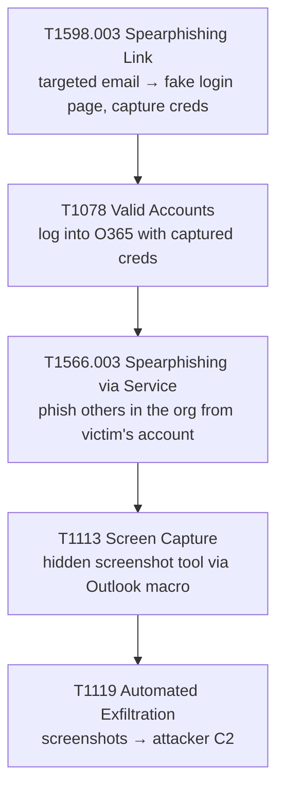
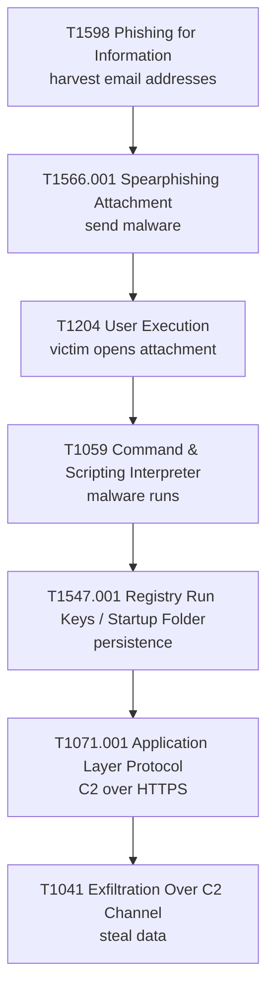
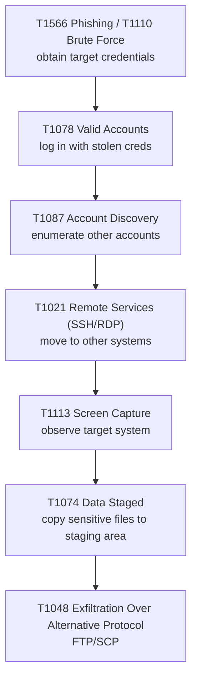
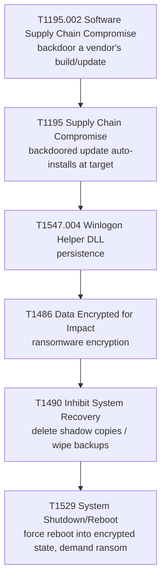
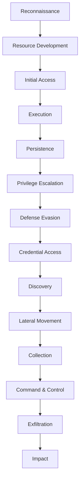

# MITRE ATT&CK

#MITRE #ATTCK #TTP #ThreatIntel #RedTeam #AdversaryEmulation

## What is this?

**MITRE ATT&CK (Adversary Tactics, Techniques, and Common Knowledge)** — Comprehensive, crowdsourced knowledge base of real-world adversary behavior. Organizes tactics (goals: Initial Access, Persistence, Privilege Escalation, etc.) and techniques (how they achieve those goals: phishing, password spray, exploit unpatched service, etc.). Used by red teamers, defenders, threat hunters, and security researchers.

---

## Overview

**ATT&CK Basics:**
- **Purpose**: Model adversary behavior realistically; bridge gap between tactics and techniques.
- **Coverage**: Multi-platform (Windows, Linux, macOS, cloud, mobile, enterprise).
- **Data Source**: Thousands of published incident reports, CVEs, security research, vendor threat reports.
- **Free**: Community-driven, MITRE-maintained; freely available on attack.mitre.org.

**History**: First published 2015 (Enterprise ATT&CK). Expanded to: ATT&CK for Cloud, Mobile, ICS (Industrial Control Systems).

**Current Size** (Enterprise): **14 tactics**, ~200 techniques, and 450+ sub-techniques; updated roughly twice a year (e.g. v16 October 2024, v17 April 2025 — added the ESXi platform and renamed the Network platform to Network Devices). Check [attack.mitre.org/resources/versions](https://attack.mitre.org/resources/versions/) for the current version before citing specifics.

---

## The ATT&CK Framework Structure

### Tactics (Threat Goals)

**Tactic** = strategic objective; what the adversary is trying to accomplish.

14 tactics across the attack lifecycle:

| Order | Tactic | Goal | Example Techniques |
|---|---|---|---|
| 1 | **Reconnaissance** | Gather info about target (passive) | Search public records, scan target website, phishing for info |
| 2 | **Resource Development** | Build attack infrastructure | Buy/register domain, acquire malware, set up C2 server |
| 3 | **Initial Access** | Get foothold in target | Phishing, exploit public-facing app, supply chain compromise |
| 4 | **Execution** | Run attacker code on target | Run local script, malicious download, macro execution |
| 5 | **Persistence** | Maintain access (survive reboots, credential changes) | Create local account, install backdoor, exploit privesc |
| 6 | **Privilege Escalation** | User → Admin/Root | Unpatched kernel exploit, weak file permissions, UAC bypass |
| 7 | **Defense Evasion** | Hide from security tools | Disable Windows Defender, obfuscate code, use living-off-land tools |
| 8 | **Credential Access** | Steal credentials | Keylogging, credential dumping (Mimikatz), brute force |
| 9 | **Discovery** | Map target environment | Network scanning, enumerate AD, find sensitive files |
| 10 | **Lateral Movement** | Move to other systems | Pass-the-hash, SSH key reuse, exploit trust relationships |
| 11 | **Collection** | Gather target data | Screen captures, clipboard data, email harvesting |
| 12 | **Command & Control (C2)** | Remote control of compromised systems | HTTPS C2 callbacks, DNS exfiltration, dead-drop comms |
| 13 | **Exfiltration** | Steal data | FTP/SSH data transfer, email data out, C2 channel exfil |
| 14 | **Impact** | Damage/disrupt target | Delete backups, wipe data, ransomware encryption, DDoS |

---

### Techniques & Sub-Techniques

**Technique** = specific method used to achieve a tactic.

**Sub-Technique** = variation of technique (more granular).

#### Example: Phishing (Initial Access tactic)

**Technique: Phishing (T1566)**
- T1566.001: Phishing - Spearphishing Attachment
- T1566.002: Phishing - Spearphishing Link
- T1566.003: Phishing - Spearphishing via Service

Each technique includes:
- **Description**: How it works.
- **Procedure Examples**: Real-world examples from incident reports.
- **Detection**: How defenders can detect this behavior.
- **Mitigations**: How to prevent/reduce risk.
- **References**: Academic papers, vendor reports, CVSS scores.

#### Example: Privilege Escalation Techniques

| Technique ID | Technique Name | Method |
|---|---|---|
| T1548 | Abuse Elevation Control Mechanism | UAC bypass, sudo misconfiguration |
| T1134 | Access Token Manipulation | Token theft, duplicate token |
| T1547 | Boot or Logon Autostart Execution | Startup folder, registry run keys, cron jobs |
| T1547.001 | Boot or Logon Autostart Execution - Registry Run Keys / Startup Folder | Add to `HKLM\Software\Microsoft\Windows\CurrentVersion\Run` |
| T1053 | Scheduled Task / Job | Create cron job, Windows scheduled task |
| T1547.014 | Boot or Logon Autostart Execution - Active Setup | Exploit Active Setup registry key (persistence + privesc) |

---

## ATT&CK Matrices

### Enterprise ATT&CK

**Platforms**: Windows, Linux, macOS, AWS, Azure, Google Cloud, Office 365, SaaS.

**Focus**: Corporate environment; traditional IT infrastructure + cloud.

**Most Common Tactics** (in order of frequency in incident reports):
1. Execution
2. Persistence
3. Defense Evasion
4. Credential Access
5. Discovery

### Mobile ATT&CK

**Platforms**: iOS, Android.

**Differences**: Mobile-specific techniques (SMS phishing, app-based C2, app-specific permissions).

**Tactics**: Similar to Enterprise but with mobile variants.

### Cloud ATT&CK

**Platforms**: AWS, Azure, Google Cloud (IaaS/PaaS).

**Focus**: Cloud-native attack techniques (compromise cloud credentials, lateral movement via IAM, cloud data exfil).

**Cloud-relevant techniques** (same 14 tactics — these are techniques, not new tactics):
- **Resource Hijacking** (T1496): abuse cloud compute for crypto-mining (an Impact technique).
- **Valid Accounts: Cloud Accounts** (T1078.004): use of compromised cloud credentials.

### ICS/OT ATT&CK

**Platforms**: Industrial Control Systems (SCADA, PLCs, etc.).

**Focus**: Operational technology; manufacturing, power grid, water treatment.

**Different Threat Model**: Focus on availability/physical safety, not just data.

---

## Using ATT&CK: Three Perspectives

### 1. Defender Perspective (Blue Team)

**Use ATT&CK to**:
- Understand what attackers do (tactics/techniques they use).
- Design defensive controls to detect/prevent each technique.
- Map existing tools/processes to ATT&CK (do we have detection for technique X?).
- Identify gaps (we don't detect lateral movement; need better logging/monitoring).
- Build attack simulations (red team exercises based on realistic ATT&CK chains).

**Questions**:
- Which techniques are most likely in our threat model?
- Do we have visibility into that technique?
- What controls can we implement?

#### Example: Phishing Detection

**ATT&CK Technique**: T1566.001 (Phishing - Spearphishing Attachment)

**Defensive Controls**:
- Email gateway: block .exe/.scr attachments; sandbox suspicious files.
- User training: phishing awareness; don't open unknown attachments.
- Detection: Email logs show suspicious sender, attachment scanned, user reports phishing.
- Monitoring: Monitor for execution of attachment (process creation logging).

---

### 2. Red Team / Pentest Perspective

**Use ATT&CK to**:
- Plan realistic attack chain (which techniques to use in which order).
- Stay within scope/ROE (don't use techniques explicitly prohibited).
- Ensure comprehensive coverage (test multiple attack paths, not just obvious ones).
- Report findings using ATT&CK language (clients understand "T1566 Phishing" better than generic "phishing").

**Example Attack Chain** (based on real incident):

---

### 3. Threat Intelligence / Hunt Perspective

**Use ATT&CK to**:
- Categorize threat actor behaviors (APT-28 always uses T1071 C2, T1018 network discovery, etc.).
- Identify known threat groups (MITRE maintains threat actor profiles with mapped techniques).
- Threat hunting (search logs for evidence of techniques; "did we see T1021 Lateral Movement via SSH?").
- Benchmarking (which techniques do most attacks use; prioritize defenses accordingly).

#### Example: Threat Actor Profile (APT1 / Comment Crew)

**Known Techniques**:
- T1566: Phishing (initial access).
- T1566.001: Spearphishing Attachment.
- T1203: Exploitation of vulnerability (unpatched software).
- T1053: Scheduled task (persistence).
- T1021: Remote services (lateral movement).

**Implications**:
- Organization targeted by this group should focus on:
  - Email security (stop phishing).
  - Patch management (eliminate exploitable vulns).
  - Logging/monitoring (detect scheduled tasks, remote connections).

---

## Common ATT&CK Attack Chains

### Chain 1: Phishing → Malware → Persistence → C2

### Chain 2: Compromised Credentials → Lateral Movement → Data Theft

### Chain 3: Supply Chain Compromise → Persistence → Impact

---

## ATT&CK Navigator

**ATT&CK Navigator** = web-based tool for visualizing techniques.

**Features**:
- Create "heat maps" of techniques (color-code by priority, detection, mitigation).
- Layer multiple views (compare your detection coverage vs. threat actor profile).
- Share layers (red team publishes attack plan; blue team reviews and updates defenses).
- Filter by tactic, platform, data source.

**Example Use Case**:
- Red team plans attack; creates layer showing which techniques they'll use.
- Blue team imports layer; checks if they have detection for each technique.
- Identifies gaps; implements new detection/monitoring.

---

## ATT&CK Lifecycle (Most Effective Attack Sequence)

Not all tactics are equally represented in real attacks. Based on incident data:

### High-Value Tactics (Most Common)

1. **Initial Access** (T1566 Phishing, T1199 Trusted Relationship, T1190 Exploit Public-Facing App)
2. **Execution** (T1204 User Execution, T1059 Command & Scripting)
3. **Persistence** (T1547 Boot/Logon Autostart, T1098 Account Manipulation)
4. **Privilege Escalation** (T1548 Abuse Elevation Control, T1134 Access Token Manipulation)
5. **Defense Evasion** (T1036 Masquerading, T1562 Impair Defenses)
6. **Credential Access** (T1110 Brute Force, T1056 Input Capture/Keylogging)
7. **Lateral Movement** (T1021 Remote Services, T1550 Use Alternate Authentication Material)
8. **Exfiltration** (T1041 Over C2, T1048 Over Alternative Protocol)

### Low-Value Tactics (Less Common)

- **Discovery** (T1007 System Service Discovery, T1046 Network Service Scanning) — important but less frequently reported.
- **Collection** (T1123 Audio Capture, T1115 Clipboard Data) — depends on attack goal.
- **Impact** (T1531 Account Access Removal, T1561 Disk Wipe) — ransomware/destructive attacks use this heavily; targeted intrusions skip it.

---

## ATT&CK Weaknesses & Criticisms

| Limitation | Context |
|---|---|
| **Hindsight bias** | Techniques documented based on known incidents; future attacks may use novel techniques ATT&CK doesn't cover |
| **Defender-heavy** | More detailed for detection than for red team execution (less "how to" and more "what to look for") |
| **Platform gaps** | Mobile/Cloud ATT&CK less mature than Enterprise (fewer techniques, fewer examples) |
| **Real-world complexity** | Incidents don't always follow clean ATT&CK chains; attackers are messier than documentation implies |
| **Not prescriptive** | Doesn't tell you which techniques are most dangerous for your environment (risk assessment is separate) |

---

## ATT&CK for Penetration Testers

**How to use ATT&CK in pentesting**:

1. **Plan realistic attack chains** (based on ATT&CK; not contrived "get shell and exfil" scenarios).
2. **Report findings using ATT&CK nomenclature**:
   - "T1566.001 Phishing - Spearphishing Attachment: sent malicious Office doc; 15% click rate in phishing simulation."
   - "T1134 Access Token Manipulation: administrator token duplicated; gained SYSTEM privilege."
3. **Map to threat actors** (if relevant): "Techniques used are consistent with APT28 / Fancy Bear profile."
4. **Align with business risk** (ATT&CK helps frame findings):
   - Initial Access technique (T1566 Phishing) = high priority (prevent breach start).
   - Defense Evasion technique (T1036 Masquerading) = secondary (assumes initial access already achieved).

---

## Quick ATT&CK Reference

### Tactic Order (Typical Attack Progression)

### Top 10 Most-Exploited Techniques (2023–2024 incident data)

1. **T1566**: Phishing (spearphishing email).
2. **T1190**: Exploit Public-Facing Application (unpatched web app). *(Don't confuse with T1203 Exploitation for Client Execution — that's a malicious doc/browser exploit run on a victim endpoint.)*
3. **T1110**: Brute Force (password spray, dictionary attack).
4. **T1098**: Account Manipulation (add backdoor account).
5. **T1021**: Remote Services (SSH, RDP lateral movement).
6. **T1056**: Input Capture (keylogger).
7. **T1547**: Boot or Logon Autostart Execution (persistence).
8. **T1036**: Masquerading (hide malware as legit file).
9. **T1041**: Exfiltration Over C2 Channel (data theft via C2).
10. **T1562**: Impair Defenses (disable Windows Defender, kill logging).

---

## ATT&CK vs. Related Models

Testers get asked to place ATT&CK against neighbouring frameworks — the distinction matters when mapping findings:

| Model | What it is | Relationship to ATT&CK |
|---|---|---|
| **Lockheed Martin Cyber Kill Chain** | 7 linear phases (Recon → Weaponization → Delivery → Exploitation → Installation → C2 → Actions on Objectives) | Coarser and strictly linear. ATT&CK's tactics are a finer, non-linear superset — a Kill Chain phase maps to several ATT&CK tactics. Use Kill Chain for exec narrative, ATT&CK for technical mapping. |
| **MITRE D3FEND** | Knowledge graph of *defensive* countermeasures | The blue-team counterpart; D3FEND techniques are linked back to the ATT&CK techniques they counter. |
| **MITRE Engage** | Adversary engagement / deception planning | Complements ATT&CK by mapping deception operations to the techniques they disrupt. |
| **CAPEC** | Attack *patterns* (how a weakness is exploited) | More abstract than ATT&CK techniques; CAPEC ↔ CWE ↔ ATT&CK cross-reference each other. |

> [!tip]
> ATT&CK describes *observed adversary behaviour*; the Kill Chain describes an *idealized intrusion lifecycle*. If a client asks "which kill-chain stage is this," answer in Kill Chain terms but cite the T-ID for precision.

---

## Resources

- **attack.mitre.org**: Main site; browse tactics/techniques, navigate by platform.
- **ATT&CK Navigator**: attack.mitre.org/matrices/enterprise (visualize techniques, build coverage heat-maps).
- **Atomic Red Team** (Red Canary): a per-technique library of small, executable tests mapped to ATT&CK IDs — the standard way to *validate detection* for a specific technique during/after a pentest.
- **ATT&CK Threat Actor Profiles**: Real-world groups (APT28, Lazarus, etc.) with mapped techniques.
- **STIX/TAXII**: ATT&CK exported in standard format; integrates with security tools (Splunk, CrowdStrike, Elastic, etc.). See [[Threat-Intelligence-Frameworks]].

---

## See also

[[Threat-Intelligence-Frameworks]], [[PTES]], [[NIST-SP-800-115]]  ·  Index: [[_Frameworks and Compliance]]

*Created: 2026-07-17*
*Updated: 2026-09-27*
*Model: claude-opus-4-8*
