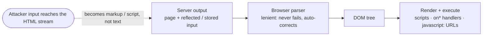

# HTML

#HTML #DOM #Markup #DataFormat #XSS #HTMLInjection #Clickjacking #Sanitization #Standard #WebAppAttacks

## What is it?

**HTML** (HyperText Markup Language; the WHATWG **HTML Living Standard**) is the markup a browser parses into the **DOM** and renders. Two design choices make it the root of the entire web-injection family: parsing is deliberately **lenient** — it *never rejects* input, it silently "corrects" malformed markup into *some* valid tree — and a single stream **mixes content, structure, and executable code** (`` | `'` , `</script>` |
| URL | `<a href="X">` | `javascript:` |
| CSS | `` | `}` , `url()` |

### Why sanitizing is hard — mutation XSS (mXSS)

The **sanitizer and the browser parse the same bytes differently** — foreign-content namespace confusion, rawtext breakouts, entity and `<template>` quirks, DOM clobbering — so a string that looks clean *mutates* into script when the browser re-parses it. This defeats naive blocklists, has broken high-profile apps (Google Search) and repeatedly bypassed even DOMPurify. (The HTML spec was amended in **May 2025** to escape `<`/`>` in attributes specifically to close an mXSS class.)

---

## Trust model — where it breaks

The browser treats the page's bytes as authoritative: it parses *anything* into a DOM and runs the active parts. Security therefore rests entirely on the app **never letting attacker input cross from *text* into *markup***.

| Assumption the app must uphold | When it fails… | Attack (payloads in the linked note) |
|---|---|---|
| Input is rendered as **text** (context-encoded) | Not encoded for its context | **XSS** — reflected / stored / DOM |
| Only **intended** markup renders | Benign-looking attacker markup injected | **HTML injection** — phishing forms, defacement, CSS/token exfil |
| Sanitizer and browser **agree** on the parse | They diverge | **mXSS / sanitizer bypass** |
| DOM sinks get **safe** data | `innerHTML` / `document.write` / `srcdoc` / `eval` on input | **DOM XSS** |
| The page can't be **framed** | No `frame-ancestors` / `X-Frame-Options` | **Clickjacking** |
| Unterminated markup is **contained** | A dangling `` allowed | Script-execution vectors |
| Defenses are **layered** | Weak/absent CSP, no Trusted Types | XSS survives a single-layer defense |

> [!note]
> The modern defense order (all of it belongs to the *app*, not the format): **context-aware output encoding → Trusted Types** (bans raw string→DOM sinks like `innerHTML`) **→ the Sanitizer API** (assigns a *safe DOM node*, never a serialized string, which structurally kills mXSS) **→ CSP** with `strict-dynamic` + nonces. No payloads here — see [[#Attacked by]].

---

## Attacked by

- [[Class notes/HTB Academy/CPTS v2 (claude)/Cross-Site Scripting (XSS)|Cross-Site Scripting (XSS)]] — the main event: reflected / stored / DOM XSS, mXSS, filter & CSP bypass, BeEF.
- [[Class notes/HTB Academy/CWES Claude/Intro to Web Apps|Intro to Web Apps]] — HTML injection, CSRF forms, and the front-end/DOM primer.
- [[Class notes/HTB Academy/CPTS v2 (claude)/CSRF Attacks|CSRF Attacks]] — an HTML `<form>` auto-submit is the delivery vehicle; clickjacking and dangling-markup are HTML-native too.
- [[XML]] — the sibling markup format: **SVG** and XHTML bridge the two (an SVG is XML that renders as *active* HTML content — a classic XXE-and-XSS crossover).

**Tooling:** [[Tools/Web/Burpsuite|Burp Suite]] and browser DevTools to find the reflection/sink and its context; DOMPurify as the sanitizer you bypass-test against.

---

## See also

[[XML]] (the sibling markup — same "parser is too trusting" problem, different attack), [[JSON]] (the sibling *data* format — schemaless text → live object, the third of the browser's core formats), [[Class notes/HTB Academy/CPTS v2 (claude)/Cross-Site Scripting (XSS)|Cross-Site Scripting (XSS)]]  ·  Index: [[_Standards & Protocols]]

*Created: 2026-07-31*
*Updated: 2026-08-14*
*Model: claude-opus-5*
