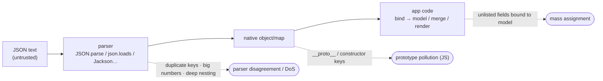

# JSON

#JSON #DataFormat #API #REST #Serialization #Standard #PrototypePollution #JSONP

## What is it?

**JSON** (JavaScript Object Notation; RFC 8259 / ECMA-404) is the **default data format of the modern web** — a lightweight, human-readable text format of objects, arrays, strings, numbers, booleans, and `null`. It is the wire format for almost every [[REST]] API, the payload of [[JWT]], the body of [[SCIM]] provisioning, and the config format for countless tools. Like [[XML]] and [[HTML]], you rarely attack "JSON" itself — you attack **how a specific parser or the receiving code handles it**: no schema by default, silent type coercion, ambiguous duplicate keys, and — in JavaScript — the fact that JSON keys can collide with the object prototype. This note is the format and the parser/handling quirks that make it dangerous; the payloads are under [[#Attacked by]].

---

## How it works

JSON is deceptively simple — six value types, two containers — and that minimalism is the point: **there is no schema, no types beyond the six, and no canonical parser behavior** for the ambiguous cases.

| Element | Detail | Why it matters |
|---|---|---|
| **Value types** | object, array, string, number, boolean, `null` | No date, no integer/float distinction, no binary — apps bolt these on (and disagree) |
| **No schema** | Nothing constrains which keys appear | Extra keys ride along → **mass assignment / over-posting** |
| **Duplicate keys** | RFC says "SHOULD be unique" — not MUST | Parsers pick first *or* last → **parser-mismatch smuggling** between two services |
| **Numbers** | Arbitrary precision in text; no defined limit | `1e309`→`Infinity`, precision loss, big-int → **type confusion / DoS** |
| **`Content-Type`** | `application/json` | If not required, JSON bodies become CSRF-able / cross-parsed |
| **Object keys (JS)** | Become real property names | `__proto__` / `constructor` / `prototype` keys → **prototype pollution** |

The single fact behind most JSON attacks: **JSON is untyped, schemaless text that becomes a live language object** — and the gap between "what the sender meant," "what this parser accepted," and "what the app did with the resulting object" is where the bugs live.

---

## Trust model — where it breaks

The format assumes the *application* validates shape, types, and which fields are trusted. JSON itself guarantees none of that, so each unchecked assumption is a known bug class.

| Assumption the design rests on | When it fails… | Attack (payloads in the linked note) |
|---|---|---|
| Only intended **fields** are honored | Body deserialized straight onto a model | **Mass assignment / over-posting** (`"isAdmin":true`) → [[Class notes/HTB Academy/CWES Claude/API Attacks]] |
| Keys are **plain data** | JS merge/`JSON.parse`+assign trusts keys | **Prototype pollution** via `__proto__`/`constructor` → [[Class notes/HTB Academy/CPTS v2 (claude)/Non-PHP Web App Attacks]] |
| Two services **parse identically** | Duplicate/oddly-encoded keys | **JSON interoperability / smuggling** — auth service sees one value, backend another |
| Values are **well-typed** | `"1"` vs `1`, arrays where scalars expected | **Type juggling** → NoSQL/auth bypass → [[Class notes/HTB Academy/CPTS v2 (claude)/NoSQL Injection]] |
| Responses are **not script** | JSON returned via `<script>`/**JSONP** callback | Cross-site data theft; callback-name XSS → [[Class notes/HTB Academy/CPTS v2 (claude)/CORS Misconfiguration]] |
| Input is **bounded** | Deeply nested / huge arrays | Parser **DoS** (stack blow-up, memory) → [[Sr Tester Role/Topics/API Unrestricted Resource Consumption]] |
| Deserialization is **inert** | Type-binding deserializers (Jackson/`pickle` bridges) | **Deserialization RCE** → [[Class notes/HTB Academy/CPTS v2 (claude)/Deserialization]] |

> [!note] No payloads here — this is the "why." JSON's danger isn't a parser bug so much as **misplaced trust in schemaless text**: the same object that carries `{"user":"me"}` can carry `{"user":"me","role":"admin","__proto__":{...}}`, and only application-side validation stops it. Contrast [[XML]], whose danger is the parser reaching *outside* the document (XXE); JSON's danger is the object *inside* it not being what the app assumed.

---

## Attacked by

- [[Class notes/HTB Academy/CWES Claude/API Attacks|API Attacks]] — mass assignment / over-posting and excessive-data-exposure, the everyday JSON-body bugs.
- [[Class notes/HTB Academy/CPTS v2 (claude)/Non-PHP Web App Attacks|Non-PHP Web App Attacks]] — **prototype pollution** (the JS-specific JSON bug) and JSON-fed deserialization.
- [[Class notes/HTB Academy/CPTS v2 (claude)/NoSQL Injection|NoSQL Injection]] — JSON operator/type-confusion payloads (`{"$ne":null}`) into Mongo-style backends.
- [[Class notes/HTB Academy/CPTS v2 (claude)/Deserialization|Deserialization]] — type-binding JSON deserializers → RCE.
- [[Class notes/HTB Academy/CPTS v2 (claude)/CORS Misconfiguration|CORS Misconfiguration]] — JSONP and cross-origin JSON reads.

**Tooling:** [[Tools/Web/Burpsuite|Burp Suite]] (Repeater, the JSON web-token/Content-Type tampering), [[Tools/File Transfer/cURL|curl]], `jq` for parsing/reshaping, PP-finder/DOM Invader for prototype pollution.

---

## See also

[[REST]] (JSON is its default wire format), [[JWT]] (a signed JSON payload), [[SCIM]] (a JSON provisioning API), [[XML]] (the older data-format sibling — XXE vs mass-assignment), [[HTML]] (the browser markup substrate)  ·  Index: [[_Standards & Protocols]]

*Created: 2026-08-14*
*Updated: 2026-08-14*
*Model: claude-opus-5*
