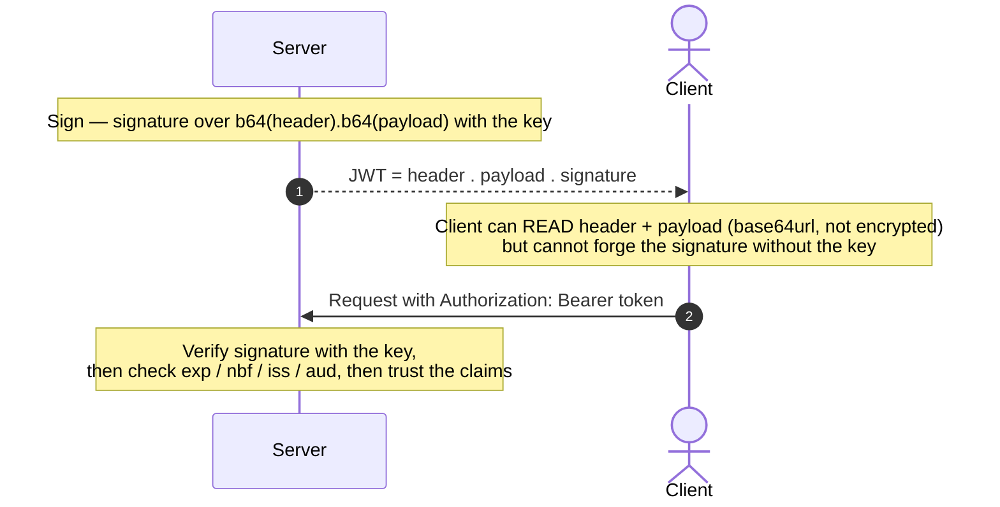

# JWT

#JWT #JWS #JWE #JWK #Token #Authentication #Claims #Standard #Identity #API

## What is it?

A **JSON Web Token** (RFC 7519) is a compact, URL-safe way to carry a set of **claims** (statements about a user/session) as a signed — and optionally encrypted — token. It's the workhorse token format of modern auth: OIDC **ID tokens** are JWTs, most OAuth **access tokens** are JWTs, and countless APIs hand a JWT to the client as a stateless session. Its whole appeal is being **self-contained and stateless** — the server can trust a JWT by checking its signature alone, without a session store — which is also the root of most of its weaknesses. This note is the format and its trust model; the payloads are under [[#Attacked by]].

> [!note]
> "JWT" almost always means a **JWS** (a *signed* token — integrity/authenticity). The signed-vs-encrypted split is a common point of confusion — see [How it works](#How%20it%20works).

---

## How it works

### The family of specs (JOSE)

| Spec | RFC | What it is |
|---|---|---|
| **JWT** | 7519 | The claims container (the payload shape) |
| **JWS** | 7515 | **Signed** token — integrity + authenticity (the common "JWT") |
| **JWE** | 7516 | **Encrypted** token — confidentiality (rare in practice) |
| **JWK / JWKS** | 7517 | JSON Web Key / Key **Set** — how public keys are published (at a `jwks_uri`) for verification |
| **JWA** | 7518 | The algorithms — `HS256`, `RS256`, `ES256`, `none`, … |

### Structure — three base64url parts joined by dots

```text
xxxxx.yyyyy.zzzzz
  │      │     └── Signature
  │      └──────── Payload  (claims)
  └─────────────── Header   (alg, typ, kid …)
```

| Part | Contents |
|---|---|
| **Header** | `alg` (signing algorithm), `typ`, and key hints: `kid`, `jku`, `jwk`, `x5u`, `x5c` |
| **Payload** | Registered claims — `iss` (issuer), `sub` (subject), `aud` (audience), `exp` (expiry), `nbf` (not-before), `iat`, `jti` — plus any custom claims (`role`, `email`, …) |
| **Signature** | `alg( base64url(header) + "." + base64url(payload), key )` — the only thing binding the token to the issuer |

> [!warning]
> Header and payload are **base64url-encoded, not encrypted** (in a JWS). Anyone holding the token can read every claim — decode with `echo <part> | tr '_-' '/+' | base64 -d`. Never put secrets in a JWT payload.

### Signing algorithms

| Family | Examples | Key model |
|---|---|---|
| **HMAC** | `HS256/384/512` | **Symmetric** — one shared secret both signs *and* verifies |
| **RSA / ECDSA** | `RS256`, `PS256`, `ES256` | **Asymmetric** — private key signs, public key (often at `jwks_uri`) verifies |
| **none** | `none` | **Unsecured** — no signature at all |

### Sign → transmit → verify



---

## Trust model — where it breaks

The model: *the server trusts the claims in a token whose signature verifies against the expected key.* Every JWT attack breaks one assumption under that sentence — and almost all of them live in the **header**, because the attacker controls it.

| Assumption the design rests on | When it fails… | Attack (payloads in the linked note) |
|---|---|---|
| The server **verifies** the signature at all | Verification skipped for `alg:none` | **`alg:none`** — strip the signature, forge any claim |
| The algorithm is **pinned server-side** | Server trusts the token's own `alg` header | **Algorithm confusion** — `RS256`→`HS256`, sign with the public key as the HMAC secret |
| The **HMAC secret** is strong | Weak/guessable shared secret | **Secret cracking** (`hashcat -m 16500`, wordlist) → sign arbitrary tokens |
| Key-selection headers aren't attacker-controlled | Server uses `kid`/`jku`/`jwk`/`x5u`/`x5c` from the token | **`kid` injection** (path traversal / SQLi), **`jku`/`jwk`/`x5c`** pointing at an attacker key |
| Claims are **validated** (`exp`/`nbf`/`aud`/`iss`) | A check is skipped | Expired-token replay, cross-service / wrong-audience reuse |
| Payload is **not** treated as secret | Devs stash secrets in claims | Info disclosure — the payload is public base64 |
| A token can be **revoked** | Stateless, no server-side revocation | Stolen token stays valid until `exp` — logout doesn't kill it |
| The crypto library is sound | ECDSA verify accepts `r=s=0` | **Psychic Signatures (CVE-2022-21449)** — any `ES*` token forges on OpenJDK 15–18 |

> [!note]
> No payloads here — this is the "why." Six critical JWT-*library* CVEs landed in 2025 alone (several one-token account-takeovers), so verify the target's library/version; current exploit detail lives in [[Class notes/HTB Academy/CPTS v2 (claude)/JWT Attacks|JWT Attacks]].

---

## Attacked by

- [[Class notes/HTB Academy/CPTS v2 (claude)/JWT Attacks|JWT Attacks]] — the full toolkit: `alg:none`, RS256→HS256 confusion, `kid`/`jku`/`jwk` injection, secret cracking, public-key recovery (`rsa_sign2n`), Psychic Signatures.
- [[OAuth-OIDC]] — OIDC **ID tokens** are JWTs and OAuth **access tokens** usually are; a JWT flaw there is an auth bypass for the whole SSO.
- [[Class notes/HTB Academy/CWES Claude/API Attacks|API Attacks]] — JWTs as stateless API sessions (role tampering, `alg:none`, cross-service reuse).
- [[Class notes/HTB Academy/CWES Claude/Broken Auth|Broken Auth]] — JWT-backed sessions in the login/session-handling view.

**Tooling:** [[Tools/Web/jwt_tool|jwt_tool]] (tamper/attack/crack), Burp **JWT Editor** extension, and `hashcat` / `john` (`-m 16500`) for HMAC-secret cracking.

---

## See also

[[OAuth-OIDC]] (the framework that carries JWTs as ID/access tokens), [[SAML]] (the XML-assertion alternative — same job, signed XML instead of a signed token)  ·  Index: [[_Standards & Protocols]]

*Created: 2026-07-31*
*Updated: 2026-07-31*
*Model: claude-opus-4-8*
