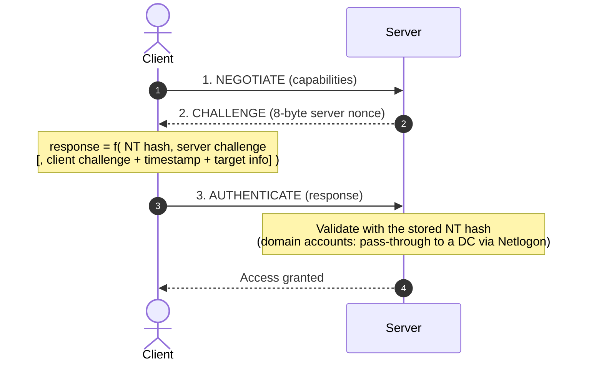
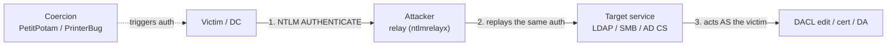

# NTLM

#NTLM #NTLMv2 #Authentication #Windows #ActiveDirectory #PassTheHash #NTLMRelay #Coercion #ChallengeResponse #Standard

## What is it?

**NTLM (NT LAN Manager)** is Microsoft's legacy challenge-response authentication protocol family — the predecessor to [[Services/Active Directory/Kerberos|Kerberos]], still everywhere in Windows/AD because it's the fallback whenever Kerberos can't be used (connecting by IP instead of hostname, local/workgroup accounts, older services). The user's secret is the **NT hash** (`MD4` of the password) and the protocol proves knowledge of that hash *without sending it* — which sounds safe but means **the hash itself is a usable credential**. That single design fact is the root of Pass-the-Hash and NTLM relay. You meet NTLM riding inside SMB, HTTP (`WWW-Authenticate: NTLM`), LDAP, MSSQL, and RPC/DCOM. This note is the protocol and its trust model; the payloads are under [[#Attacked by]].

> [!note]
> Microsoft is **deprecating NTLM** — Windows 11 24H2 / Server 2025 remove **NTLMv1** and disable NTLMv2 in some paths. But most enterprise DCs still run Server 2019/2022, so NTLM (and relay) remains a first-class engagement target for years yet.

---

## How it works

### The NT hash

```text
NT hash = MD4( UTF-16-LE(password) )      # no salt, no iteration
```

Unsalted and fast — so it's the thing you dump (SAM / LSASS / NTDS.dit), crack, **or replay directly**. It's also the account's RC4 Kerberos key, which is what links NTLM to Kerberos abuse.

### The three-message handshake

Carried inside whatever application protocol is authenticating (SMB, HTTP, LDAP…):



### NTLMv1 vs NTLMv2

| | NTLMv1 | NTLMv2 |
|---|---|---|
| Crypto | DES over the server challenge | HMAC-MD5 over server **+ client** challenge, timestamp, **target info** |
| Offline attack | Trivially reversible to the NT hash (crack.sh rainbow) | Crack the password (`hashcat -m 5600`), no precomputation |
| Relay defense hooks | None | Target-info binding is what MIC / SMB signing / EPA use to *break* relay |
| Verdict | Must be disabled | Current, but still relayable without signing/EPA |

- **Net-NTLM hash** = the *captured handshake response* (crackable / relayable) — **not** the same as the NT hash (which is the stored credential you Pass-the-Hash with). Confusing these is the classic NTLM mistake.
- **Domain vs local**: local accounts validate against the SAM; domain accounts are validated by a DC over the **Netlogon** secure channel (pass-through auth).

---

## Trust model — where it breaks

The design rests on two load-bearing assumptions: *knowing the hash is proof of identity*, and *by default the authentication is not bound to the specific service it's being spent on*. Nearly every NTLM attack pulls one of these threads.

| Assumption the design rests on | When it fails… | Attack (payloads in the linked note) |
|---|---|---|
| You need the **plaintext** to authenticate | Only the NT hash is needed | **Pass-the-Hash (PtH)** — authenticate with the dumped hash directly |
| Auth is **bound to the intended server** | No SMB signing / LDAP channel binding / EPA | **NTLM relay** — forward the victim's AUTHENTICATE to a *different* service (SMB→LDAP, →AD CS **ESC8**, →SMB) |
| Clients authenticate **only when they choose**, to legit servers | A coercion primitive forces it | **Coercion** — PetitPotam (MS-EFSRPC), PrinterBug (MS-RPRN), DFSCoerce, ShadowCoerce → forced auth to the attacker |
| The challenge-response **resists offline attack** | Handshake captured | **Net-NTLMv2 cracking** (`hashcat -m 5600`); **NTLMv1 downgrade** → crack.sh → NT hash |
| **NTLMv1 is disabled** | Legacy still allowed | Downgrade to NTLMv1 and reverse to the NT hash |
| The NT hash **isn't** a Kerberos key | NT hash **is** the RC4 Kerberos key | **Overpass-the-Hash** — turn a stolen hash into a Kerberos TGT → [[Services/Active Directory/Kerberos|Kerberos]] |

### The relay chain (the money shot)



> [!warning]
> Coercion + relay chains "I can reach the network" straight to Domain Admin in minutes, and new coercion primitives keep surfacing from unexpected surfaces (file pickers, screenshot tools — e.g. the 2026 Snipping Tool hash-leak CVE). Defenses are **SMB signing**, **LDAP signing + channel binding**, **EPA**, and disabling NTLM — confirm which are missing rather than blindly firing coercion on a production DC.

---

## Attacked by

- [[Class notes/HTB Academy/CPTS v2 (claude)/Password Attacks|Password Attacks]] — dumping NT hashes (SAM/LSASS/NTDS), Pass-the-Hash, capturing and cracking Net-NTLMv2, Overpass-the-Hash.
- [[Services/Active Directory/ADCS|ADCS]] — **ESC8**: relay a coerced machine account's NTLM auth to the AD CS web-enrollment endpoint → attacker-controlled cert → DA.
- Also surfaces in the AD attack chain around [[Services/Active Directory/Kerberos|Kerberos]] (Overpass-the-Hash) and LDAP/SMB relay targets.

**Tooling:** [[Tools/Lateral Movement/responder|Responder]] / [[Tools/Lateral Movement/inveigh|Inveigh]] (poison + capture Net-NTLMv2), [[Tools/Lateral Movement/ntlmrelayx|ntlmrelayx]] (relay), [[Tools/Lateral Movement/mitm6|mitm6]] (IPv6/WPAD-driven capture), [[Tools/Lateral Movement/Coercer|Coercer]] (coercion multi-tool), [[Tools/Network/PCredz|PCredz]] (passive Net-NTLM harvest from pcap), [[Tools/Network/NTLMRawUnHide|NTLMRawUnHide]] (extract Net-NTLMv2 from a raw pcap/`.etl` capture when Responder wasn't in the path).

---

## See also

[[Services/Active Directory/Kerberos|Kerberos]] (the successor — ticket-based, what NTLM falls back *from*), [[SPNEGO-GSS|SPNEGO / GSS-API]] (the Negotiate layer that picks Kerberos vs NTLM — and downgrades to it), [[SAML]] / [[OAuth-OIDC]] / [[JWT]] (the web-era auth standards)  ·  Index: [[_Standards & Protocols]]

*Created: 2026-07-31*
*Updated: 2026-08-14*
*Model: claude-opus-5*
