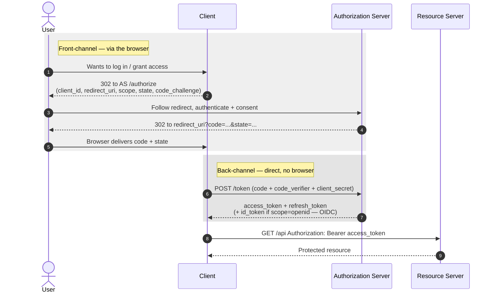

# OAuth 2.0 & OIDC

#OAuth #OIDC #OpenIDConnect #SSO #Federation #Identity #Authorization #Token #Standard #IdP

## What is it?

**OAuth 2.0** is an *authorization* framework (RFC 6749): it lets a user grant an app **delegated access** to their data on another service — "let this app read my Google contacts" — *without* handing over their password, by issuing the app a scoped **access token** instead. **OpenID Connect (OIDC)** is a thin *authentication* layer on top of OAuth 2.0: it adds an **ID token** (a signed [[JWT]]) and a userinfo endpoint, turning "delegated access" into "**log in with** Google/Microsoft/GitHub." You meet it everywhere modern SSO, API bearer auth, SPAs, mobile apps, and M365/Entra live. Same job as [[SAML]] (federated SSO) but token/JSON/redirect-based instead of XML-assertion-based. This note is the protocol; the payloads are under [[#Attacked by]].

> [!note]
> The security baseline moved: **RFC 9700** (Best Current Practice for OAuth Security, 2025) and **OAuth 2.1** fold the old "recommended" hardening into hard requirements — PKCE on every Authorization Code flow, **exact-string** `redirect_uri` matching, and removal of the Implicit and Password (ROPC) grants. Most OAuth attacks below are "target still allows the pre-2.1 loose behavior."

---

## How it works

### Roles

| Role | Who it is |
|---|---|
| **Resource Owner** | The user who owns the data |
| **Client** | The app requesting access (confidential = has a secret; public = SPA/mobile, can't keep one) |
| **Authorization Server (AS)** | Authenticates the user, gets consent, issues tokens (the **IdP** in OIDC) |
| **Resource Server** | The API that holds the data and accepts the access token |

### Tokens

| Token | What it is | Lifetime |
|---|---|---|
| **Access token** | Bearer credential to call the API (opaque *or* a JWT) | Short |
| **Refresh token** | Exchanged for fresh access tokens without re-auth | Long |
| **ID token** (OIDC only) | Signed [[JWT]] asserting *who* logged in — claims `iss`, `sub`, `aud`, `exp`, `nonce` | Per-login |

### Discovery endpoints

```text
/.well-known/openid-configuration          ← OIDC metadata
/.well-known/oauth-authorization-server    ← OAuth AS metadata
  → authorization_endpoint, token_endpoint, jwks_uri, userinfo_endpoint, scopes_supported
```

### Authorization Code flow + PKCE (the one to know)



- **`state`** = a CSRF token binding the callback to the request the client started.
- **PKCE** (`code_challenge` / `code_verifier`) = binds the auth code to the client instance that began the flow, so an intercepted code can't be redeemed by anyone else. **Mandatory in OAuth 2.1.**

### Grant types

| Grant | Use | Status |
|---|---|---|
| **Authorization Code + PKCE** | Web, SPA, mobile — the default | Current |
| **Client Credentials** | Machine-to-machine, no user | Current |
| **Device Authorization** (device code) | Input-constrained devices (TV, CLI); user types a code at a URL | Current — **phishable** |
| **Refresh Token** | Renew access tokens silently | Current |
| **Implicit** (token in URL fragment) | Legacy SPA | **Removed in 2.1** |
| **Resource Owner Password (ROPC)** | App collects the password directly | **Removed in 2.1** |

### OIDC specifics

- `scope=openid` is what turns an OAuth request into OIDC and yields an `id_token`.
- **`nonce`** binds the `id_token` to the auth request (replay defense — the ID-token analog of `state`).
- The client must **validate the id_token**: signature via `jwks_uri`, plus `iss`, `aud`, `exp`, and `nonce`. Skipping any of these is where OIDC breaks (see [[JWT]]).

---

## Trust model — where it breaks

The model: *the AS issues a token after the user consents, and every party downstream trusts whoever bears the token (or presents a validly-signed `id_token`).* Each attack violates one assumption underneath that.

| Assumption the design rests on | When it fails… | Attack (payloads in the linked note) |
|---|---|---|
| AS **exact-matches** `redirect_uri` | Substring/subdomain match, open redirect, path traversal, `@`/`.` tricks | **redirect_uri manipulation** → auth-code / token theft |
| `state` is present and verified | Missing or predictable | **CSRF / authorization-code injection** — force victim into an attacker-linked session |
| Code is **bound to the originating client** (PKCE) | AS supports PKCE but doesn't *enforce* it | **PKCE downgrade** — strip `code_challenge`; a stolen code becomes redeemable (RFC 9700) |
| Access token isn't exposed | Implicit flow / token in URL fragment / `Referer` / logs | **Token leakage** |
| Scope is fixed at grant | AS honors a scope change on **refresh** or token-exchange | **Scope creep / escalation** |
| `id_token` fully validated (sig/`iss`/`aud`/`nonce`) | A check is skipped | **ID-token forgery** — `alg:none`, key confusion → [[JWT]] |
| Client secret stays confidential | Leaked in JS, mobile binary, public client | **Client impersonation** |
| Device-code grant approved only by the real device | User phished into approving the *attacker's* device request | **Device-code phishing** — survives MFA, yields real tokens |
| Bearer = possession is enough | Token stolen and replayed elsewhere | No proof-of-possession → mitigated by **DPoP** / mTLS-bound tokens |
| Client knows which AS issued a code | Multi-AS client confused about the issuer | **IdP mix-up** |

> [!note]
> No payloads here — this is the "why." Read the trust table first and each technique in the attack note becomes "which of these did the target skip."

---

## Attacked by

- [[Class notes/HTB Academy/CPTS v2 (claude)/OAuth-OIDC-SAML|OAuth / OIDC / SAML Attacks]] — `redirect_uri` abuse, `state` CSRF, token leakage, scope escalation, PKCE bypass, device-code phishing, FOCI.
- [[Class notes/HTB Academy/CPTS v2 (claude)/JWT Attacks|JWT Attacks]] — the `id_token` / JWT-access-token side: `alg:none`, algorithm confusion, `kid`/`jwks` injection.
- [[Services/Active Directory/Entra ID|Entra ID]] — device-code phishing, **FOCI** refresh-token pivoting, and PRT abuse in the M365/Entra environment.
- [[Class notes/HTB Academy/CWES Claude/Broken Auth|Broken Auth]] — OAuth/SSO as the login mechanism (account-linking / pre-account-takeover).

**Tooling:** [[Tools/Web/Burpsuite|Burp Suite]] to tamper `redirect_uri`/`state`/`code`; [[Tools/Web/jwt_tool|jwt_tool]] for the token JWTs; [[Tools/Cloud/TokenTactics|TokenTactics]] for Entra device-code/FOCI token abuse; [[Tools/Web/TokenSpy|TokenSpy]] to hunt tokens leaked in JS.

---

## See also

[[SAML]] (the XML-assertion federation cousin — same job, different wire format), [[JWT]] (the token format OIDC carries)  ·  Index: [[_Standards & Protocols]]

*Created: 2026-07-31*
*Updated: 2026-07-31*
*Model: claude-opus-4-8*
