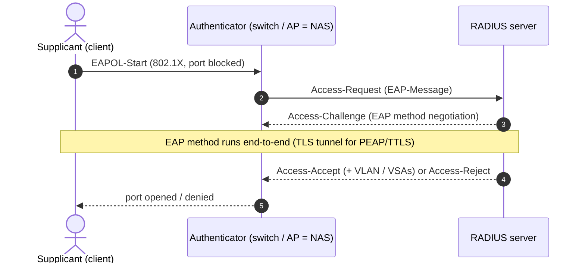

# RADIUS

#RADIUS #AAA #802dot1X #EAP #Authentication #NetworkAccess #SharedSecret #Standard #NetworkManagement

## What is it?

**RADIUS** (Remote Authentication Dial-In User Service; RFC 2865 auth / RFC 2866 accounting) is the ubiquitous **AAA** protocol — **A**uthentication, **A**uthorization, **A**ccounting — that a network access device asks *"may this user on?"*. The device (a VPN concentrator, Wi-Fi AP, or a switch doing **802.1X**) is the **NAS/client**; it forwards credentials to a central **RADIUS server** (FreeRADIUS, Microsoft NPS, Cisco ISE) that holds the policy. It's what sits behind WPA2/3-Enterprise Wi-Fi, VPN logins, and network-device admin auth. The whole protocol's integrity rests on **one shared secret** between NAS and server and on **MD5** — a 1990s design carried into modern networks, which is exactly why it's attackable. This note is the protocol and its trust model; the hands-on attacks are under [[#Attacked by]].

> [!note]
> Ports: **UDP 1812** (auth) / **1813** (accounting) today; **1645/1646** are the legacy pair still seen on old gear. **TACACS+** is Cisco's separate AAA protocol (TCP 49, encrypts the whole body) — the common alternative for device admin.

---

## How it works

### Packet + the shared-secret anchor

A RADIUS packet is `Code | Identifier | Length | Authenticator (16 bytes) | Attributes (TLV AVPs)`.

- **Access-Request** carries a random **Request Authenticator** and the user's attributes.
- **Access-Accept / -Reject / -Challenge** carry a **Response Authenticator = `MD5(Code + ID + Length + RequestAuthenticator + Attributes + SharedSecret)`** — this keyed MD5 is the *only* thing proving the reply came from the real server.
- **`User-Password`** isn't encrypted — it's XORed with a keystream `MD5(SharedSecret + RequestAuthenticator)` (chained per 16 bytes). Reversible if the secret is known, and malleable.
- **`Message-Authenticator`** (HMAC-MD5 over the packet) is an *optional* attribute that adds real integrity — its absence is central to the attack below.

### 802.1X — RADIUS carrying EAP

- **EAP methods** carried inside RADIUS: **EAP-TLS** (mutual certificates — strong), **PEAP / EAP-TTLS** (a TLS tunnel wrapping a weaker inner method, usually **MSCHAPv2**), and legacy **EAP-MD5** (no protection). The inner method is where the weakness usually lives.
- **RadSec** (RFC 6614, TCP 2083) wraps the whole of RADIUS in **TLS** — the modern fix for RADIUS's cleartext transport, but still rarely deployed.

---

## Trust model — where it breaks

RADIUS assumes the shared secret stays secret, MD5 is sound, and (for Wi-Fi) the client validates the server it's authenticating to. All three fail in the field.

| Assumption the design rests on | When it fails… | Attack (detail in the linked note) |
|---|---|---|
| The **shared secret** is strong & unique | Default / weak / reused secret, or read from a device config | **Offline secret crack** from a captured Request+Response (the Response Authenticator is a keyed MD5) → decrypt passwords, forge replies |
| **MD5** integrity can't be forged | `Message-Authenticator` not enforced | **Blast-RADIUS (CVE-2024-3596, 2024)** — MITM turns an Access-**Reject** into a forged Access-**Accept** via an MD5 chosen-prefix collision, *without* the secret |
| `User-Password` is protected | It's an MD5-XOR keystream, not encryption | Recover the password once the secret is known; bit-flip malleability |
| The transport is confidential | Base RADIUS is cleartext UDP (only the password field is hidden) | Sniff usernames, assigned VLAN, VSAs; RadSec/IPsec needed |
| The client validates the **server cert** (PEAP/TTLS) | Supplicant doesn't pin/validate the RADIUS cert | **Evil-twin AP** — rogue AP + RADIUS harvests the inner MSCHAPv2 exchange |
| The inner EAP method is **strong** | PEAP/TTLS-**MSCHAPv2** or EAP-MD5 | MSCHAPv2 is NT-hash challenge/response → crack offline / relay → [[NTLM]]; EAP-MD5 trivially cracked |
| Accounting records are **trustworthy** | Accounting packets unauthenticated | Spoofed start/stop records (fraud, log evasion) |

> [!note]
> No payloads here — this is the "why." Two things make RADIUS soft: **it's MD5 + one shared secret** (crack the secret, or exploit Blast-RADIUS where `Message-Authenticator` is missing), and **on Wi-Fi the client often doesn't validate the server cert** (evil-twin → harvest NT-hash-based MSCHAPv2). The fixes are RadSec/TLS, mandatory `Message-Authenticator`, EAP-TLS, and enforced server-cert validation.

---

## Attacked by

- [[Techniques/Network Device Pentesting|Network Device Pentesting]] — pulling **RADIUS/TACACS+ shared secrets** from device configs and cracking/reusing them against the AAA server; the unauth RADIUS RCE class (e.g. CVE-2025-20265).
- [[Class notes/HTB Academy/CPTS v2 (claude)/Password Attacks|Password Attacks]] / [[NTLM]] — PEAP/EAP-**MSCHAPv2** is an NT-hash challenge/response: evil-twin harvest → offline crack (asleap / hashcat), the same credential material as NTLM.
- [[Class notes/Wifi Bootcamp|Wi-Fi Bootcamp]] — the 802.1X / EAP-method breakdown and the Wi-Fi-Enterprise attack toolkit (EAPHammer, eapmd5pass).

**Tooling:** `hashcat`/`john` (RADIUS secret + MSCHAPv2), EAPHammer / hostapd-wpe (evil-twin RADIUS), `eapmd5pass`, and the Blast-RADIUS PoC — all in the linked notes.

---

## See also

[[TLS]] (RadSec wraps RADIUS in TLS, and PEAP/TTLS/EAP-TLS ride a TLS tunnel), [[X509-PKI|X.509 / PKI]] (EAP-TLS certs + the server-cert validation an evil-twin abuses), [[NTLM]] (MSCHAPv2 ↔ the NT hash), [[SPNEGO-GSS|SPNEGO / GSS-API]] (the *other* enterprise auth negotiation layer)  ·  Index: [[_Standards & Protocols]]

*Created: 2026-09-26*
*Updated: 2026-09-26*
*Model: claude-opus-4-8*
