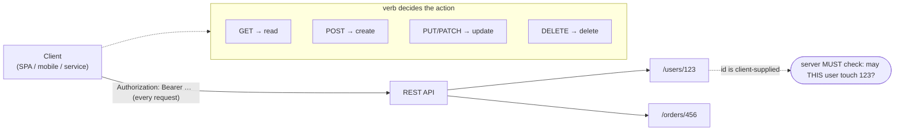

# REST

#REST #API #HTTP #CRUD #JSON #Protocol #Standard #BOLA #IDOR #WebServices

## What is it?

**REST** (REpresentational State Transfer) is an **architectural style** for APIs, not a wire protocol: resources are named by **URLs**, acted on with **HTTP verbs**, carry state in **[[JSON]]** (usually), and every request is **stateless** (it must carry its own auth). It's the dominant modern API style — the thing behind virtually every mobile app, SPA, and microservice — and the lightweight counterpart to [[SOAP]] (rigid XML + WSDL + WS-Security). REST has no built-in contract, no built-in message security, and no built-in authorization: those are the developer's job on **every endpoint**, which is exactly why the same handful of authz bugs recur. This note is *why the design is attackable*; the payloads are under [[#Attacked by]] — it is deliberately **not** a REST tutorial.

> [!note] **CRUD** (Create / Read / Update / Delete) is the operation vocabulary REST maps onto HTTP verbs (see the table below). **AJAX** (Asynchronous JavaScript And XML) is just *how a browser calls a REST API* — background `XMLHttpRequest`/`fetch` from JavaScript instead of a full page load; despite the name it's almost always [[JSON]] now, not XML. AJAX is a technique, not a standard: its security surface is the **same-origin policy / CORS** and **CSRF**, covered in [[Techniques/CORS Misconfiguration|CORS Misconfiguration]] and [[Techniques/CSRF Attacks|CSRF]].

---

## How it works

The whole model is **{HTTP verb} + {resource URL} → {representation}**, stateless, with auth re-presented every time.

**Verb ↔ CRUD ↔ meaning:**

| HTTP verb | CRUD | Semantics | Attack-relevant property |
|---|---|---|---|
| `GET` | Read | Safe, idempotent, **no body** | Cacheable/logged → tokens-in-URL leak |
| `POST` | Create | Not idempotent | Mass-assignment on the created object |
| `PUT` / `PATCH` | Update | PUT idempotent (full), PATCH partial | Mass-assignment / over-posting extra fields |
| `DELETE` | Delete | Idempotent | Destructive if authz is missing |
| `OPTIONS` | — | Capability/preflight (CORS) | Reveals methods; drives CORS preflight |

**Design properties that shape the attack surface:**

- **Resource IDs are client-supplied** and usually sequential/guessable (`/users/123`) → the server *must* check ownership on every call.
- **Stateless** → no server session; a **bearer token/JWT** rides on every request → token theft/replay is full access, and there's no server-side "logout."
- **No built-in contract** → hidden endpoints/params exist and are found by fuzzing, JS-bundle analysis, or a leaked OpenAPI/Swagger doc.
- **Verb + override quirks** → `X-HTTP-Method-Override`, framework verb tunneling, and "auth checked on GET but not PUT" mismatches.
- **Browser clients need CORS** → the server relaxes the same-origin policy, and misconfiguring that is its own bug class.

---

## Trust model — where it breaks

REST pushes **contract, authorization, and message security entirely onto the implementation** — nothing in the style enforces them. Each missing check is a well-known API vuln class.

| Assumption the design rests on | When it fails… | Attack (payloads in the linked note) |
|---|---|---|
| Server checks **object ownership** per request | ID trusted because it was returned once | **BOLA / IDOR** — `/users/123` → `/users/124` |
| Server checks the **action/function**, not just login | Endpoint-level authz missing | **BFLA** — call admin-only operations |
| Only intended **fields** are writable | Request body bound straight to the model | **Mass assignment / over-posting** (`"role":"admin"`) |
| **Every** endpoint is authenticated | New/undocumented route ships without a guard | Unauth data access → surface found by fuzzing/Swagger |
| A **token** = the right user, now | No expiry/revocation/binding | **Token replay / theft**; no server-side logout |
| Auth is enforced on **all verbs** | Filter covers `GET` but not `PUT`/`DELETE` | **Verb tampering** / method-override bypass |
| The browser enforces **same-origin** | Over-permissive `Access-Control-Allow-Origin` | **CORS** cross-origin theft → [[Techniques/CORS Misconfiguration]] |
| Clients send **sane** volume/shape | No rate/size limits | Resource-consumption **DoS** → [[Sr Tester Role/Topics/API Unrestricted Resource Consumption]] |

> [!note] No payloads here — this is the "why." REST's insecurity is an **absence**, not a flaw: the style provides no authorization, so every endpoint re-implements it and any one that forgets is a finding. That's why **BOLA is the #1 API risk** and why the first move against a REST API is always *enumerate the endpoints, then swap the IDs*.

---

## Attacked by

- [[Class notes/HTB Academy/CWES Claude/API Attacks|API Attacks]] — the core note: BOLA, BFLA, mass assignment, broken auth, excessive data exposure — the OWASP API Top 10 in practice.
- [[Sr Tester Role/Topics/API Broken Object Level Authorization|BOLA (API #1)]] · [[Sr Tester Role/Topics/API Broken Function Level Authorization|BFLA]] — the per-vuln-class notes these map to.
- [[Techniques/CORS Misconfiguration|CORS Misconfiguration]] — the browser-client (AJAX) cross-origin surface.
- [[Class notes/HTB Academy/CPTS v2 (claude)/Fuzzing|Fuzzing]] — discovering the undocumented endpoints/params REST hides.
- [[Class notes/HTB Academy/CWES Claude/Intro to GraphQL|GraphQL]] — the query-language alternative that replaces many REST endpoints with one (and its own IDOR/DoS surface).

**Tooling:** [[Tools/Web/Burpsuite|Burp Suite]] (Repeater/Intruder, Autorize for BOLA), [[Tools/File Transfer/cURL|curl]], [[Tools/Scanning/ffuf|ffuf]] (endpoint/param fuzzing), Postman/Swagger-UI for the spec, [[Tools/Web/Arjun|Arjun]] for hidden params.

---

## See also

[[SOAP]] (the rigid XML+WSDL API style REST displaced), [[JSON]] (REST's default wire format), [[JWT]] (the stateless bearer token REST APIs carry), [[SCIM]] (a REST/JSON provisioning API)  ·  Index: [[_Standards & Protocols]]

*Created: 2026-08-14*
*Updated: 2026-08-14*
*Model: claude-opus-5*
