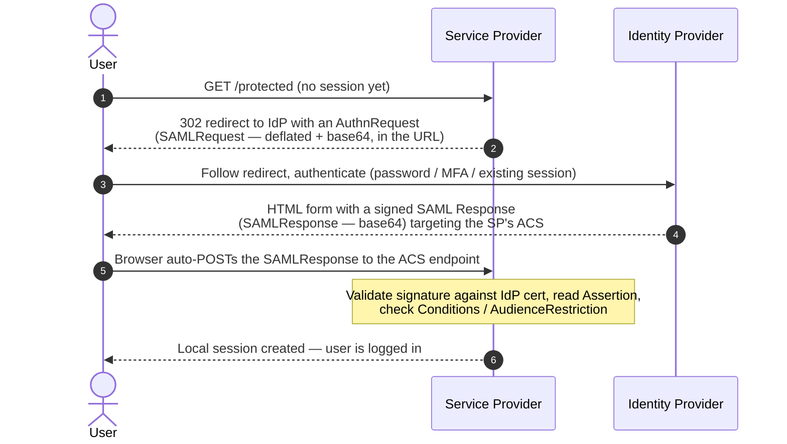

# SAML

#SAML #SSO #Federation #Identity #XML #Authentication #Standard #IdP #ServiceProvider

## What is it?

**Security Assertion Markup Language** — an XML-based open standard (OASIS; **SAML 2.0**, the version everyone means, ratified 2005) for passing authentication and authorization data between an **Identity Provider (IdP)** and a **Service Provider (SP)**. It's the backbone of enterprise web **SSO**: authenticate once at the IdP (Okta, ADFS, Entra ID, PingFederate…) and reach many SPs without re-entering credentials. On an engagement you meet SAML any time a corporate app's "Log in with SSO / your company account" button bounces the browser to a central login and back. This note is the *protocol* — how it works and why it's attackable; the payloads live under [[#Attacked by]].

---

## How it works

Three roles: the **Principal** (the user's browser), the **IdP** (asserts who the user is), and the **SP** (the app that trusts that assertion).

### SSO flow (SP-initiated — the common case)

- **Bindings** = how each message travels: **HTTP-Redirect** (request, in the URL), **HTTP-POST** (response, auto-submitted form — most common), **HTTP-Artifact** (SP fetches the assertion back-channel).
- **IdP-initiated** flow skips steps 1–2: the IdP sends an *unsolicited* SAMLResponse straight to the SP's ACS. Convenient, but weaker — there's no `AuthnRequest` to correlate against, widening replay and injection surface.
- **Metadata**: IdP and SP swap metadata XML out-of-band (entityID, ACS URLs, and crucially the **signing certificate**) to bootstrap trust before any user logs in.

### Anatomy of a SAML Response

| Element | Purpose |
|---|---|
| `<samlp:Response>` | Outer envelope — `Destination`, `InResponseTo`, `<Status>` |
| `<saml:Assertion>` | The identity claim itself — the security-critical payload |
| `<saml:Subject>` / `<NameID>` | **Who** — the authenticated user's identifier |
| `<saml:Conditions>` | Validity window (`NotBefore` / `NotOnOrAfter`) and `<AudienceRestriction>` (which SP it's for) |
| `<saml:AuthnStatement>` | When and how the user authenticated |
| `<saml:AttributeStatement>` / `<Attribute>` | Roles, groups, email — the **authorization** data the SP maps to access |
| `<ds:Signature>` | XML-DSig over the Response and/or the Assertion — the *only* thing binding this document to the IdP |

- **The signature is the entire trust anchor.** The SP believes an assertion because it carries a valid XML signature made with the IdP's private key, verified against the IdP's public cert from metadata. Everything else is just XML the attacker's browser relayed.
- Signature can cover the **Response**, the **Assertion**, or both — *which* element is signed vs. *which* element the SP actually reads is the crack most SAML attacks pry open.

---

## Trust model — where it breaks

The design reduces to one sentence: *the SP grants a session to whoever presents an assertion bearing a valid IdP signature.* Every SAML attack violates one assumption underneath that sentence.

| Assumption the design rests on | When it fails… | Attack (payloads in the linked note) |
|---|---|---|
| The SP actually **validates** the signature | Unsigned or modified assertions accepted | Signature stripping / no-verify |
| The signature covers the element the SP **reads** | SP verifies one node, consumes another | **XML Signature Wrapping (XSW)** — 8 known variants |
| The XML parser reads the **whole** text node | Parser stops at an inline comment | **Comment injection** (CVE-2017-11427 family): `admin<!---->@evil.com` → SP reads `admin` |
| The parser won't resolve **external entities** | DTD entities resolve | **XXE via SAMLResponse** → file read / SSRF |
| The IdP signing key stays **secret** | Key stolen or forged | **Golden SAML** (on-prem ADFS cert+DKM) / **Silver SAML** (imported Entra cert) |
| Assertions are **single-use, time-bound, audience-scoped** | Missing `InResponseTo` / replay / audience checks | Assertion replay, cross-SP reuse |
| `Destination` / `Recipient` is **enforced** | Not checked | Assertion redirected to an attacker-controlled SP |

> [!note]
> This is the "why," not the "how" — deliberately no payloads here. The point of this note is that once you see the trust model, each attack in the notes below is obvious: it's just *which* of these seven assumptions the target skipped.

---

## Attacked by

- [[Class notes/HTB Academy/CPTS v2 (claude)/OAuth-OIDC-SAML|OAuth / OIDC / SAML Attacks]] — the web-SSO attack surface: signature stripping, XSW, comment injection, XXE-via-SAML, plus the Golden/Silver SAML overview and tooling.
- [[Services/Active Directory/ADFS|ADFS]] — on-prem **Golden SAML**: extracting the token-signing certificate + DKM key to forge assertions for any federated user, offline.
- [[Services/Active Directory/Entra ID|Entra ID]] — cloud side: consuming Golden SAML on **Federated** tenants, and **Silver SAML** via an imported enterprise-app signing cert.
- [[Sr Tester Role/Topics/XXE|XXE]] — a SAML assertion is XML the SP parses; it's a first-class XXE and signature-wrapping sink.
- SAML-fronted appliances/VPNs — [[Services/Remote Access/Cisco AnyConnect|Cisco AnyConnect]], [[Services/Remote Access/ZPA - Zscaler Private Access|Zscaler ZPA]] use SAML as their auth front-end.

**Tooling:** SAMLRaider (Burp extension) automates XSW; [[Tools/Web/Burpsuite|Burp Suite]] to intercept/replay the auto-POST; `echo <b64> | base64 -d | xmllint --format -` to read an assertion.

---

## See also

[[OAuth-OIDC]] (companion federation standards — the token-based cousin), [[JWT]] (the token format OIDC carries)  ·  Index: [[_Standards & Protocols]]

*Created: 2026-07-31*
*Updated: 2026-07-31*
*Model: claude-opus-4-8*
