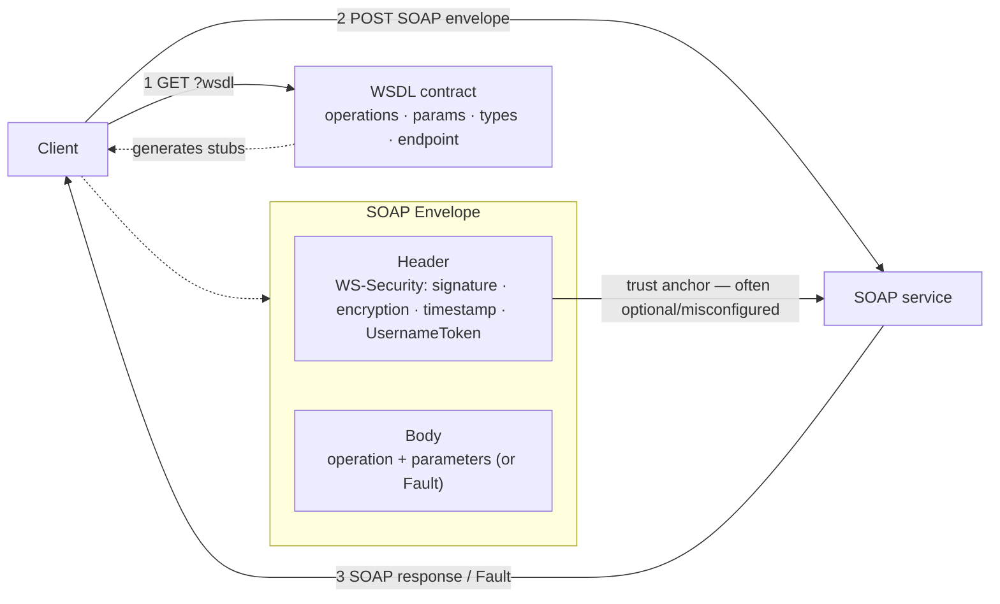

# SOAP

#SOAP #WebServices #WSDL #WSSecurity #XML #API #Protocol #Standard #XXE

## What is it?

**SOAP** (Simple Object Access Protocol) is a **strictly-structured, XML-based messaging protocol** for calling operations on remote services. Every message is an XML **envelope**; the available operations, their parameters, and types are published in a machine-readable **WSDL** contract; and security (signing, encryption, auth) is layered on with **WS-Security** headers rather than the transport. You meet it in **enterprise, financial, government, telecom, and legacy** systems — anywhere a rigid contract and message-level security were requirements. It's the heavyweight counterpart to [[REST]]: where REST is "HTTP verbs + [[JSON]]," SOAP is "one endpoint + XML envelopes + a WSDL." Because it's XML underneath, it inherits the entire [[XML]] attack surface; the payloads live under [[#Attacked by]].

> [!note] **API** here is the umbrella term (an application's programmatic interface), not a standard. Its concrete *styles* are the notes: **SOAP** (this), [[REST]], and GraphQL (see [[Class notes/HTB Academy/CWES Claude/Intro to GraphQL|Intro to GraphQL]]). **CRUD** (Create/Read/Update/Delete) is the operation vocabulary REST maps onto HTTP verbs — SOAP instead exposes arbitrary named operations (`GetUser`, `TransferFunds`) defined by its WSDL.

---

## How it works

- **Envelope** — the root. Contains an optional **Header** and a mandatory **Body**.
- **Header** — where **WS-Security** lives: XML-Signature, XML-Encryption, timestamps, and `UsernameToken` (username/password). This is message-level, so it survives proxies and multiple hops — but it is *optional* and frequently half-implemented.
- **Body** — the operation call and its parameters, or a **Fault** (SOAP's error object).
- **WSDL** — the contract, usually reachable at `?wsdl`/`?singleWsdl`. It enumerates **every** operation, parameter, and type: a complete map of the attack surface handed to the client.
- **Binding/transport** — almost always HTTP(S) with a `SOAPAction` header naming the operation; JMS and others exist.

| Element | Purpose | Why it matters to an attacker |
|---|---|---|
| **WSDL** | Machine-readable contract | Full operation/parameter/type enumeration — often exposed unauthenticated |
| **`SOAPAction`** | Names the operation being invoked | Routing/dispatch confusion; some stacks trust it over the body |
| **WS-Security Header** | Signing / encryption / auth | The trust anchor — optional, so "present but not enforced" is common |
| **Body** | Operation + params (XML) | Parameters flow to SQL/OS/XML parsers → injection & XXE |
| **Fault** | Error response | Verbose faults leak stack traces / internal structure |

---

## Trust model — where it breaks

SOAP's design assumes the WSDL is a *convenience* and that WS-Security, *if configured*, actually guards the message. Both assumptions fail routinely.

| Assumption the design rests on | When it fails… | Attack (payloads in the linked note) |
|---|---|---|
| The parser **won't resolve external entities** | XML parser left at legacy defaults | **XXE** in the envelope — file read / SSRF → [[XML]] |
| The **WSDL** is just documentation | Exposed unauthenticated | Operation/parameter enumeration → hit hidden/admin operations |
| WS-Security **is enforced** | Signature/encryption optional or unchecked | Message tampering; **UsernameToken** creds in cleartext |
| A signature covers **what's processed** | Namespace / `Id` confusion in signed XML | **XML Signature Wrapping (XSW)** → [[SAML]] |
| Messages **can't be replayed** | Missing/!checked timestamp + nonce | **Replay** of a captured signed request |
| Object IDs in the body are **authorized** | No per-operation object-level authz | **BOLA/IDOR** — change `<UserID>123</UserID>` to another's |
| Faults are **generic** | Verbose fault handling | Stack traces / internal paths / logic disclosure |

> [!note] No payloads here — this is the "why." The recurring theme: SOAP *offers* strong message-level security (WS-Security) but leaves it optional, so the practical questions on an engagement are **"is WS-Security actually enforced?"** and **"what does the WSDL expose?"** — the exploitation detail is in the linked attack notes.

---

## Attacked by

- [[Sr Tester Role/Topics/SOAP|SOAP API Testing]] — the hands-on counterpart: WSDL recon, XML/parameter injection, XXE-in-envelope, WS-Security misconfig, replay, verbose faults.
- [[Class notes/HTB Academy/CWES Claude/API Attacks|API Attacks]] — object-level authz (BOLA), mass assignment, and auth flaws apply to SOAP operations exactly as to REST.
- [[Sr Tester Role/Topics/XXE|XXE]] — the envelope is XML; every XXE technique applies to any SOAP body. Model in [[XML]].
- [[SAML]] — SAML assertions are signed XML often carried *inside* SOAP (WS-Trust/WS-Federation) — **XSW** territory.

**Tooling:** SoapUI (WSDL parsing + request generation), [[Tools/Web/Burpsuite|Burp Suite]] (+ **Wsdler**/**SAMLRaider**), `curl` with a raw envelope + `SOAPAction` header, any XXE OOB listener.

---

## See also

[[REST]] (the lightweight API style SOAP is usually contrasted with), [[XML]] (the format under every envelope), [[JSON]] (REST's wire format), [[SAML]] (signed XML carried over SOAP in WS-*)  ·  Index: [[_Standards & Protocols]]

*Created: 2026-08-14*
*Updated: 2026-08-14*
*Model: claude-opus-5*
