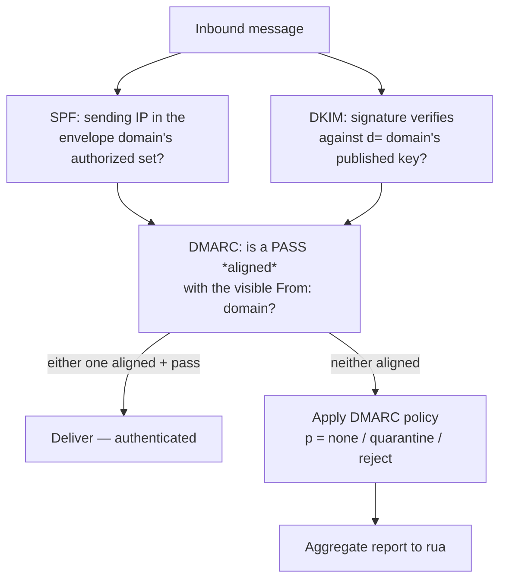

# SPF / DKIM / DMARC

#SPF #DKIM #DMARC #Email #Authentication #AntiSpoofing #DNS #Phishing #Standard

## What is it?

Three DNS-published standards that together let a receiving mail server decide whether a message's **domain was really authorized to send it** — the defence against email spoofing that underpins phishing resistance:

- **SPF** (Sender Policy Framework, RFC 7208) — the domain publishes *which IPs may send* for it; the receiver checks the connecting IP.
- **DKIM** (DomainKeys Identified Mail, RFC 6376) — the sender **cryptographically signs** the message; the receiver verifies against a public key in DNS.
- **DMARC** (RFC 7489) — ties SPF/DKIM to the **From:** header the user actually sees, sets a **policy** (monitor / quarantine / reject) for failures, and requests **reports**.

The critical, non-obvious fact: **SPF and DKIM don't protect the address a human reads.** SPF checks the *envelope* sender and DKIM checks the *signing* domain — DMARC's job (via **alignment**) is to bind either of those to the visible `From:`. Miss that, and "authenticated" mail can still be spoofed. This note is the standards and their trust model; the practical spoofing/recon lives under [[#Attacked by]].

---

## How it works

| Standard | DNS record | What it authenticates | Key weakness class |
|---|---|---|---|
| **SPF** | `TXT` at domain: `v=spf1 … -all` | The **envelope** `MAIL FROM` / HELO vs the sending **IP** | Covers envelope, not `From:`; 10-lookup limit; `+all` |
| **DKIM** | `TXT` at `<selector>._domainkey.<d>` (`v=DKIM1; k=rsa; p=…`) | A **signature** (`b=`) over selected headers + body, tied to `d=` | Weak/short keys; `l=` body-length; replay; stale keys |
| **DMARC** | `TXT` at `_dmarc.<domain>` (`v=DMARC1; p=…; rua=…`) | That an SPF **or** DKIM pass is **aligned** with the `From:` domain | `p=none`; no subdomain policy; relaxed alignment |

### The receiver's decision

- **DMARC passes on an OR:** *either* an aligned SPF pass *or* an aligned DKIM pass is enough. DKIM alignment survives forwarding better, so it's the load-bearing one.
- **Alignment** compares domains: **SPF alignment** = envelope-`MAIL FROM` domain vs header `From:`; **DKIM alignment** = `d=` vs header `From:`. `aspf`/`adkim` set **relaxed** (organizational-domain match, the default) or **strict** (exact).
- **Policy + reporting:** `p=` is the action on failure; `sp=` overrides it for subdomains; `pct=` samples enforcement; `rua`/`ruf` collect aggregate/forensic reports. **ARC** (RFC 8617) re-asserts auth results across legitimate forwarders/mailing lists that would otherwise break SPF/DKIM.

---

## Trust model — where it breaks

Each standard guards a *different* identifier, and each has a "configured but not enforced" failure mode. The gaps between them are where spoofed mail slips through.

| Assumption the design rests on | When it fails… | Attack (detail in the linked note) |
|---|---|---|
| SPF/DKIM protect the address the **user sees** | No **DMARC** — SPF/DKIM only bind the envelope / `d=` | **Header-`From:` spoofing** — forge the visible sender freely |
| A published DMARC policy is **enforced** | `p=none` (monitor only), or `pct<100` | Spoofed mail delivered anyway — the #1 real-world gap |
| **Subdomains** inherit protection | No record on the subdomain and no `sp=` | **Subdomain / unused-domain spoofing** |
| The **SPF record is effective** | `+all`, over-broad `include:`, or **>10 DNS lookups → permerror** | SPF silently ignored → spoof via envelope |
| DKIM keys are **strong and current** | 512/768-bit RSA (factorable), or old keys left in DNS | **Signature forgery** (weak key) / **DKIM replay** of a captured valid signature |
| A DKIM signature covers the **whole body** | `l=` body-length tag limits coverage | **Append** unsigned malicious content after the signed portion |
| Auth = the mail is **trustworthy** | Attacker sends from *their own* fully-authenticated look-alike domain | **Cousin-domain / display-name spoofing** — DMARC passes; the human is fooled |
| Forwarding preserves auth | Mailing lists rewrite headers/body | SPF/DKIM break → over-permissive receivers fall back to accepting; **ARC** needed |

> [!note]
> No payloads here — this is the "why." Two questions decide an org's real exposure: **is there a DMARC record at `p=quarantine`/`reject` (not `p=none`)**, and **do SPF/DKIM actually align with the `From:`?** Everything else (weak keys, `l=`, replay, cousin domains) is a narrower edge. The record contents are one `dig`/DNS lookup away — recon and spoofing detail in the linked notes.

---

## Attacked by

- [[Services/Email/SMTP|SMTP]] — the hands-on spoofing surface: missing/`p=none` records → forge the `From:`; and **SMTP smuggling** (CVE-2023-51764/5/6), where a message that *passes* SPF/DKIM/DMARC is split into a second spoofed one by the relay.
- [[Class notes/HTB Academy/CPTS v2 (claude)/Info Gathering|Info Gathering]] — recon: reading `SPF`/`_dmarc` `TXT` records reveals mail providers, cloud services, and relays an org uses (and whether spoofing is even possible).
- [[Services/Network Management/DNS|DNS]] / [[Tools/Network/dig|dig]] — where all three records live and how they're queried.

**Tooling:** `dig TXT <domain>` / `dig TXT _dmarc.<domain>` / `dig TXT <selector>._domainkey.<domain>`; online DMARC/SPF analysers; MXToolbox — all in the recon notes.

---

## See also

[[Services/Email/SMTP|SMTP]] (the transport these authenticate; spoofing & smuggling), [[Services/Network Management/DNS|DNS]] (all three are DNS `TXT` records), [[TLS]] (transport-level protection of the *channel* — orthogonal to these domain-level content/sender checks), [[X509-PKI|X.509 / PKI]] (DKIM uses raw DNS-published keys, *not* X.509 — the contrast; though BIMI's VMC does reintroduce certificates)  ·  Index: [[_Standards & Protocols]]

*Created: 2026-09-26*
*Updated: 2026-09-26*
*Model: claude-opus-4-8*
