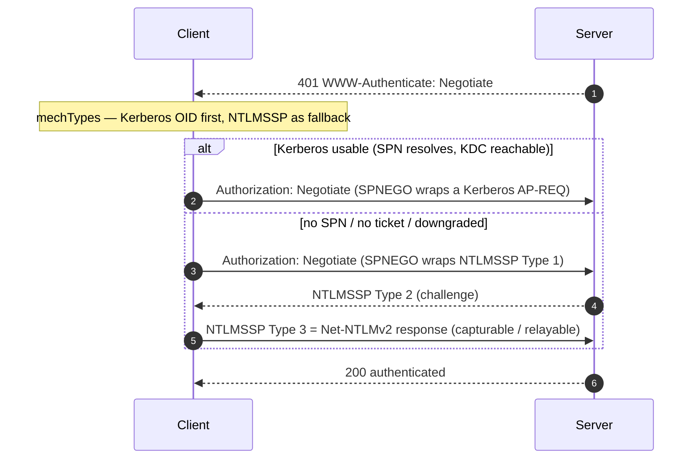

# SPNEGO / GSS-API

#SPNEGO #GSSAPI #Negotiate #Kerberos #NTLM #Windows #Authentication #Standard #Downgrade #IWA

## What is it?

**GSS-API** (Generic Security Service API, RFC 2743) is a mechanism-neutral API that lets an application do authentication *without hardcoding* Kerberos, NTLM, or anything else — it just exchanges opaque security tokens until the context is established. **SPNEGO** (Simple and Protected GSS-API Negotiation, RFC 4178) is a GSS-API **"pseudo-mechanism"** whose only job is to **negotiate which *real* mechanism** to use. On Windows this is the **"Negotiate"** provider, and over HTTP (RFC 4559) it's exactly what `WWW-Authenticate: Negotiate` / `Authorization: Negotiate` means: **try Kerberos first, fall back to NTLM.** You meet it in IIS Integrated Windows Auth / intranet SSO, and under the hood of SMB, LDAP, and RPC. Offensively it matters because that fallback is a **downgrade** surface and the negotiated blob carries **capturable** authentication material. It's the connective tissue between [[NTLM]] and [[Services/Active Directory/Kerberos|Kerberos]]; attack angles under [[#Attacked by]].

---

## How it works

### The negotiation



- **NegTokenInit** (client → server) carries the **mechTypes** list — Kerberos OID `1.2.840.113554.1.2.2` first, NTLMSSP `1.3.6.1.4.1.311.2.2.10` as fallback — plus an *optimistic* first token (usually the Kerberos AP-REQ or NTLM Type 1).
- **NegTokenResp** (server → client) selects a mechanism; tokens flow until the context completes.
- **mechListMIC** — a MIC computed over the advertised mech list, added specifically so a MITM **can't silently tamper the list to force the weaker mechanism**. If it isn't enforced, downgrade is undetected.

### Reading a `Negotiate` blob

```bash
# base64-decode the Authorization: Negotiate value and look at the first bytes
echo '<b64>' | base64 -d | xxd | head
#  "NTLMSSP\x00"                → NTLM inside (Type 1/2/3)
#  SPNEGO/Kerberos OID (60 …)   → Kerberos AP-REQ inside
```

---

## Trust model — where it breaks

SPNEGO negotiates a *preference in the clear* before the security context exists, and then it **wraps whatever mechanism token results**. So the weak points are the fallback choice and the material it carries — not the API itself.

| Assumption the design rests on | When it fails… | Attack (payloads in the linked note) |
|---|---|---|
| Kerberos is used **whenever available** | Attacker prevents it — block the KDC, strip/confuse the SPN, tamper mechTypes, or spoof an unsupported client | **Downgrade to NTLM** → then capture or relay Net-NTLM |
| mechList tampering is **detected** (mechListMIC) | MIC not enforced/verified | **Silent downgrade** |
| The `Negotiate` blob is **opaque and safe** | It wraps an NTLMSSP Type 3 or a Kerberos AP-REQ | **Capture Net-NTLMv2** from `Authorization: Negotiate` (crack/relay); AP-REQ capture |
| Auth is **bound to the intended service** | Negotiate relayed to another service | **Relay** the wrapped NTLM (`ntlmrelayx` speaks Negotiate); emerging **Kerberos relay** (Project Zero 2021 → decoder.cloud 2025; **CVE-2025-33073** SMB reflection) |

---

## Attacked by

- [[NTLM]] — the **downgrade target**; the wrapped NTLMSSP is what gets captured/relayed once Kerberos is knocked out.
- [[Services/Active Directory/Kerberos|Kerberos]] — the **preferred** mechanism; AP-REQ capture and the newer **Kerberos relay/reflection** research live here.
- [[Class notes/HTB Academy/CPTS v2 (claude)/Password Attacks|Password Attacks]] — capturing and cracking the Net-NTLMv2 pulled out of a `Negotiate` header.

**Tooling:** Responder / [[Tools/Lateral Movement/ntlmrelayx|ntlmrelayx]] capture and relay the Negotiate wrapper; Wireshark decodes SPNEGO tokens (`gss-api` / `spnego` dissectors) to confirm which mechanism was chosen.

---

## See also

[[NTLM]] and [[Services/Active Directory/Kerberos|Kerberos]] (the two mechanisms it negotiates between)  ·  Index: [[_Standards & Protocols]]

*Created: 2026-07-31*
*Updated: 2026-07-31*
*Model: claude-opus-4-8*
