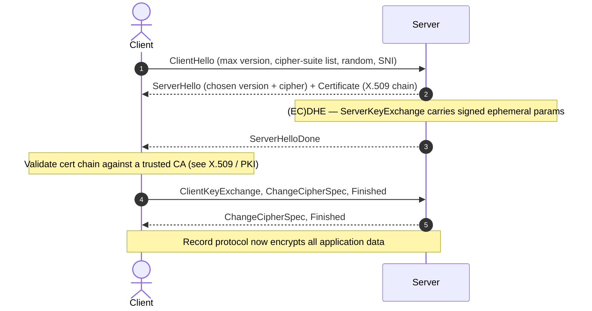

# TLS

#TLS #SSL #Cryptography #ForwardSecrecy #Downgrade #Handshake #Protocol #Standard #NetworkManagement

## What is it?

**TLS (Transport Layer Security)** — RFC 8446 (**TLS 1.3**) / RFC 5246 (**1.2**) — is the protocol that wraps a plaintext TCP stream in **confidentiality, integrity, and authentication**. It's the "S" in HTTPS and the security layer under SMTPS/IMAPS/LDAPS/RDP/MySQL and countless others. A TLS session is bootstrapped by a **handshake** that authenticates the server (via its [[X509-PKI|X.509]] certificate), agrees a cipher suite, and derives session keys — and *that negotiation*, not the bulk encryption, is where almost every TLS weakness lives: a protocol that must interoperate with old peers can be **talked down** to weak crypto. This note is the protocol and its trust model; the hands-on testing (testssl/sslyze/openssl, per-vuln checks) is the sibling attack note under [[#Attacked by]].

---

## How it works

### The two layers

- **Handshake protocol** — negotiates version + cipher suite, authenticates the peer(s), and establishes the shared keys.
- **Record protocol** — once keys exist, it fragments, then encrypts and MACs (or AEAD-seals) the application data.

### Handshake (TLS 1.2, abbreviated)

- **TLS 1.3 collapsed this to 1-RTT** (the ClientHello already carries key shares) and **removed** the entire class of legacy weak options — static-RSA key exchange, renegotiation, compression, CBC-mode and non-AEAD ciphers, and custom DH groups. Most attacks below are really *"the peer still speaks 1.2 or earlier."*

### Cipher suite = four choices in one string

A suite like `ECDHE-RSA-AES128-GCM-SHA256` bundles **key exchange** (ECDHE), **authentication** (an RSA cert), **bulk cipher + mode** (AES-GCM), and **MAC/PRF hash** (SHA-256). The **server picks** from the client's offered list — so what the client is *willing* to accept sets the security floor.

### Forward secrecy — the pivotal design choice

| Key exchange | Forward secrecy? | Consequence |
|---|---|---|
| **Static RSA** (client encrypts the secret to the server's public key) | **No** | Steal the server's private key once → decrypt *all previously recorded* sessions |
| **(EC)DHE** (ephemeral Diffie–Hellman) | **Yes** | Per-session key that can't be recovered from the long-term key (mandatory in 1.3) |

---

## Trust model — where it breaks

TLS assumes both peers negotiate honestly and the client validates the server's certificate. A network attacker who can tamper the handshake, or a client that skips validation, breaks it.

| Assumption the design rests on | When it fails… | Attack (detail in the linked note) |
|---|---|---|
| The peer's **certificate is validated** | Chain / host / expiry / revocation not checked | **MITM** — attacker's cert accepted → [[X509-PKI|X.509 / PKI]] |
| **Version/cipher negotiation isn't tamperable** | No downgrade protection (pre-`TLS_FALLBACK_SCSV`) | **Downgrade** — POODLE (→SSL3), FREAK / Logjam (→export-grade), DROWN (→SSLv2) |
| Key exchange gives **forward secrecy** | Static-RSA suites still offered | Recorded traffic decryptable after later key theft; **ROBOT** (Bleichenbacher RSA padding oracle) |
| **Renegotiation** is bound to the session | Insecure renegotiation (CVE-2009-3555) | Plaintext **prefix injection** into the stream |
| **Compression** leaks nothing | TLS/HTTP compression over secret + attacker-controlled data | **CRIME / BREACH** — recover cookies/tokens a byte at a time |
| Record MAC/padding is **constant-time** | CBC-mode padding checks leak timing | **Lucky13 / BEAST** (CBC, TLS ≤ 1.0) |
| A **STARTTLS** upgrade can't be stripped | Opportunistic TLS on SMTP/IMAP/POP3 | **STARTTLS stripping** — MITM deletes the upgrade → cleartext |
| Endpoints run **current** versions | SSLv2/3, TLS 1.0/1.1 still enabled | The whole toolbox above reopens (RFC 8996 deprecated 1.0/1.1) |

> [!note]
> No payloads here — this is the "why." The recurring theme is **downgrade**: TLS's need to interoperate with old peers is exactly what lets an attacker force weak crypto. So the first questions on an engagement are *which versions/suites does this endpoint still accept* and *does the client actually validate the cert* — the hands-on checks live in the testing note below.

---

## Attacked by

- [[Services/Network Management/TLS|TLS (testing)]] — the hands-on counterpart: testssl.sh / sslyze / openssl enumeration, per-vuln checks (Heartbleed, POODLE, CRIME…), cipher/version audits, and certificate inspection.
- [[X509-PKI|X.509 / PKI]] — the certificate side: chain / hostname validation bypass is how a TLS MITM actually lands.
- [[Services/Email/SMTP|SMTP]] / [[Services/Email/IMAP|IMAP]] / [[Services/Email/POP3|POP3]] — opportunistic **STARTTLS** is the classic stripping / downgrade surface.

**Tooling:** `testssl.sh`, `sslyze`, `openssl s_client`, `nmap --script ssl-enum-ciphers` — all covered in the testing note.

---

## See also

[[X509-PKI|X.509 / PKI]] (the certificate / trust-chain substrate TLS authenticates with), [[Services/Network Management/TLS|TLS (testing)]] (the hands-on attack/enum note), [[SAML]] / [[JWT]] (app-layer signing that rides *over* TLS)  ·  Index: [[_Standards & Protocols]]

*Created: 2026-09-26*
*Updated: 2026-09-26*
*Model: claude-opus-4-8*
