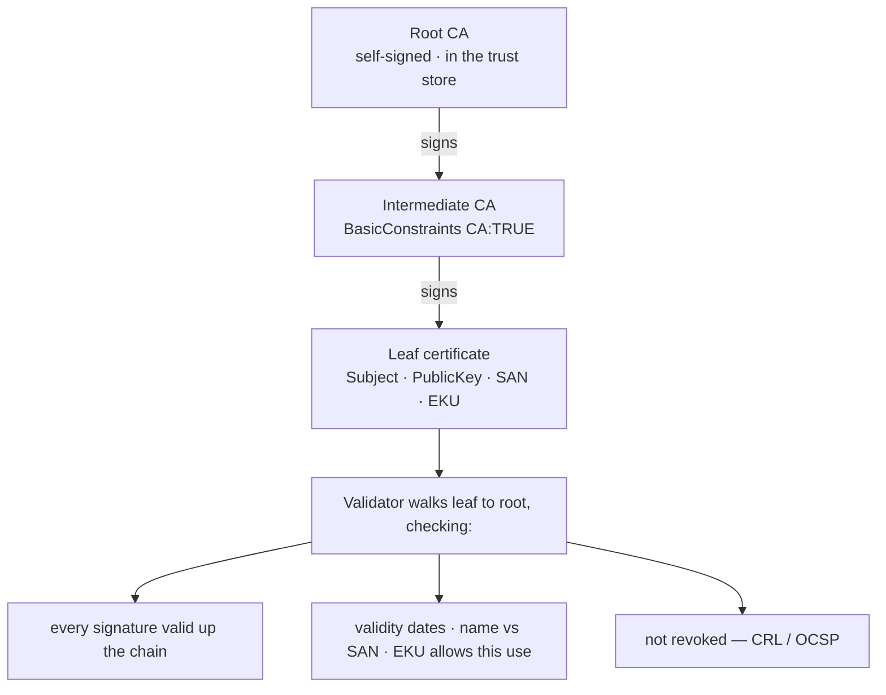

# X.509 / PKI

#X509 #PKI #Certificates #CA #TLS #ADCS #PKINIT #CodeSigning #TrustChain #Standard

## What is it?

**X.509** (RFC 5280) is the standard format for a **digital certificate** — a Certificate Authority's signed binding of a **public key** to an **identity** (a hostname, a user, a service). **PKI (Public Key Infrastructure)** is the surrounding machinery — CAs, chains of trust, and revocation — that makes those certificates *verifiable* by a relying party that has never met the subject. It's the trust substrate under an enormous amount of security tech: **TLS/HTTPS** and mTLS, **AD CS / smart-card / PKINIT** certificate logon, code signing, the **token-signing certs** behind SAML and JWT, S/MIME, and WebAuthn attestation. Trust reduces to two things — **the validator checking the chain correctly**, and **the CA (and its keys/templates) being trustworthy**. Weaken either and you forge identities the whole ecosystem accepts. This note is the standard; attacks under [[#Attacked by]].

---

## How it works

### What's in a certificate

| Field | Meaning |
|---|---|
| Subject / Issuer | Who it's for / which CA signed it |
| Public Key | The bound key |
| Validity | `NotBefore` / `NotAfter` |
| Serial, AKI/SKI | Unique id; links leaf → issuer |
| **Signature** | The CA's signature over everything above — the trust anchor |
| **SAN** (ext) | Subject Alternative Name — the identities the cert is actually valid for (**checked instead of CN**) |
| **EKU** (ext) | Extended Key Usage — *what* the key may do: Server Auth, **Client Auth**, Code Signing, **Smart-Card Logon**, Any |
| **KeyUsage / BasicConstraints** | `CA:TRUE` + path length decide whether a cert can *issue* other certs |

### Chain of trust

- A **root CA** is self-signed and lives in the OS/browser **trust store**; intermediates chain down to the **leaf** (end-entity) cert.
- **Validation** walks leaf→root verifying each signature, the validity window, **name vs SAN**, **EKU**, path-length/BasicConstraints, and **revocation** (**CRL** lists / **OCSP** queries, often soft-fail).
- **Enrollment**: a subject sends a **CSR**; the CA issues per policy. In AD CS, **certificate templates** decide *who* can enroll for *what EKU* — which is where the ESC attacks live.

---

## Trust model — where it breaks

Everything rests on *the validator enforcing the chain* and *the CA issuing only what it should*. Each attack removes one of those guarantees.

| Assumption the design rests on | When it fails… | Attack (payloads in the linked note) |
|---|---|---|
| Validator checks the **whole chain** + signatures | Skipped, accepts self-signed, or a **non-CA cert is trusted as a CA** | MITM / impersonation (e.g. Vault CVE-2025-6037) |
| Name **matches SAN** | Loose/absent name check, CN fallback | Wrong-host cert accepted → **TLS MITM** |
| Only a **trusted CA** can issue | Rogue/compromised CA, or attacker installs a root | Forge **any** identity — trust-store poisoning |
| **EKU / BasicConstraints** enforced | Not checked | Leaf used as a CA (`CA:TRUE`), or **EKU confusion** (EKUwu) — a cert usable for auth it shouldn't be |
| AD CS **templates** are least-privilege | Enrollee-Supplies-Subject + Client-Auth EKU + low-priv enrollment | **ESC1** & friends — request a cert *as any user* → **PKINIT/Schannel logon** → DA |
| Certificate→account **mapping** is strong | Weak/implicit SAN→UPN mapping | **ESC15 / certificate-mapping** abuse |
| Revocation is **checked** | CRL/OCSP soft-fail or ignored | Revoked/stolen cert still accepted |
| The signing **private key** stays secret | Key theft | Forge signatures — **Golden/Silver SAML** token-signing certs, code-signing cert theft |
| Path-length / hash strength enforced | Bypassable constraint; MD5/SHA-1 | Over-depth issuance (2025 research); collision-forged cert (historic Flame) |

---

## Attacked by

- [[Services/Active Directory/ADCS|ADCS]] — the marquee target: certificate-template/CA misconfig (**ESC1–16**, EKUwu, ESC15 mapping), NTLM relay to web enrollment (**ESC8**), certificate-based Domain Admin. The X.509 mental model (EKU / SAN / PKINIT) is the prerequisite for all of it.
- [[Services/Network management/TLS|TLS]] — server/client-cert validation, chain and hostname-vs-SAN bypass, MITM with a forged or mistrusted cert.
- [[SAML]] — XML-DSig signs assertions with an X.509 token-signing cert; **Golden/Silver SAML** forge with the stolen signing key.
- [[JWT]] — `x5c` / `x5u` header-cert injection and RS256 verification against an attacker-supplied cert.

**Tooling:** `openssl x509 -text` / `openssl s_client` (inspect & MITM-test), Certipy / Certify (AD CS enumeration + abuse), [[Tools/Web/Burpsuite|Burp Suite]] for the TLS/JWT side.

---

## See also

[[Services/Network management/TLS|TLS]] (carries server/client certs), [[Services/Active Directory/ADCS|ADCS]] (the AD CS deployment that issues them), [[SAML]] / [[JWT]] (signed *with* X.509)  ·  Index: [[_Standards & Protocols]]

*Created: 2026-07-31*
*Updated: 2026-07-31*
*Model: claude-opus-4-8*
