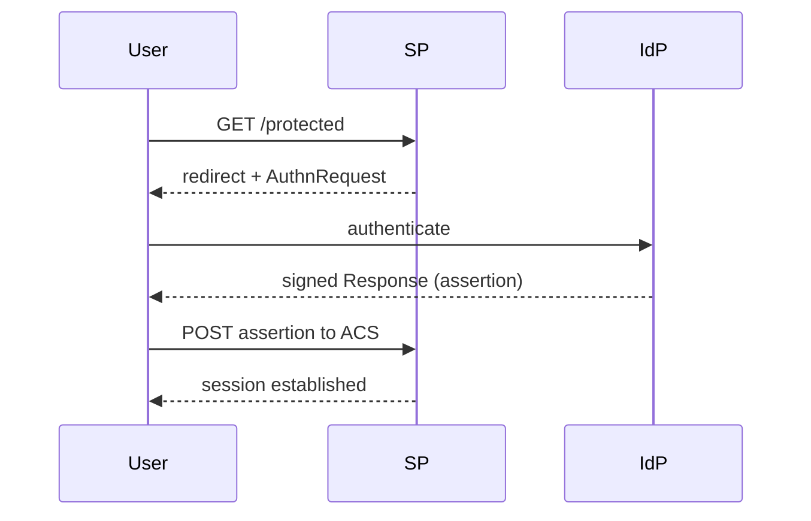

# Standards & Protocols — Note Template

How to write a note in this folder. These are **concept notes** — what a protocol/standard *is*, how it works, and *why its design is attackable*. They are the counterpart to the attack notes (CPTS/CWES/Services), which cover *how* to break it. Read [[SAML]] as the worked example alongside this.

---

## What earns a note here

A topic belongs in `Standards & Protocols/` only if **all three** hold:

1. It's a **protocol, data format, or identity/auth standard** — not a product, a tool, or a vulnerability class (those go to `Tools/`, `Services/`, and the CPTS/CWES attack notes respectively).
2. Its **design must be understood to attack it** — there's real "how it works" beyond the exploit.
3. It's **cross-cutting** — referenced or abused by 2+ existing notes (or clearly will be).

That bar keeps out the black holes (TCP, HTTP, "the web"), vuln classes (stay in CPTS/CWES), and tools. Things that *already* have a substantial home (Kerberos, LDAP → `Services/`) stay there — cross-link, don't duplicate.

---

## The concept-vs-attack rule (the whole point)

The folder only pays off if concept notes and attack notes **don't duplicate**:

- **Concept note (here)** = what it is, its structure/flow, its trust model, and which design assumption each attack violates. **No payloads.**
- **Attack note (elsewhere)** = how to break it. Its `## What is this?` shrinks to 2–3 sentences + "see [[SAML]] for the protocol," instead of re-explaining the standard.

Done right, this folder *reduces* total content — the "how it works" is written once and pointed at, not restated in every attack note.

---

## Skeleton

```markdown
# <Protocol / Standard Name>

#Tag1 #Tag2 #Standard #Identity ...

## What is it?
2–4 sentences: what the standard is, who uses it, where you meet it on an
engagement. End by pointing at [[#Attacked by]]. No payloads.

---

## How it works
Structure, message flow, key components. Prefer an ASCII/mermaid flow diagram
plus a table of the fields/elements that matter. Explain the security-critical
part explicitly (e.g. "the signature is the entire trust anchor").

---

## Trust model — where it breaks
A table of the security assumptions the design rests on, and — for each — what
happens when it fails and which attack exploits that failure. This is the bridge
to the attack notes. Still no payloads: explain *why*, not *how*.

---

## Attacked by
Wikilinks OUT to the attack / technique / service notes that exploit this, one
line each on the angle they take. List the relevant tools too.

---

## See also
[[Related Standard]], [[Another]]  ·  Index: [[_Standards & Protocols]]

*Created: YYYY-MM-DD*
*Updated: YYYY-MM-DD*
*Model: <model>*
```

---

## Diagrams & images

These notes lean on flow and trust-relationship diagrams (auth handshakes, IdP ↔ SP ↔ user), so pictures are explicitly welcome when they beat ASCII. Two options, both render in Obsidian *and* on the public GitHub:

- **mermaid** — first choice for auth/message flows, sequence diagrams, and graphs. A fenced ` ```mermaid ` block stays text (diffable, editable) and renders natively in both Obsidian and GitHub. Example — an SP-initiated SSO handshake:



- **SVG** — for anything mermaid can't express (custom layouts, annotated illustrations, network topology). Author a **self-contained** `.svg` (no external fonts, scripts, or image refs), save it in a `_media/` subfolder beside the note, and embed with `![[diagram.svg]]`. Don't paste raw inline `<svg>` into the note body — Obsidian's reading mode renders it inconsistently and GitHub strips it; an embedded `.svg` file or a mermaid block is the portable path.

Make every diagram **theme-legible** — they're viewed in Obsidian's light and dark themes (and GitHub's), so use stroke/label colors that read on both and don't rely on a solid white background; give SVGs a `<title>`/`<desc>` for accessibility. Reserve diagrams for genuine structure; a short table or ASCII sketch is still fine for simple or linear things.

---

## Cross-linking (reciprocal — not optional)

Same discipline as the rest of the vault (`Services/template.md`, `Class notes/HTB Academy/Notes.md`):

- This note's **Attacked by** links every attack/service note that exploits the standard.
- **Each of those notes gets a pointer back** — a short "protocol reference: see [[SAML]]" line (in its `What is this?` or a `> [!note]`), and its footer bumped. Add it inline when you create the concept note; don't defer it.
- Add the new note to the folder index, [[_Standards & Protocols]], under the right tier.

---

*Created: 2026-07-31*
*Updated: 2026-07-31*
*Model: claude-opus-4-8*
